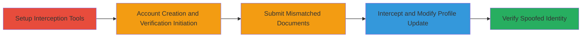

# EXNESS KYC Bypass via Mismatched Documents and Unauthenticated Post-Verification Profile Updates

Multi-stage attack chain demonstrating a business logic vulnerability in EXNESS's identity verification (KYC) process. Attackers can verify accounts using stolen or mismatched official documents that do not match provided personal details, then update profile information (name, date of birth, address) via an unauthenticated PATCH API endpoint without re-verification. This enables identity theft, fraudulent trading under false identities, loss of platform trust, and potential regulatory violations like GDPR non-compliance. Discovered via HTTP request interception with Burp Suite during account creation and verification flows.

## Chain Metrics Dashboard

| Metric | Value |
|--------|-------|
| Chain Status | Unverified |
| Total Steps | 4 |
| Execution Time | ~45 minutes |
| Skill Level | Intermediate |
| Complexity | Medium |
| Impact Level | High |

## Attack Flow Visualization

## Prerequisites & Requirements

### Required Tools

- [[tools/Burp-Suite-CE]]

### Target Environment

- Web platform: my.exness.com and my.exnesstrade.pro
- No specific ports or services required beyond standard HTTPS (443)
- Internet access to EXNESS domains

### Initial Access Requirements

- No prior credentials needed; uses self-registered account
- Valid email and phone for verification codes
- Access to official documents (ID, proof of address) for upload, potentially stolen or mismatched

## Detailed Attack Procedures

### Step 1: Setup Interception Tools

procedure: [[procedures/Configure-Burp-Suite-for-HTTP-Interception]]

**Objective**: Configure Burp Suite to log and intercept HTTP requests during the verification flow without disrupting normal browsing.

**Instructions**: Launch Burp Suite CE, disable the Proxy interception feature to log requests passively, and configure your browser to route traffic through Burp's proxy (typically 127.0.0.1:8080). This prepares for capturing the verification-related API calls.

**Expected Output**: Burp's HTTP history populated with site requests; no interception halts.

**Success Indicators**:
- Browser traffic routed through Burp without errors
- Initial requests to my.exness.com logged in Burp

### Step 2: Account Creation and Verification Initiation

procedure: [[procedures/Create-EXNESS-Account-and-Initiate-Verification]]

**Objective**: Register a new account and begin the KYC process to reach the personal information and document upload stages.

**Instructions**: Navigate to my.exness.com, create an account using a valid email provider, verify email and phone with received codes, then go to profile settings at https://my.exness.com/pa/settings/profile and start verification. Enter arbitrary personal details (name, DoB, address) without matching any documents yet.

**Expected Output**: Account created; verification flow initiated with prompts for documents.

**Success Indicators**:
- Email and phone verified
- Profile settings page accessible and verification button clickable

### Step 3: Submit Mismatched Personal Info and Documents

procedure: [[procedures/Submit-Mismatched-Personal-Info-and-Documents]]

**Objective**: Upload official documents (ID and proof of address) that do not match the entered personal information, exploiting the lack of cross-validation, and submit for verification.

**Instructions**: Select ID card type, upload a mismatched official ID document, then upload proof of address matching the ID but not the profile info. Submit and keep the session active by interacting with the site while waiting 15-30 minutes for automated verification approval.

**Expected Output**: Documents submitted; verification status updates to "completed" after wait time.

**Success Indicators**:
- Documents uploaded successfully
- Verification approved despite mismatch (no re-check triggered)

### Step 4: Intercept and Modify Post-Verification Profile Update

procedure: [[procedures/Intercept-and-Modify-Post-Verification-Profile-Update]]

**Objective**: Capture the automatic post-verification profile update request and modify it to change personal details arbitrarily, bypassing re-verification.

**Instructions**: In Burp's HTTP history, locate the PATCH request to /kyc_back/api/v2/surveys/personal_info, send it to Repeater. Modify the JSON body to arbitrary values (e.g., new name, DoB, address), then resend. Refresh the profile page to confirm changes.

**Expected Output**: HTTP 200 response with {"status":"OK"}; updated profile reflected on https://my.exness.com/pa/settings/profile.

**Success Indicators**:
- Profile details changed without additional verification
- No errors or restrictions on the API update

## Attack Chain Summary

### Key Achievements

1. Verified an account using mismatched identity documents, evading KYC checks.
2. Updated verified profile information via unauthenticated API, enabling identity spoofing.
3. Demonstrated potential for fraudulent trading and identity theft on the platform.

## Technique & Tactic Coverage

### MITRE ATT&CK Techniques

- [[Valid Accounts]] Valid Accounts
- [[Exploit Public-Facing Application]] Exploit Public-Facing Application
- [[Impair Defenses]] Impair Defenses

### MITRE ATT&CK Tactics

- [[Initial Access]] Initial Access
- [[Defense Evasion]] Defense Evasion

---

*Last updated: 2023-10-01T00:00:00Z*
