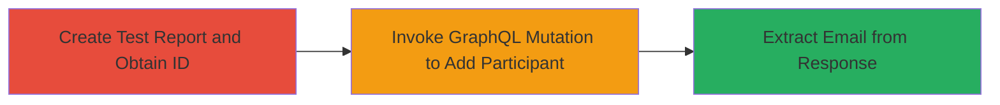

---
tags:
  - graphql
  - authorization-bypass
  - email-disclosure
  - pii-leak
  - hackerone
type: attack_chain
tools: []
tactics:
  - '[[Discovery]]'
verified: false
platforms:
  - Web
submitted: true
complexity: medium
created_at: '2023-10-01T00:00:00Z'
procedures:
  - '[[procedures/Create-Test-Report-to-Obtain-ID]]'
  - '[[procedures/Exploit-GraphQL-Mutation-to-Disclose-Email]]'
step_count: 2
techniques:
  - '[[Exploit Public-Facing Application]]'
  - '[[Account Discovery]]'
updated_at: '2025-12-14T17:26:00.476Z'
description: >-
  A multi-step attack exploiting improper authorization in HackerOne's GraphQL
  API to disclose any user's email address by inviting them to a report using
  their known username.
skill_level: intermediate
impact_level: high
id: c54ffcf3-2787-4d1d-acb6-78a3faa28d73
validated: true
mitre_tactics:
  - '[[Discovery]]'
mitre_techniques:
  - '[[Exploit Public-Facing Application]]'
  - '[[Account Discovery]]'
---
# Email Address Disclosure via Improper Authorization in HackerOne GraphQL Invitation System

Multi-stage attack chain demonstrating the exploitation of an improper authorization vulnerability in HackerOne's GraphQL API for the report invitation system. An authenticated user can create a test report, then use a GraphQL mutation to add a participant by username, bypassing privacy controls and exposing the target's email address in the response. This affects user privacy by disclosing PII, and was reported under HackerOne's bug bounty program (Report #792927). The vulnerability stemmed from incomplete ACL implementation during migration from REST to GraphQL, allowing email leakage when inviting by username instead of email.

## Chain Metrics Dashboard

| Metric | Value |
|--------|-------|
| Chain Status | Unverified |
| Total Steps | 2 |
| Execution Time | ~5 minutes |
| Skill Level | Intermediate |
| Complexity | Medium |
| Impact Level | High |

## Attack Flow Visualization



## Prerequisites & Requirements

### Required Tools

- None (uses standard HTTP client like curl)

### Target Environment

- HackerOne platform (web application)
- GraphQL endpoint at /graphql
- Authenticated access to HackerOne (bug bounty hacker account)

### Initial Access Requirements

- Valid HackerOne account with permission to create programs and reports
- Knowledge of target username
- Network access to hackerone.com

## Detailed Attack Procedures

### Step 1: Create Test Report to Obtain ID
procedure: [[procedures/Create-Test-Report-to-Obtain-ID]]

**Objective**: Establish a test environment by creating a program and report to acquire a valid report ID, which is required for the GraphQL mutation.

**Instructions**: Log in to HackerOne, create a new test program, submit a benign report within it to generate a report ID (e.g., 626371), then encode the ID in base64 format as a Global ID (gid://hackerone/Report/626371 becomes Z2lkOi8vaGFja2Vyb25lL1JlcG9ydC82MjYzNzE=).

**Expected Output**: Base64-encoded report ID ready for use in the mutation.

**Success Indicators**:
- Test program created successfully
- Report submitted and ID obtained (visible in URL or API response)
- Base64 encoding verified

### Step 2: Exploit GraphQL Mutation to Disclose Email
procedure: [[procedures/Exploit-GraphQL-Mutation-to-Disclose-Email]]

**Objective**: Send a crafted GraphQL mutation to add a participant by username, triggering the invitation response that leaks the target's actual email address.

**Instructions**: Use [[commands/graphql-add-participant]] to POST the mutation to /graphql, providing the encoded report ID, a placeholder email, and the target username (e.g., jobert). The response's invitation object will contain the real email.

```bash
curl -X POST https://hackerone.com/graphql -H "Content-Type: application/json" -H "Authorization: Bearer YOUR_TOKEN" -d '{"query":"mutation Revoke_credential_mutation($input_0:AddReportParticipantInput!) {addReportParticipant(input:$input_0) {clientMutationId,...F1}}  fragment F1 on AddReportParticipantPayload {clientMutationId,was_successful,errors{nodes{message}},invitation{email,token}}","variables":{"input_0":{"report_id":"Z2lkOi8vaGFja2Vyb25lL1JlcG9ydC82MjYzNzE=","email":"placeholder@example.com","username":"jobert"}}}' 
```

**Expected Output**: JSON response with {"data":{"addReportParticipant":{"...","invitation":{"email":"target@example.com","token":null}}}}.

**Success Indicators**:
- Mutation successful (was_successful: true)
- Email field in invitation object populated with target's real email
- No errors in response

## Attack Chain Summary

### Key Achievements

1. Bypassed privacy controls to disclose PII (email addresses) for any known username.
2. Exploited GraphQL API during framework migration flaw.
3. Demonstrated low-privilege access leading to high-impact privacy violation; patched within hours after responsible disclosure.

## Technique & Tactic Coverage

### MITRE ATT&CK Techniques

- [[Exploit Public-Facing Application]] Exploit Public-Facing Application
- [[Account Discovery]] Account Discovery

### MITRE ATT&CK Tactics

- [[Discovery]] Discovery

---

*Last updated: 2023-10-01T00:00:00Z*
