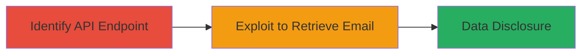

---
tags:
  - information-disclosure
  - api-vulnerability
  - auth-bypass
  - email-leak
type: attack_chain
tools: []
tactics:
  - '[[Initial Access]]'
  - '[[Discovery]]'
verified: false
platforms:
  - Web
submitted: true
complexity: low
created_at: '2023-10-01T00:00:00Z'
procedures:
  - '[[procedures/Identify-Internal-API-Endpoint-for-User-Data]]'
  - '[[procedures/Exploit-getPersonBySlug-to-Retrieve-Email]]'
step_count: 2
techniques:
  - '[[Exploit Public-Facing Application]]'
  - '[[Account Discovery]]'
updated_at: '2025-12-14T17:32:39.401Z'
description: >-
  Attack chain exploiting a missing authorization check in the getPersonBySlug
  API method to disclose private email addresses of users with Google-connected
  LGTM accounts.
skill_level: intermediate
impact_level: medium
id: 78c18e15-44d0-4510-8785-01c09183725c
validated: true
mitre_tactics:
  - '[[Initial Access]]'
  - '[[Discovery]]'
mitre_techniques:
  - '[[Exploit Public-Facing Application]]'
  - '[[Account Discovery]]'
---
# Email Address Disclosure via Unauthenticated getPersonBySlug API

Multi-stage attack chain demonstrating the exploitation of an internal API vulnerability in Semmle's LGTM platform to disclose private email addresses without authentication.

## Chain Metrics Dashboard

| Metric | Value |
|--------|-------|
| Chain Status | Unverified |
| Total Steps | 2 |
| Execution Time | ~5 minutes |
| Skill Level | Intermediate |
| Complexity | Low |
| Impact Level | Medium |

## Attack Flow Visualization



## Prerequisites & Requirements

### Required Tools

- Browser developer tools for API inspection
- [[tools/curl]]

### Target Environment

- Web platform
- LGTM code analysis service with Google Accounts integration
- Access to public-facing frontend

### Initial Access Requirements

- No credentials required due to lack of auth
- Network access to the API endpoint
- Knowledge of user slugs (e.g., usernames or identifiers)

## Detailed Attack Procedures

### Step 1: Identify Internal API Endpoint
procedure: [[procedures/Identify-Internal-API-Endpoint-for-User-Data]]

**Objective**: Examine the frontend to discover the internal API method used for retrieving user data, identifying the lack of authorization checks.

**Instructions**: Use browser developer tools to monitor network requests while interacting with the LGTM frontend. Look for calls to the getPersonBySlug method, which fetches user profiles including email for Google-connected accounts.

**Expected Output**: API endpoint details, such as the URL structure and parameters (e.g., /api/person/{slug}).

**Success Indicators**:
- API method identified without auth requirements
- Confirmation that it returns sensitive data like emails

### Step 2: Exploit getPersonBySlug to Retrieve Email
procedure: [[procedures/Exploit-getPersonBySlug-to-Retrieve-Email]]

**Objective**: Call the API with a target user's slug to unauthenticatedly retrieve their private email address.

**Instructions**: Use [[commands/curl-api-call]] to send a GET request to the endpoint with a known user slug:

```bash
curl -X GET "https://api.lgtm.com/person/example-slug" -H "Accept: application/json"
```

Parse the response JSON for the email field.

**Expected Output**: JSON response containing user data, including the email address (e.g., {"email": "user@example.com"}).

**Success Indicators**:
- Email address retrieved without authentication
- No error for unauthorized access

## Attack Chain Summary

### Key Achievements

1. Discovered unauthenticated API endpoint exposing user data
2. Retrieved private email addresses of Google-connected LGTM users
3. Demonstrated impact leading to user notifications and API fix

## Technique & Tactic Coverage

### MITRE ATT&CK Techniques

- [[Exploit Public-Facing Application]]
- [[Account Discovery]]

### MITRE ATT&CK Tactics

- [[Initial Access]]
- [[Discovery]]

---
*Last updated: 2023-10-01T00:00:00Z*
