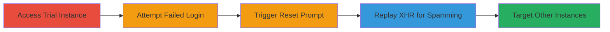

# Email Bombing via Unlimited Password Reset API in Nextcloud Trial Instances

Multi-stage attack chain demonstrating exploitation of Nextcloud demo instances' unlimited password reset email functionality to perform email bombing and denial-of-service against the admin's inbox.

## Chain Metrics Dashboard

| Metric | Value |
|--------|-------|
| Chain Status | Unverified |
| Total Steps | 5 |
| Execution Time | ~5 minutes |
| Skill Level | Intermediate |
| Complexity | Medium |
| Impact Level | High |

## Attack Flow Visualization

## Prerequisites & Requirements

### Required Tools

- [[tools/Chrome-Developer-Tools]]

### Target Environment

- Web platform
- Nextcloud trial/demo instances (e.g., https://demo.nextcloud.com/[instance])
- No specific ports required beyond standard HTTPS (443)
- Network access to public demo URLs

### Initial Access Requirements

- No credentials needed
- Public internet access
- Browser with developer tools (e.g., Chrome)

## Detailed Attack Procedures

### Step 1: Access a Nextcloud Instant Trial Instance
procedure: [[procedures/Access-Nextcloud-Trial-Instance-and-Trigger-Reset]]

**Objective**: Gain access to a vulnerable Nextcloud demo instance with a default admin user.

**Instructions**: Open a web browser and navigate to a Nextcloud trial URL, such as `https://demo.nextcloud.com/yourname`. These instances always include a default admin user.

**Expected Output**: The Nextcloud login page loads, showing the instance is accessible.

**Success Indicators**:
- Login page appears with admin username field
- No authentication barriers encountered

### Step 2: Attempt Login with Wrong Credentials
procedure: [[procedures/Access-Nextcloud-Trial-Instance-and-Trigger-Reset]]

**Objective**: Trigger the failed login to expose the password reset functionality.

**Instructions**: On the login page (e.g., `https://demo.nextcloud.com/yourname/login?user=admin`), enter username `admin` and an incorrect password (e.g., `xxxxx`). Submit the form.

**Expected Output**: Failed login message displayed, with a prompt to reset password.

**Success Indicators**:
- Error message for invalid credentials
- Password reset option becomes available

### Step 3: Trigger Password Reset Prompt
procedure: [[procedures/Access-Nextcloud-Trial-Instance-and-Trigger-Reset]]

**Objective**: Initiate the first password reset email to capture the API request.

**Instructions**: Click the "Reset password" link or button on the failed login screen. This sends a single reset email to the admin's configured address.

**Expected Output**: Confirmation message that a reset email has been sent.

**Success Indicators**:
- Reset prompt activates
- Single email sent (verifiable via network inspection)

### Step 4: Replay the XHR Request to Spam Emails
procedure: [[procedures/Replay-XHR-Request-to-Spam-Emails]]

**Objective**: Exploit the lack of rate limiting by repeatedly sending reset email requests, causing inbox flooding.

**Instructions**: Open Chrome Developer Tools (F12), go to the Network tab, and filter for XHR. Trigger the reset once to capture the request to `https://demo.nextcloud.com/yourname/lostpassword/email`. Right-click the request and select "Replay XHR" or copy as cURL and execute repeatedly in the console to send multiple emails rapidly.

**Expected Output**: Multiple POST requests to the API endpoint succeed without errors, resulting in numerous emails to the admin.

**Success Indicators**:
- Network tab shows repeated successful 200 OK responses
- Admin inbox receives spam (if accessible for verification)

### Step 5: Apply to Harm Other Instances
procedure: [[procedures/Replay-XHR-Request-to-Spam-Emails]]

**Objective**: Extend the attack to other non-owned trial instances for broader impact.

**Instructions**: Navigate to another trial instance (e.g., `https://demo.nextcloud.com/test`). If the admin has an email configured, repeat the login failure, reset trigger, and XHR replay steps using Developer Tools.

**Expected Output**: Successful spamming on the target instance's admin email.

**Success Indicators**:
- Requests succeed on new instance
- Potential DoS observed in target's email service

## Attack Chain Summary

### Key Achievements

1. Accessed vulnerable Nextcloud demo without authentication
2. Bypassed rate limits to spam unlimited reset emails
3. Caused denial-of-service to admin inbox via email bombing

## Technique & Tactic Coverage

### MITRE ATT&CK Techniques

- [[Exploit Public-Facing Application]]

### MITRE ATT&CK Tactics

- [[Execution]]
- [[Impact]]

---
*Last updated: 2023-10-01T00:00:00Z*
