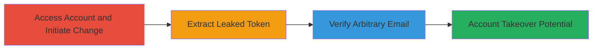

---
tags:
  - auth-bypass
  - token-leak
  - email-verification
  - account-takeover
  - shopify
type: attack_chain
tools: []
tactics:
  - '[[Initial Access]]'
  - '[[Defense Evasion]]'
verified: false
platforms:
  - Web
submitted: true
complexity: low
created_at: '2023-10-01T00:00:00Z'
procedures:
  - '[[procedures/Access-Shopify-Account-and-Initiate-Email-Change]]'
  - '[[procedures/Extract-Confirmation-Token-from-Resend-Link]]'
  - '[[procedures/Verify-Email-Using-Leaked-Token]]'
step_count: 3
techniques:
  - '[[Exploit Public-Facing Application]]'
  - '[[Valid Accounts]]'
updated_at: '2025-12-14T17:30:35.289Z'
description: >-
  A multi-step attack exploiting a token leak in Shopify's email change feature
  to verify and change email addresses without ownership, leading to potential
  account takeover.
skill_level: beginner
impact_level: high
id: f6082639-0b0c-4a7f-adbf-4d2c7251f78d
validated: true
mitre_tactics:
  - '[[Initial Access]]'
  - '[[Defense Evasion]]'
mitre_techniques:
  - '[[Exploit Public-Facing Application]]'
  - '[[Valid Accounts]]'
---
# Email Confirmation Token Leak Enabling Unauthorized Email Verification on Shopify Accounts

Multi-stage attack chain demonstrating exploitation of a vulnerability in Shopify's accounts.shopify.com email change feature, where the confirmation token is leaked in a resend link, allowing attackers to verify arbitrary email addresses without access to the inbox.

## Chain Metrics Dashboard

| Metric | Value |
|--------|-------|
| Chain Status | Unverified |
| Total Steps | 3 |
| Execution Time | ~5 minutes |
| Skill Level | Beginner |
| Complexity | Low |
| Impact Level | High |

## Attack Flow Visualization

## Prerequisites & Requirements

### Required Tools

- Web browser (e.g., Chrome, Firefox)

### Target Environment

- Web platform
- Access to https://accounts.shopify.com
- Valid Shopify account credentials for initial access

### Initial Access Requirements

- Valid login credentials to a Shopify account
- No special network access beyond standard internet
- No prior access needed beyond authentication

## Detailed Attack Procedures

### Step 1: Access Account and Initiate Email Change
procedure: [[procedures/Access-Shopify-Account-and-Initiate-Email-Change]]

**Objective**: Log in to the Shopify account page and start the email change process to trigger the vulnerable resend link generation.

**Instructions**: Navigate to the account page using a web browser and enter credentials. Then, locate the email field and initiate the change by clicking the 'Change' button. Input an arbitrary email address not owned by the attacker.

**Expected Output**: A verification message appears stating that an email has been sent to the new address, along with a resend link.

**Success Indicators**:
- Successful login to https://accounts.shopify.com/account
- Email change interface activated with input field for new email
- Verification message displayed after submitting new email

### Step 2: Extract Confirmation Token from Resend Link
procedure: [[procedures/Extract-Confirmation-Token-from-Resend-Link]]

**Objective**: Inspect the resend link in the verification message to capture the leaked confirmation token.

**Instructions**: After submitting the new email, observe the on-screen message which includes a resend link in the format https://accounts.shopify.com/email-change/<Confirmation-TOKEN>/resend. Right-click or inspect the link to copy the full URL and extract the token value.

**Expected Output**: The full resend URL with the exposed token, e.g., https://accounts.shopify.com/email-change/abc123def456/resend.

**Success Indicators**:
- Resend link visible in the UI
- Token successfully extracted from the URL path

### Step 3: Verify Email Using Leaked Token
procedure: [[procedures/Verify-Email-Using-Leaked-Token]]

**Objective**: Use the extracted token to directly confirm the email change without accessing the target inbox, bypassing ownership verification.

**Instructions**: Modify the resend URL by removing '/resend' to form https://accounts.shopify.com/email-change/<TOKEN>/ and navigate to it in the browser. The system will process the token and confirm the email change.

**Expected Output**: The email address is updated in the account without requiring email receipt or click.

**Success Indicators**:
- Successful navigation to the confirmation endpoint
- Email change confirmed and applied to the account
- No email access required for verification

## Attack Chain Summary

### Key Achievements

1. Gained ability to verify arbitrary emails without ownership
2. Bypassed Shopify's email ownership verification mechanism
3. Enabled potential account takeover via unauthorized email changes

## Technique & Tactic Coverage

### MITRE ATT&CK Techniques

- [[Exploit Public-Facing Application]] Exploit Public-Facing Application
- [[Valid Accounts]] Valid Accounts

### MITRE ATT&CK Tactics

- [[Initial Access]] Initial Access
- [[Defense Evasion]] Defense Evasion

---
*Last updated: 2023-10-01T00:00:00Z*
