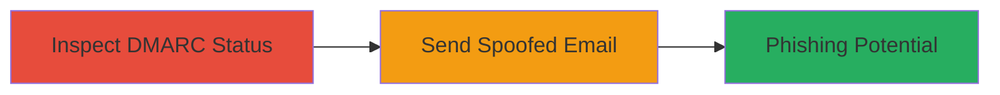

# Email Spoofing via Missing DMARC Policy on paragonie.com

Multi-stage attack chain demonstrating how the lack of a DMARC record for paragonie.com enables email spoofing, allowing attackers to impersonate legitimate addresses for phishing or social engineering.

## Chain Metrics Dashboard

| Metric | Value |
|--------|-------|
| Chain Status | Unverified |
| Total Steps | 2 |
| Execution Time | ~5 minutes |
| Skill Level | Beginner |
| Complexity | Low |
| Impact Level | Medium |

## Attack Flow Visualization

## Prerequisites & Requirements

### Required Tools

- [[tools/DMARC-Inspector]]

### Target Environment

- DNS resolution for the target domain (paragonie.com)
- Email sending capability (e.g., via SMTP client or online service)
- No special ports required beyond standard DNS (53) and SMTP (25/587)

### Initial Access Requirements

- Public internet access
- No credentials needed for inspection; email sending may require an SMTP account

## Detailed Attack Procedures

### Step 1: Inspect DMARC Status
procedure: [[procedures/Inspect-Domain-DMARC-Status]]

**Objective**: Verify the absence of a DMARC policy to confirm spoofing feasibility.

**Instructions**: Use the DMARC Inspector tool to query the _dmarc subdomain TXT record for paragonie.com.

Navigate to the tool's website and enter "paragonie.com" to analyze DNS records.

**Expected Output**: Confirmation of no DMARC policy, with details on SPF and DKIM if present.

**Success Indicators**:
- No DMARC TXT record found under _dmarc.paragonie.com
- Tool reports policy as "none" or absent

### Step 2: Demonstrate Spoofing
procedure: [[procedures/Demonstrate-Email-Spoofing]]

**Objective**: Send a spoofed email from a paragonie.com address to show authentication bypass.

**Instructions**: Use an email client or SMTP tool to forge the From header as scott@paragonie.com or security@paragonie.com, sending to an external address like abcd@example.com. Check receiver-side authentication (e.g., Gmail headers) to confirm failure.

**Expected Output**: Email delivered with spoofed sender, but authentication tests (SPF/DKIM/DMARC) fail, allowing it to appear legitimate without rejection.

**Success Indicators**:
- Email received with forged From address
- Receiver's spam filter does not block due to missing DMARC enforcement

## Attack Chain Summary

### Key Achievements

1. Confirmed missing DMARC policy via DNS inspection
2. Successfully demonstrated spoofed email delivery
3. Highlighted phishing risk despite company's GPG reliance

## Technique & Tactic Coverage

### MITRE ATT&CK Techniques

- [[Phishing]] Phishing
- [[Valid Accounts]] Valid Accounts

### MITRE ATT&CK Tactics

- [[Initial Access]] Initial Access

---
*Last updated: 2023-10-01T12:00:00Z*
