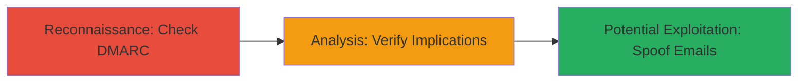

# Email Spoofing via Missing DMARC Record

Multi-stage attack chain demonstrating the discovery of a missing DMARC policy, enabling potential email spoofing and phishing attacks.

## Chain Metrics Dashboard

| Metric | Value |
|--------|-------|
| Chain Status | Unverified |
| Total Steps | 2 |
| Execution Time | ~5 minutes |
| Skill Level | Beginner |
| Complexity | Low |
| Impact Level | Medium |

## Attack Flow Visualization

## Prerequisites & Requirements

### Required Tools

- [[tools/DMARC-Inspector]]

### Target Environment

- Domain with email services (e.g., paragonie.com)
- Access to DNS query tools or online inspectors
- No special ports required; uses standard DNS (port 53)

### Initial Access Requirements

- Public internet access
- No credentials needed for DNS queries
- Domain name resolution

## Detailed Attack Procedures

### Step 1: Check for DMARC Record
procedure: [[procedures/Check-for-DMARC-Record]]

**Objective**: Query the domain's DNS to determine if a DMARC policy is published.

**Instructions**: Use the DMARC Inspector tool to query TXT records for _dmarc.paragonie.com:

Navigate to the tool's URL and enter the domain name.

**Expected Output**: Confirmation of 'No DMARC record published' if absent.

**Success Indicators**:
- No DMARC TXT record found
- Tool reports absence of policy

### Step 2: Verify Missing DMARC Implications
procedure: [[procedures/Verify-Missing-DMARC-Implications]]

**Objective**: Analyze the lack of DMARC and understand how it enables spoofing.

**Instructions**: Review the tool's output for authentication failures and simulate spoofed email scenarios mentally or with email testing tools.

**Expected Output**: Explanation of risks like non-aligned emails passing as legitimate.

**Success Indicators**:
- Identification of spoofing risks
- Confirmation that SPF/DKIM alone are insufficient without DMARC

## Attack Chain Summary

### Key Achievements

1. Discovered missing DMARC policy on paragonie.com
2. Highlighted phishing and reputation damage risks
3. Noted mitigation via GPG signatures

## Technique & Tactic Coverage

### MITRE ATT&CK Techniques

- [[Hardware]] Gather Victim Network Information
- [[Phishing]] Phishing

### MITRE ATT&CK Tactics

- [[Reconnaissance]] Reconnaissance
- [[Initial Access]] Initial Access

---
*Last updated: 2023-10-01T00:00:00Z*
