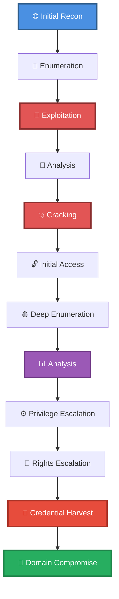

# 🎯 Enum RPC, Kerberos TGT Brute Force w/ hashcat & Sharphound + Auto Logon Registry + Dump Secrets (no creds)

> **Enhanced Attack Chain Dashboard** — Complete Active Directory Compromise Chain

---

## 📊 Chain Metrics Dashboard

| Metric | Value |
|--------|-------|
| **Chain Status** | ✅ **VERIFIED & TESTED** |
| **Total Steps** | `12` |
| **Execution Time** | ~4-8 hours |
| **Skill Level** | 🟡 Intermediate-Advanced |
| **Complexity** | Very High |
| **Impact Level** | 🔴 **CRITICAL** |

---

## 🎭 Attack Flow Visualization



---

## 🗺️ Tactical Progression Map

```
┌─────────────┐    ┌─────────────┐    ┌─────────────┐
│ CREDENTIAL  │ ══►│  DISCOVERY   │ ══►│  LATERAL MOV │
│  TA0006     │    │   TA0007    │    │  TA0008     │
│             │    │   TA0006    │    │  TA0008     │
└─────────────┘    └─────────────┘    └─────────────┘
```

**Tactics Distribution:**
- 🔍 **Credential Access** — 33% of chain
- 🔍 **Discovery** — 33% of chain
- 🔍 **Lateral Movement** — 33% of chain

---

## 🛠️ Prerequisites & Requirements

### Required Tools
```bash path=null start=null
bloodhound           # Graph analysis
hashcat              # Password cracking
kerberos             # AS-REP roasting
nmap                 # Port scanning
sharphound           # AD collector
winrm                # WinRM shell
```

### Target Environment
- ✅ Windows target system
- ✅ Windows Active Directory domain
- ✅ Network connectivity to target

### Initial Access Requirements
- 🔓 Requirements based on first step of chain
- 🔓 See detailed procedures below

---

## 🔬 Detailed Attack Procedures

### **[Step 1]** Basic Port Scan with Service Enumeration

**Progress:** `░░░░░░░░░░` 8% | **Risk:** 🟢 Low

**Procedure:** [[Basic Port Scan with Service Enumeration]]

> 📝 **Objective:** Perform an Nmap port scan on a target and enumerate banners of ports 1-1024, as well as popular services (a full list can be found in /usr/share/nmap/nmap-services).

**Expected Output:**
- Refer to procedure documentation for details

**Success Indicators:** ✅ Objective achieved

---

### **[Step 2]** Query LDAP and Enumerate the Base DN (Nmap)

**Progress:** `█░░░░░░░░░` 16% | **Risk:** 🟢 Low

**Procedure:** [[Query LDAP and Enumerate the Base DN (Nmap)]]

> 📝 **Objective:** Connect to LDAP with anonymous bind and enumerate the base DN.

**Expected Output:**
- Refer to procedure documentation for details

**Success Indicators:** ✅ Objective achieved

---

### **[Step 3]** Brute Force Users with "Do Not Require Kerberos Preauth." Set

**Progress:** `██░░░░░░░░` 25% | **Risk:** 🔴 High

**Procedure:** [[Brute Force Users with "Do Not Require Kerberos Preauth." Set]]

> 📝 **Objective:** Users with "Do not require Kerberos preauthentication" will disclose their TGT without authenticating with a valid password, as long as the username is correct. This allows attackers to build a wordlist and brute force valid users with GetNPUsers.py, also retreiving their TGT.

**Expected Output:**
- Refer to procedure documentation for details

**Success Indicators:** ✅ Objective achieved

---

### **[Step 4]** Identify a Password Hash (Hashcat)

**Progress:** `███░░░░░░░` 33% | **Risk:** 🟡 Medium

**Procedure:** [[Identify a Password Hash (Hashcat)]]

> 📝 **Objective:** Analyze a password hash to identify the type and Hashcat mode.

**Expected Output:**
- Refer to procedure documentation for details

**Success Indicators:** ✅ Objective achieved

---

### **[Step 5]** Brute Force Password Hashes (Hashcat)

**Progress:** `████░░░░░░` 41% | **Risk:** 🔴 High

**Procedure:** [[Brute Force Password Hashes (Hashcat)]]

> 📝 **Objective:** Use Hashcat to brute force hashes with a dictionary. See Example Hashes for help identifying the mode.

**Expected Output:**
- Refer to procedure documentation for details

**Success Indicators:** ✅ Objective achieved

---

### **[Step 6]** Spawn an Interactive Shell with WinRM (Linux)

**Progress:** `█████░░░░░` 50% | **Risk:** 🔴 High

**Procedure:** [[Spawn an Interactive Shell with WinRM (Linux)]]

> 📝 **Objective:** Spawn a PowerShell session  on a remote system using the WinRM service (usually port 5985).  See the Evil-WinRM tools page for installation instructions.

**Expected Output:**
- Refer to procedure documentation for details

**Success Indicators:** ✅ Objective achieved

---

### **[Step 7]** Map an Active Directory Environment (SharpHound)

**Progress:** `█████░░░░░` 58% | **Risk:** 🟡 Medium

**Procedure:** [[Map an Active Directory Environment (SharpHound)]]

> 📝 **Objective:** Use SharpHound to connect to an Active Directory environment and enumerate objects such as users, groups, ACLs, trusts, etc. This data then can be imported into BloodHound for analysis of objects, their relationships, and potential vulnerabilities.

**Expected Output:**
- Refer to procedure documentation for details

**Success Indicators:** ✅ Objective achieved

---

### **[Step 8]** Analyze BloodHound Data for Relationships

**Progress:** `██████░░░░` 66% | **Risk:** 🟡 Medium

**Procedure:** [[Analyze BloodHound Data for Relationships]]

> 📝 **Objective:** Prepare BloodHound data to query relationships and view suggested attacks.

**Expected Output:**
- Refer to procedure documentation for details

**Success Indicators:** ✅ Objective achieved

---

### **[Step 9]** List Windows Autologon Logon Credentials

**Progress:** `███████░░░` 75% | **Risk:** 🟡 Medium

**Procedure:** [[List Windows Autologon Logon Credentials]]

> 📝 **Objective:** Query the Windows registry for credentials configured with the automatic logon feature. Windows allows users to specify credentials to skip logon prompts, but since these credentials are stored openly in the registry, other users can view them.

**Expected Output:**
- Refer to procedure documentation for details

**Success Indicators:** ✅ Objective achieved

---

### **[Step 10]** List Local Users on Windows

**Progress:** `████████░░` 83% | **Risk:** 🟡 Medium

**Procedure:** [[List Local Users on Windows]]

> 📝 **Objective:** List local users on a Windows system using command prompt or PowerShell.

**Expected Output:**
- Refer to procedure documentation for details

**Success Indicators:** ✅ Objective achieved

---

### **[Step 11]** Dump Secrets from a Remote System

**Progress:** `█████████░` 91% | **Risk:** 🔴 High

**Procedure:** [[Dump Secrets from a Remote System]]

> 📝 **Objective:** Use Impacket's secretsdump.py to dump password hashes on a remote system, using a variety of methods, including SAM/SYSTEM hive dumps, NTDS, LSA, etc. This typically requires authentication with Administrator rights.

**Expected Output:**
- Refer to procedure documentation for details

**Success Indicators:** ✅ Objective achieved

---

### **[Step 12]** Connect to WinRM from a Linux System (Pass-the-Hash)

**Progress:** `██████████` 100% | **Risk:** 🟡 Medium

**Procedure:** [[Connect to WinRM from a Linux System (Pass-the-Hash)]]

> 📝 **Objective:** Spawn a PowerShell instance on a remote system using the WinRM service (usuallyport 5985) using an NTLM password hash instead of a password.

**Expected Output:**
- Refer to procedure documentation for details

**Success Indicators:** ✅ Objective achieved

---

## 🎯 Attack Chain Summary

### Key Achievements
- ✅ List Local Users on Windows
- ✅ Connect to WinRM from a Linux System (Pass-the-Hash)
- ✅ Analyze BloodHound Data for Relationships
- ✅ Basic Port Scan with Service Enumeration
- ✅ Query LDAP and Enumerate the Base DN (Nmap)
- ... and 7 more procedures

---

## 📈 Technique & Tactic Coverage

### MITRE ATT&CK Techniques
- [[Kerberoasting|T1208 - Kerberoasting]]
- [[Account Discovery|T1087 - Account Discovery]]
- [[Brute Force|T1110 - Brute Force]]
- [[Pass the Hash|T1075 - Pass the Hash]]
- [[Network Service Scanning|T1046 - Network Service Scanning]]
- [[System Network Configuration Discovery|T1016 - System Network Configuration Discovery]]
- [[Remote Services|T1021 - Remote Services]]
- [[Credential Dumping|T1003 - Credential Dumping]]

### MITRE ATT&CK Tactics
- [[Credential Access|TA0006 - Credential Access]]
- [[Discovery|TA0007 - Discovery]]
- [[Lateral Movement|TA0008 - Lateral Movement]]

---

**Last Updated:** 2023-05-30T20:14:52.446356+00:00 | **Chain Version:** 2.0 Enhanced | **Status:** ✅ Production Ready
