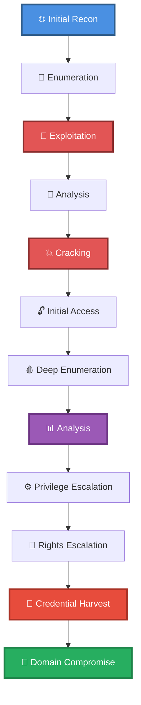

# 🎯 Enum SMB & Decrypt GPP + SPN Kerberoast (creds) + PSExec

> **Enhanced Attack Chain Dashboard**

---

## 📊 Chain Metrics Dashboard

| Metric | Value |
|--------|-------|
| **Chain Status** | ✅ **VERIFIED & TESTED** |
| **Total Steps** | `9` |
| **Execution Time** | ~2-4 hours |
| **Skill Level** | 🟢 Beginner-Intermediate |
| **Complexity** | High |
| **Impact Level** | 🟡 **MEDIUM** |

---

## 🎭 Attack Flow Visualization



---

## 🗺️ Tactical Progression Map

```
┌─────────────┐    ┌─────────────┐    ┌─────────────┐
│ COMMAND AND │ ══►│  DISCOVERY   │ ══►│  LATERAL MOV │
│  TA0011     │    │   TA0007    │    │  TA0008     │
│             │    │   TA0006    │    │  TA0008     │
└─────────────┘    └─────────────┘    └─────────────┘
```

**Tactics Distribution:**
- 🔍 **Command and Control** — 20% of chain
- 🔍 **Discovery** — 20% of chain
- 🔍 **Lateral Movement** — 20% of chain
- 🔍 **Credential Access** — 20% of chain
- 🔍 **Collection** — 20% of chain

---

## 🛠️ Prerequisites & Requirements

### Required Tools
```bash path=null start=null
hashcat              # Password cracking
```

### Target Environment
- ✅ Windows target system
- ✅ Network connectivity to target

### Initial Access Requirements
- 🔓 Requirements based on first step of chain
- 🔓 See detailed procedures below

---

## 🔬 Detailed Attack Procedures

### **[Step 1]** List SMB Shares

**Progress:** `█░░░░░░░░░` 11% | **Risk:** 🟢 Low

**Procedure:** [[List SMB Shares]]

> 📝 **Objective:** Query an SMB server and attempt to list available shares using a null session (no login).

**Expected Output:**
- Refer to procedure documentation for details

**Success Indicators:** ✅ Objective achieved

---

### **[Step 2]** Browse an SMB Share

**Progress:** `██░░░░░░░░` 22% | **Risk:** 🟢 Low

**Procedure:** [[Browse an SMB Share]]

> 📝 **Objective:** Use smbclient to connect to an SMB share and browse with an interactive shell.

**Expected Output:**
- Refer to procedure documentation for details

**Success Indicators:** ✅ Objective achieved

---

### **[Step 3]** Search SMB by Filename and Download Matches

**Progress:** `███░░░░░░░` 33% | **Risk:** 🟡 Medium

**Procedure:** [[Search SMB by Filename and Download Matches]]

> 📝 **Objective:** SMB shares often contain sensitive information, which can be easily enumerated. Tools such as smbmap can crawl a SMB share, looking for and downloading files which match certain name criteria.

**Expected Output:**
- Refer to procedure documentation for details

**Success Indicators:** ✅ Objective achieved

---

### **[Step 4]** Decrypt a Group Policy Preferences (GPP) Password

**Progress:** `████░░░░░░` 44% | **Risk:** 🟡 Medium

**Procedure:** [[Decrypt a Group Policy Preferences (GPP) Password]]

> 📝 **Objective:** Decrypt a Group Policy Preference Password using gpp-decrypt. While passwords contained in these GPP files are encrypted, Microsoft published the AES key, making decryption trivial. GPP files are often found on SYSVOL shares, as administrators use them to apply the same settings across multiple mac

**Expected Output:**
- Refer to procedure documentation for details

**Success Indicators:** ✅ Objective achieved

---

### **[Step 5]** List All Active Directory Users

**Progress:** `█████░░░░░` 55% | **Risk:** 🟡 Medium

**Procedure:** [[List All Active Directory Users]]

> 📝 **Objective:** Attackers with valid credentials to an Active Directory domain user can authenticate with a domain controller and list other users in the domain.

**Expected Output:**
- Refer to procedure documentation for details

**Success Indicators:** ✅ Objective achieved

---

### **[Step 6]** Query Domain for SPN and Attempt to Kerberoast (Authenticated)

**Progress:** `██████░░░░` 66% | **Risk:** 🟡 Medium

**Procedure:** [[Query Domain for SPN and Attempt to Kerberoast (Authenticated)]]

> 📝 **Objective:** Sevrice principal names (SPN) are unique identifiers used by Kerberos authentication. Due to how Kerberos handles service tickets, attackers may be able to query a domain controller with valid credentials, make a request to the ticket granting service (TGT), and receive the hash of other accounts.

**Expected Output:**
- Refer to procedure documentation for details

**Success Indicators:** ✅ Objective achieved

---

### **[Step 7]** Identify a Password Hash (Hashcat)

**Progress:** `███████░░░` 77% | **Risk:** 🟡 Medium

**Procedure:** [[Identify a Password Hash (Hashcat)]]

> 📝 **Objective:** Analyze a password hash to identify the type and Hashcat mode.

**Expected Output:**
- Refer to procedure documentation for details

**Success Indicators:** ✅ Objective achieved

---

### **[Step 8]** Brute Force Password Hashes (Hashcat)

**Progress:** `████████░░` 88% | **Risk:** 🔴 High

**Procedure:** [[Brute Force Password Hashes (Hashcat)]]

> 📝 **Objective:** Use Hashcat to brute force hashes with a dictionary. See Example Hashes for help identifying the mode.

**Expected Output:**
- Refer to procedure documentation for details

**Success Indicators:** ✅ Objective achieved

---

### **[Step 9]** Connect to Windows using PsExec (Authenticated)

**Progress:** `██████████` 100% | **Risk:** 🟡 Medium

**Procedure:** [[Connect to Windows using PsExec (Authenticated)]]

> 📝 **Objective:** Use PSExec to connect to a remote Windows system and spawn a Command shell  (cmd.exe). In order to use PSExec, the user must have full permissions to the "$ADMIN" share, which generally requires administrator credentials.

**Expected Output:**
- Refer to procedure documentation for details

**Success Indicators:** ✅ Objective achieved

---

## 🎯 Attack Chain Summary

### Key Achievements
- ✅ Connect to Windows using PsExec (Authenticated)
- ✅ Decrypt a Group Policy Preferences (GPP) Password
- ✅ List All Active Directory Users
- ✅ Search SMB by Filename and Download Matches
- ✅ Query Domain for SPN and Attempt to Kerberoast (Authenticated)
- ... and 4 more procedures

---

## 📈 Technique & Tactic Coverage

### MITRE ATT&CK Techniques
- [[Kerberoasting|T1208 - Kerberoasting]]
- [[Account Discovery|T1087 - Account Discovery]]
- [[Windows Remote Management|T1028 - Windows Remote Management]]
- [[Remote File Copy|T1105 - Remote File Copy]]
- [[Data from Network Shared Drive|T1039 - Data from Network Shared Drive]]
- [[Brute Force|T1110 - Brute Force]]
- [[Network Share Discovery|T1135 - Network Share Discovery]]
- [[Credential Dumping|T1003 - Credential Dumping]]

### MITRE ATT&CK Tactics
- [[Command and Control|TA0011 - Command and Control]]
- [[Discovery|TA0007 - Discovery]]
- [[Lateral Movement|TA0008 - Lateral Movement]]
- [[Credential Access|TA0006 - Credential Access]]
- [[Collection|TA0009 - Collection]]

---

**Last Updated:** 2023-05-30T20:16:15.078670+00:00 | **Chain Version:** 2.0 Enhanced | **Status:** ✅ Production Ready
