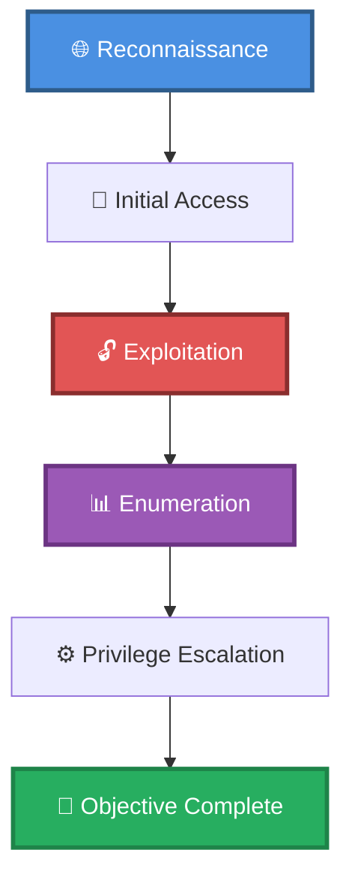

# 🎯 Enum and brute force SMB using RID (creds), WinRM, w/ Remote Shell

> **Enhanced Attack Chain Dashboard**

---

## 📊 Chain Metrics Dashboard

| Metric | Value |
|--------|-------|
| **Chain Status** | ✅ **VERIFIED & TESTED** |
| **Total Steps** | `7` |
| **Execution Time** | ~2-4 hours |
| **Skill Level** | 🔴 Advanced |
| **Complexity** | High |
| **Impact Level** | 🟠 **HIGH** |

---

## 🎭 Attack Flow Visualization



---

## 🗺️ Tactical Progression Map

```
┌─────────────┐    ┌─────────────┐    ┌─────────────┐
│ DISCOVERY   │ ══►│  LATERAL MOV │ ══►│  CREDENTIAL  │
│  TA0007     │    │   TA0008    │    │  TA0006     │
│             │    │   TA0006    │    │  TA0008     │
└─────────────┘    └─────────────┘    └─────────────┘
```

**Tactics Distribution:**
- 🔍 **Discovery** — 20% of chain
- 🔍 **Lateral Movement** — 20% of chain
- 🔍 **Credential Access** — 20% of chain
- 🔍 **Collection** — 20% of chain
- 🔍 **Organizational Information Gathering** — 20% of chain

---

## 🛠️ Prerequisites & Requirements

### Required Tools
```bash path=null start=null
winrm                # WinRM shell
```

### Target Environment
- ✅ Windows target system
- ✅ Network connectivity to target

### Initial Access Requirements
- 🔓 Requirements based on first step of chain
- 🔓 See detailed procedures below

---

## 🔬 Detailed Attack Procedures

### **[Step 1]** Build a User List from a Public Webpage

**Progress:** `█░░░░░░░░░` 14% | **Risk:** 🟢 Low

**Procedure:** [[Build a User List from a Public Webpage]]

> 📝 **Objective:** Administrators will often create user names following predictable patterns, making it possible for attackers to guess at valid names. This procedure will go over popular naming schemes for building potential user lists from a public website, which can be then used to brute force logins.

**Expected Output:**
- Refer to procedure documentation for details

**Success Indicators:** ✅ Objective achieved

---

### **[Step 2]** Brute Force SMB Usernames and Passwords

**Progress:** `██░░░░░░░░` 28% | **Risk:** 🟢 Low

**Procedure:** [[Brute Force SMB Usernames and Passwords]]

> 📝 **Objective:** Various tools can be used to brute force valid username and password combinations of exposed SMB shares, and is a common approach when attacking Active Directory environments. This attack is noisy, and should be avoided is stealth is a requirement.

**Expected Output:**
- Refer to procedure documentation for details

**Success Indicators:** ✅ Objective achieved

---

### **[Step 3]** Brute Force SMB Users Using RID (Authenticated)

**Progress:** `████░░░░░░` 42% | **Risk:** 🔴 High

**Procedure:** [[Brute Force SMB Users Using RID (Authenticated)]]

> 📝 **Objective:** Various tools can be used to brute force valid SMB users using their relative identifier (RID). This allows attackers to easily enumerate additional users on a system with which they've already authenticated.

**Expected Output:**
- Refer to procedure documentation for details

**Success Indicators:** ✅ Objective achieved

---

### **[Step 4]** Spawn an Interactive Shell with WinRM (Linux)

**Progress:** `█████░░░░░` 57% | **Risk:** 🔴 High

**Procedure:** [[Spawn an Interactive Shell with WinRM (Linux)]]

> 📝 **Objective:** Spawn a PowerShell session  on a remote system using the WinRM service (usually port 5985).  See the Evil-WinRM tools page for installation instructions.

**Expected Output:**
- Refer to procedure documentation for details

**Success Indicators:** ✅ Objective achieved

---

### **[Step 5]** Dump a Process's Memory (PowerShell)

**Progress:** `███████░░░` 71% | **Risk:** 🔴 High

**Procedure:** [[Dump a Process's Memory (PowerShell)]]

> 📝 **Objective:** Dump a process's memory  into a file using PowerSploit's Out-Minidump cmdlet.

**Expected Output:**
- Refer to procedure documentation for details

**Success Indicators:** ✅ Objective achieved

---

### **[Step 6]** Find Interesting Strings in a Raw Memory Dump

**Progress:** `████████░░` 85% | **Risk:** 🔴 High

**Procedure:** [[Find Interesting Strings in a Raw Memory Dump]]

> 📝 **Objective:** Basic enumeration of human readable strings can quickly provide information from a raw memory dump. Depending on the source, a dump may include usernames and passwords, encryption keys, cookies, library calls, etc, all of which can be easily identified without the need for more sophisticated analys

**Expected Output:**
- Refer to procedure documentation for details

**Success Indicators:** ✅ Objective achieved

---

### **[Step 7]** Spawn an Interactive Shell with WinRM (Linux)

**Progress:** `██████████` 100% | **Risk:** 🔴 High

**Procedure:** [[Spawn an Interactive Shell with WinRM (Linux)]]

> 📝 **Objective:** Spawn a PowerShell session  on a remote system using the WinRM service (usually port 5985).  See the Evil-WinRM tools page for installation instructions.

**Expected Output:**
- Refer to procedure documentation for details

**Success Indicators:** ✅ Objective achieved

---

## 🎯 Attack Chain Summary

### Key Achievements
- ✅ Brute Force SMB Users Using RID (Authenticated)
- ✅ Find Interesting Strings in a Raw Memory Dump
- ✅ Build a User List from a Public Webpage
- ✅ Dump a Process's Memory (PowerShell)
- ✅ Spawn an Interactive Shell with WinRM (Linux)
- ... and 1 more procedures

---

## 📈 Technique & Tactic Coverage

### MITRE ATT&CK Techniques
- [[Account Discovery|T1087 - Account Discovery]]
- [[Windows Remote Management|T1028 - Windows Remote Management]]
- [[Brute Force|T1110 - Brute Force]]
- [[Data from Local System|T1005 - Data from Local System]]
- [[Acquire OSINT data sets and information|T1277 - Acquire OSINT data sets and information]]

### MITRE ATT&CK Tactics
- [[Discovery|TA0007 - Discovery]]
- [[Lateral Movement|TA0008 - Lateral Movement]]
- [[Credential Access|TA0006 - Credential Access]]
- [[Collection|TA0009 - Collection]]
- [[Organizational Information Gathering|TA0017 - Organizational Information Gathering]]

---

**Last Updated:** 2023-05-30T20:16:01.720164+00:00 | **Chain Version:** 2.0 Enhanced | **Status:** ✅ Production Ready
