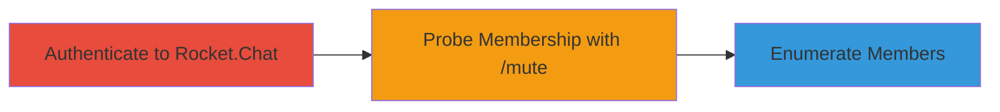

---
tags:
  - information-disclosure
  - rocket-chat
  - channel-enumeration
  - membership-leak
type: attack_chain
tools: []
tactics:
  - '[[Discovery]]'
verified: false
platforms:
  - Web
submitted: true
created_at: '2023-10-01T00:00:00Z'
procedures:
  - '[[procedures/Disclose-Private-Channel-Membership-Using-Mute-Command]]'
step_count: 1
techniques:
  - '[[Account Discovery]]'
updated_at: '2025-12-14T17:28:51.870Z'
description: >-
  An authenticated user exploits a vulnerability in Rocket.Chat's /mute slash
  command to disclose membership status of private channels they lack access to,
  enabling unauthorized enumeration of channel members.
id: 0d6a0891-b8f9-4109-aef3-6d2ef6da3708
validated: true
mitre_tactics:
  - '[[Discovery]]'
mitre_techniques:
  - '[[Account Discovery]]'
---
# Enumerate Private Channel Members via /mute Command in Rocket.Chat

Multi-stage attack chain demonstrating a complete attack workflow.

## Chain Metrics Dashboard

| Metric | Value |
|--------|-------|
| Chain Status | Unverified |
| Total Steps | 1 |
| Execution Time | ~1 minutes |
| Skill Level | Intermediate |
| Complexity | Medium |
| Impact Level | Medium |

## Attack Flow Visualization

## Prerequisites & Requirements

### Required Tools

- None (uses built-in Rocket.Chat interface)

### Target Environment

- Rocket.Chat web application
- Required services/ports: HTTPS (443)
- Network access requirements: Valid authenticated session

### Initial Access Requirements

- Credential requirements: Valid user account on the Rocket.Chat instance
- Network position: Direct access to the Rocket.Chat server
- Prior access needed: Authentication to the platform

## Detailed Attack Procedures

### Step 1: Authenticate and Probe Channel Membership
procedure: [[procedures/Disclose-Private-Channel-Membership-Using-Mute-Command]]

**Objective**: Use the /mute command in a private channel to leak membership information of target users in channels without access.

**Instructions**: Log in to the Rocket.Chat web interface with a valid account. Navigate to any private channel you have access to (or create one if needed). In the message input field, attempt to execute the /mute command targeting a suspected user from a private channel you cannot access, e.g., type `/mute @suspectedusername` and submit. Observe the response: if the user is a member of the target private channel, the command will indicate membership before ACL denial; otherwise, it will fail differently.

**Expected Output**: Error message revealing membership status, such as "User is already muted" or direct confirmation of presence in the channel context.

**Success Indicators**:
- Response leaks whether the target user is in the private channel
- Ability to systematically probe multiple usernames to enumerate members

## Attack Chain Summary

### Key Achievements

1. Unauthorized disclosure of private channel membership
2. Enumeration of sensitive user groupings without direct access
3. Potential for broader reconnaissance in collaborative environments

## Technique & Tactic Coverage

### MITRE ATT&CK Techniques

- [[Account Discovery]]

### MITRE ATT&CK Tactics

- [[Discovery]]

---
*Last updated: 2023-10-01T00:00:00Z*
