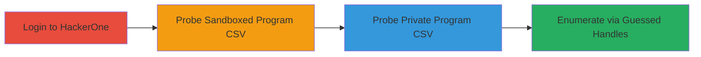

# Enumerate Private HackerOne Programs via CSV Endpoint Response Differences

Multi-stage attack chain demonstrating a complete attack workflow for information disclosure on the HackerOne platform.

## Chain Metrics Dashboard

| Metric | Value |
|--------|-------|
| Chain Status | Unverified |
| Total Steps | 3 |
| Execution Time | ~5 minutes |
| Skill Level | Beginner |
| Complexity | Low |
| Impact Level | Medium |

## Attack Flow Visualization

## Prerequisites & Requirements

### Required Tools

- Web browser (e.g., Chrome or Firefox)

### Target Environment

- HackerOne platform (web application)
- No specific ports or services beyond standard HTTPS (443)

### Initial Access Requirements

- Valid logged-in HackerOne account (any user level)
- Knowledge of potential program handles (guessed or from public sources)
- Network access to hackerone.com

## Detailed Attack Procedures

### Step 1: Access CSV Endpoint for Known Sandboxed Program
procedure: [[procedures/Distinguish-HackerOne-Program-Types-via-CSV-Endpoint]]

**Objective**: Confirm successful access to the CSV endpoint for a sandboxed program, establishing baseline response for public/sandboxed handles.

**Instructions**: Log in to your HackerOne account, then navigate to the CSV download URL for a known sandboxed program handle, such as `test_pie77`. Use your browser to directly access the endpoint.

**Expected Output**: The browser downloads a CSV file containing default text (e.g., terms acceptance data), indicating success without errors.

**Success Indicators**:
- CSV file downloads successfully
- No error page or redirect; file contains expected content

### Step 2: Observe Response for Sandboxed Program Confirmation
procedure: [[procedures/Distinguish-HackerOne-Program-Types-via-CSV-Endpoint]]

**Objective**: Validate that the response confirms the program is sandboxed and accessible, setting up the differential for private programs.

**Instructions**: After downloading the CSV, inspect the file content to ensure it loads without issues. Note the HTTP response (200 OK) and file delivery.

**Expected Output**: CSV file opens in a spreadsheet or text editor showing default or empty terms data.

**Success Indicators**:
- File downloads and parses correctly
- Response time is normal; no access denied messages

### Step 3: Probe Endpoint with Private Program Handle
procedure: [[procedures/Distinguish-HackerOne-Program-Types-via-CSV-Endpoint]]

**Objective**: Attempt access with a guessed or suspected private program handle to observe the distinct error response, confirming existence and privacy status.

**Instructions**: Replace the handle in the URL with a private program's handle (e.g., a guessed one like `secret_program`). Access `https://hackerone.com/{private_handle}/terms_acceptance_data.csv` in the browser.

**Expected Output**: The request fails with a non-404 error (e.g., access denied or custom message), differing from sandboxed responses.

**Success Indicators**:
- Distinct error response (not standard 404)
- Confirmation of program existence without full access

## Attack Chain Summary

### Key Achievements

1. Successfully download CSV for sandboxed programs, confirming baseline access.
2. Identify differential responses for private programs, enabling existence confirmation.
3. Enumerate private programs by scripting or manually guessing handles, compromising program confidentiality.

## Technique & Tactic Coverage

### MITRE ATT&CK Techniques

- [[Active Scanning]] Active Scanning
- [[Account Discovery]] Account Discovery

### MITRE ATT&CK Tactics

- [[Reconnaissance]] Reconnaissance
- [[Discovery]] Discovery

---
*Last updated: 2023-10-01T00:00:00Z*
