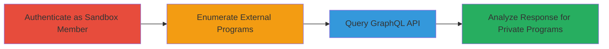

# Enumerate Private HackerOne Programs via GraphQL Remaining Reports Disclosure

Multi-stage attack chain demonstrating a complete attack workflow to disclose hidden private programs on HackerOne by leveraging an authenticated GraphQL query against the remaining_reports field.

## Chain Metrics Dashboard

| Metric | Value |
|--------|-------|
| Chain Status | Unverified |
| Total Steps | 4 |
| Execution Time | ~10 minutes |
| Skill Level | Intermediate |
| Complexity | Medium |
| Impact Level | High |

## Attack Flow Visualization



## Prerequisites & Requirements

### Required Tools

- None (uses standard HTTP client like curl)

### Target Environment

- HackerOne platform
- Web-based GraphQL API
- No specific ports required (HTTPS/443)

### Initial Access Requirements

- HackerOne account
- Ability to join a sandbox program for authentication
- Network access to hackerone.com

## Detailed Attack Procedures

### Step 1: Authenticate as Sandbox Team Member
procedure: [[procedures/Authenticate-as-Sandbox-Team-Member]]

**Objective**: Gain authenticated access to the GraphQL API by becoming a member of a sandbox team.

**Instructions**: Register a HackerOne account if needed and join any sandbox program to obtain necessary permissions.

**Expected Output**: Successful login and team membership confirmation.

**Success Indicators**:
- Auth token obtained
- Access to GraphQL endpoint verified

### Step 2: Enumerate External Programs from Directory
procedure: [[procedures/Enumerate-External-Programs-from-Directory]]

**Objective**: Collect a list of external program team handles from the public directory for iteration.

**Instructions**: Access the public directory URL and extract team handles for external programs.

**Expected Output**: List of team handles (e.g., in a text file).

**Success Indicators**:
- Directory page loaded
- Team handles scraped or manually listed

### Step 3: Query GraphQL Remaining Reports
procedure: [[procedures/Query-GraphQL-Remaining-Reports]]

**Objective**: Send GraphQL queries using target team handles to probe for remaining reports.

**Instructions**: Use an HTTP client to POST the GraphQL query to the API endpoint, iterating over team handles. Execute [[commands/graphql-query-remaining-reports]] for each handle:

```bash
curl -X POST https://api.hackerone.com/graphql -H "Authorization: Bearer YOUR_TOKEN" -H "Content-Type: application/json" -d '{"query":"query Report_submission_page{\n query {\n id,\n ...F0\n }\n}\nfragment F0 on Query {\n me {\n username,\n _remaining_reports3zrc4S:remaining_reports(team_handle:\"TARGET_HANDLE\")\n },\n id\n}","variables":{"first_0":100}}'
```

Replace YOUR_TOKEN and TARGET_HANDLE accordingly.

**Expected Output**: JSON response with _remaining_reports3zrc4S field.

**Success Indicators**:
- 200 OK response
- Field populated in response

### Step 4: Analyze Response for Private Program Detection
procedure: [[procedures/Analyze-Response-for-Private-Program-Detection]]

**Objective**: Interpret query results to identify private programs.

**Instructions**: Parse the JSON responses and check the value of _remaining_reports3zrc4S.

**Expected Output**: Determination of private program existence (e.g., value 1 indicates private).

**Success Indicators**:
- Non-null value for private programs
- Null or other values for non-private

## Attack Chain Summary

### Key Achievements

1. Authenticated access to sensitive API fields
2. Enumeration of all external programs
3. Detection of hidden private programs
4. Exposure of otherwise concealed program information

## Technique & Tactic Coverage

### MITRE ATT&CK Techniques

- [[Account Discovery]] Account Discovery
- [[Active Scanning]] Active Scanning

### MITRE ATT&CK Tactics

- [[Discovery]] Discovery

---

*Last updated: 2024-01-01T00:00:00Z*
