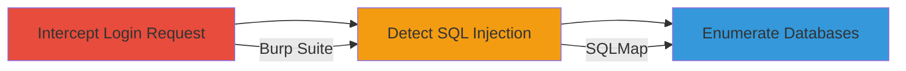

# Error-Based SQL Injection in Sony Login Form for Database Enumeration

Multi-stage attack chain demonstrating the discovery and exploitation of an error-based SQL injection vulnerability in a Sony web login endpoint to enumerate database names.

## Chain Metrics Dashboard

| Metric | Value |
|--------|-------|
| Chain Status | Unverified |
| Total Steps | 3 |
| Execution Time | ~15 minutes |
| Skill Level | Intermediate |
| Complexity | Medium |
| Impact Level | High |

## Attack Flow Visualization



## Prerequisites & Requirements

### Required Tools

- [[tools/Burp-Suite]]
- [[tools/SQLMap]]

### Target Environment

- Web application with a login form
- Accessible HTTP/HTTPS endpoint
- No specific ports required beyond standard web (80/443)

### Initial Access Requirements

- Network access to the target web endpoint
- No prior credentials needed
- Proxy setup for request interception

## Detailed Attack Procedures

### Step 1: Intercept Login Request
procedure: [[procedures/Intercept-Login-Request-with-Burp-Suite]]

**Objective**: Capture the HTTP login request to identify injectable parameters.

**Instructions**: Configure Burp Suite as a proxy and navigate to the login form. Submit a test login to intercept the POST request containing username and password parameters.

**Expected Output**: Raw HTTP request with form data visible in Burp's Proxy or Repeater tab.

**Success Indicators**:
- Request intercepted successfully
- Parameters like username or password are visible for manipulation

### Step 2: Detect SQL Injection Vulnerability
procedure: [[procedures/Detect-SQL-Injection-Vulnerability-with-SQLMap]]

**Objective**: Test the intercepted request for SQL injection vulnerabilities using automated scanning.

**Instructions**: Save the intercepted request to a file (e.g., request.txt) and run SQLMap against it to detect error-based SQLi. Use the following command:

```bash
sqlmap -r request.txt --batch --level=1 --risk=1
```

**Expected Output**: SQLMap reports SQL injection vulnerability detected, specifying the injectable parameter (e.g., username).

**Success Indicators**:
- Vulnerability confirmed as error-based SQLi
- Error messages from the database exposed in responses

### Step 3: Enumerate Database Names
procedure: [[procedures/Enumerate-Database-Names-via-SQL-Injection]]

**Objective**: Exploit the SQLi to extract database schema information, starting with database names.

**Instructions**: With the vulnerability confirmed, use SQLMap's database enumeration features on the request file:

```bash
sqlmap -r request.txt --dbs --batch
```

**Expected Output**: List of database names dumped from the target DBMS (e.g., MySQL databases like 'sony_users', 'admin_db').

**Success Indicators**:
- Database names successfully enumerated
- Potential for further exploitation like table dumping indicated

## Attack Chain Summary

### Key Achievements

1. Intercepted and analyzed login request to identify injection points
2. Automated detection of error-based SQL injection in the login form
3. Enumerated database names, enabling potential data exfiltration

## Technique & Tactic Coverage

### MITRE ATT&CK Techniques

- [[Exploit Public-Facing Application]]

### MITRE ATT&CK Tactics

- [[Initial Access]]
- [[Collection]]

---
*Last updated: 2023-10-01T00:00:00Z*
