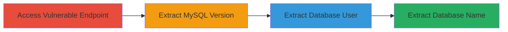

---
tags:
  - sqli
  - mysql
  - error-based
  - injection
  - web
type: attack_chain
tools:
  - '[[tools/Firefox]]'
  - '[[tools/Web-Browser]]'
tactics:
  - '[[Initial Access]]'
  - '[[Collection]]'
verified: false
platforms:
  - Web
submitted: true
created_at: '2023-10-01T00:00:00Z'
procedures:
  - '[[procedures/Extract-MySQL-Version-via-SQL-Injection]]'
  - '[[procedures/Extract-Database-User-via-SQL-Injection]]'
  - '[[procedures/Extract-Database-Name-via-SQL-Injection]]'
step_count: 3
techniques:
  - '[[Exploit Public-Facing Application]]'
updated_at: '2025-12-14T03:46:20.209Z'
description: >-
  A multi-step SQL injection attack exploiting insufficient input sanitization
  in a URL parameter to extract MySQL database details including version, user,
  and database name using error-based techniques.
id: e8540225-0cf0-4e89-afa7-921cecdc0636
validated: true
mitre_tactics:
  - '[[Initial Access]]'
  - '[[Collection]]'
mitre_techniques:
  - '[[Exploit Public-Facing Application]]'
---
# Error-Based SQL Injection via UpdateXML to Extract MySQL Database Information

Multi-stage attack chain demonstrating a complete SQL injection workflow to extract sensitive database information from a vulnerable web application.

## Chain Metrics Dashboard

| Metric | Value |
|--------|-------|
| Chain Status | Unverified |
| Total Steps | 3 |
| Execution Time | ~5 minutes |
| Skill Level | Intermediate |
| Complexity | Medium |
| Impact Level | High |

## Attack Flow Visualization

## Prerequisites & Requirements

### Required Tools

- [[tools/Firefox]]
- [[tools/Web-Browser]]

### Target Environment

- Web application with MySQL backend
- Accessible URL with vulnerable parameter (e.g., `id=`)
- No authentication required for the endpoint

### Initial Access Requirements

- Public network access to the target subdomain
- No credentials needed
- Basic knowledge of SQL syntax and URL encoding

## Detailed Attack Procedures

### Step 1: Extract MySQL Version
procedure: [[procedures/Extract-MySQL-Version-via-SQL-Injection]]

**Objective**: Identify the MySQL version to assess potential exploits and confirm the backend database.

**Instructions**: Use a web browser to append an error-based SQL payload to the vulnerable `id=` parameter in the URL.

**Expected Output**: Error message revealing the MySQL version, e.g., "XPATH syntax error: '5.7.34'".

**Success Indicators**:
- Error message contains version information
- Payload triggers an updatexml error without crashing the page

### Step 2: Extract Database User
procedure: [[procedures/Extract-Database-User-via-SQL-Injection]]

**Objective**: Retrieve the current database user to understand privileges and potential escalation paths.

**Instructions**: Append a modified payload targeting the user() function to the vulnerable parameter.

**Expected Output**: Error message displaying the database user, e.g., "XPATH syntax error: 'dbuser@localhost'".

**Success Indicators**:
- User details exposed in error output
- Consistent error-based response

### Step 3: Extract Database Name
procedure: [[procedures/Extract-Database-Name-via-SQL-Injection]]

**Objective**: Obtain the name of the current database to map the schema and identify sensitive tables.

**Instructions**: Use a URL-encoded payload with the database() function appended to the parameter.

**Expected Output**: Error message with the database name, e.g., "XPATH syntax error: 'airforce_db'".

**Success Indicators**:
- Database name revealed
- Payload executes without syntax errors

## Attack Chain Summary

### Key Achievements

1. Confirmed SQL injection vulnerability through error-based extraction
2. Gathered critical database metadata for further exploitation
3. Demonstrated potential for arbitrary SQL query execution and data dumping

## Technique & Tactic Coverage

### MITRE ATT&CK Techniques

- [[Exploit Public-Facing Application]]

### MITRE ATT&CK Tactics

- [[Initial Access]]
- [[Collection]]

---

*Last updated: 2023-10-01T00:00:00Z*
