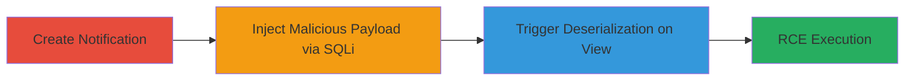

---
tags:
  - deserialization
  - pickle
  - rce
  - sqli
  - python
  - web
type: attack_chain
tools:
  - '[[tools/Python-Pickle-Module]]'
tactics:
  - '[[Execution]]'
  - '[[Collection]]'
commands:
  - '[[commands/update-notifications-context-with-malicious-pickle]]'
platforms:
  - Web
complexity: medium
procedures:
  - '[[procedures/Create-Notification-via-Team-Invitation]]'
  - '[[procedures/Inject-Malicious-Pickle-Payload-via-SQL-Injection]]'
  - '[[procedures/Trigger-Deserialization-by-Viewing-Notifications]]'
step_count: 3
techniques:
  - '[[Exploit Public-Facing Application]]'
  - '[[Python]]'
description: >-
  A multi-stage attack exploiting unsafe deserialization in Liberapay's
  notification system, combined with SQL injection to achieve remote code
  execution.
skill_level: intermediate
impact_level: high
id: 264fd5e4-f76d-4786-809b-5645139927cc
created_at: '2025-12-14T03:46:19.816Z'
updated_at: '2025-12-14T03:46:19.816Z'
verified: false
validated: true
submitted: true
mitre_tactics:
  - '[[Execution]]'
  - '[[Collection]]'
mitre_techniques:
  - '[[Exploit Public-Facing Application]]'
  - '[[Python]]'
---
# Escalating SQL Injection to RCE via Unsafe Pickle Deserialization in Liberapay

## Overview

This attack chain demonstrates how an unsafe deserialization vulnerability in Liberapay's notification system, using Python's pickle module, can be escalated from a SQL injection to remote code execution (RCE). The vulnerability exists in the serialization and deserialization of notification contexts stored in the PostgreSQL database. By injecting a malicious pickle payload via SQLi into the notifications table, an attacker can execute arbitrary code, such as system commands, when the targeted user views their notifications. This requires prior access to trigger a notification and a SQL injection vector, making it a chained exploit with high impact on authenticated users.

## Chain Metrics Dashboard

| Metric | Value |
|--------|-------|
| Chain Status | Unverified |
| Total Steps | 3 |
| Execution Time | ~5 minutes |
| Skill Level | Intermediate |
| Complexity | Medium |
| Impact Level | High |

## Attack Flow Visualization



## Prerequisites & Requirements

### Required Tools

- [[tools/Python-Pickle-Module]]
- Database access tool (e.g., psql for PostgreSQL)

### Target Environment

- Liberapay web application
- PostgreSQL database (inferred from E'' hex syntax)
- Python backend

### Initial Access Requirements

- Authenticated access to create teams and invite users
- SQL injection vulnerability in inputs affecting the notifications table
- Target user credentials to view notifications

## Detailed Attack Procedures

### Step 1: Create Notification via Team Invitation
procedure: [[procedures/Create-Notification-via-Team-Invitation]]

**Objective**: Establish a notification record in the database to serve as the injection target.

**Instructions**: Log in as an authenticated user and invite another user to a team, which triggers the notify function to serialize context data using pickle and store it in the notifications table.

**Expected Output**: A new notification entry with ID (e.g., 43) in the database, containing serialized context.

**Success Indicators**:
- Notification created and visible in the database
- Context field populated with pickled data

### Step 2: Inject Malicious Pickle Payload via SQL Injection
procedure: [[procedures/Inject-Malicious-Pickle-Payload-via-SQL-Injection]]

**Objective**: Exploit SQL injection to overwrite the notification's context with a malicious pickle payload that executes code on deserialization.

**Instructions**: Use a SQL injection point (assumed in team-related inputs) to execute the update command with the hex-encoded payload. For example, execute [[commands/update-notifications-context-with-malicious-pickle]] targeting the notification ID:

```sql
UPDATE notifications SET context = E'\x80027d710028580400000061736432710158030000006c6f6c71025801000000627103580500000033303030307104580100000063710563706f7369780a73797374656d0a7106580c000000736c656570203530303030307107857108527109752e' WHERE id = 43;
```

**Expected Output**: Database row updated successfully; no immediate errors.

**Success Indicators**:
- Context field updated with malicious hex payload
- Query executes without syntax errors

### Step 3: Trigger Deserialization by Viewing Notifications
procedure: [[procedures/Trigger-Deserialization-by-Viewing-Notifications]]

**Objective**: Cause the application to deserialize the malicious payload, executing the embedded code.

**Instructions**: Log in as the invited user and navigate to the notifications page, which invokes render_notifications and deserializes the context, triggering the payload (e.g., os.system('sleep 500000') causing a hang).

**Expected Output**: Application hangs or executes the command; potential timeout or error on page load.

**Success Indicators**:
- Page load delays or hangs due to sleep command
- Logs show deserialization and code execution

## Attack Chain Summary

### Key Achievements

1. Created a injectable notification entry
2. Escalated SQLi to inject RCE payload via unsafe deserialization
3. Achieved code execution on victim interaction

## Technique & Tactic Coverage

### MITRE ATT&CK Techniques

- [[Exploit Public-Facing Application]]
- [[Python]]

### MITRE ATT&CK Tactics

- [[Execution]]
- [[Collection]]

---
*Last updated: 2023-10-01*
