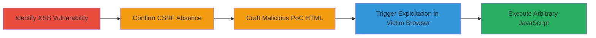

---
tags:
  - xss
  - csrf
  - joomla
  - reflected-xss
  - self-xss
type: attack_chain
tools:
  - '[[tools/Notepad++]]'
  - '[[tools/Firefox]]'
  - '[[tools/Google-Chrome]]'
tactics:
  - '[[Initial Access]]'
  - '[[Execution]]'
  - '[[Collection]]'
verified: false
platforms:
  - Web
submitted: true
created_at: '2023-10-01T00:00:00Z'
procedures:
  - '[[procedures/Identify-Reflected-XSS-in-arg2-Parameter]]'
  - '[[procedures/Confirm-Absence-of-CSRF-Protection]]'
  - '[[procedures/Craft-PoC-HTML-for-CSRF-XSS-Exploitation]]'
  - '[[procedures/Demonstrate-Exploitation-via-Browser-Auto-Submission]]'
step_count: 4
techniques:
  - '[[Drive-by Compromise]]'
  - '[[JavaScript]]'
updated_at: '2025-12-14T03:47:18.586Z'
description: >-
  A multi-stage attack exploiting a reflected XSS vulnerability in the 'arg2'
  parameter of a Joomla-based registration endpoint, combined with missing CSRF
  protection to trick victims into executing JavaScript via a malicious HTML
  page.
id: e64b7b39-7f9c-41a0-8f09-7ee217c17d5b
validated: true
mitre_tactics:
  - '[[Initial Access]]'
  - '[[Execution]]'
  - '[[Collection]]'
mitre_techniques:
  - '[[Drive-by Compromise]]'
  - '[[JavaScript]]'
---
# Escalating Self-XSS to Global Reflected XSS via CSRF in Joomla Registration

Multi-stage attack chain demonstrating how a self-reflected XSS in a Joomla registration endpoint can be escalated to a global attack using CSRF to force victim browsers to submit malicious payloads.

## Chain Metrics Dashboard

| Metric | Value |
|--------|-------|
| Chain Status | Unverified |
| Total Steps | 4 |
| Execution Time | ~5 minutes |
| Skill Level | Intermediate |
| Complexity | Medium |
| Impact Level | High |

## Attack Flow Visualization

## Prerequisites & Requirements

### Required Tools

- [[tools/Notepad++]]
- [[tools/Firefox]]
- [[tools/Google-Chrome]]

### Target Environment

- Web platform running PHP-based CMS like Joomla
- Accessible /index.php endpoint with registration functionality (e.g., task=azrul_ajax, option=community, func=register,ajaxCheckEmail)
- No specific ports required beyond standard HTTP/HTTPS (80/443)

### Initial Access Requirements

- Ability to send POST requests to the target (e.g., via browser or tools)
- Victim must be authenticated or in a context where the endpoint processes requests
- Network access to the target site (https://target/index.php)

## Detailed Attack Procedures

### Step 1: Identify XSS Vulnerability
procedure: [[procedures/Identify-Reflected-XSS-in-arg2-Parameter]]

**Objective**: Detect the reflected XSS in the 'arg2' parameter by testing unsanitized input reflection.

**Instructions**: Send a POST request to /index.php with parameters including a JavaScript payload in arg2, such as task=azrul_ajax&option=community&func=register,ajaxCheckEmail&arg2=["test",""]. Observe if the payload executes in the response.

**Expected Output**: JavaScript alert(1) pops up, confirming reflection without sanitization.

**Success Indicators**:
- Payload reflected and executed in browser
- No HTML/JS escaping observed in response

### Step 2: Confirm CSRF Absence
procedure: [[procedures/Confirm-Absence-of-CSRF-Protection]]

**Objective**: Verify that the endpoint lacks CSRF tokens, allowing cross-origin submissions.

**Instructions**: Attempt a POST request from a different origin (e.g., local HTML file) without any token. Check if the request is processed successfully.

**Expected Output**: Request accepted and processed without token validation errors.

**Success Indicators**:
- No CSRF token required in form or headers
- Cross-origin POST succeeds

### Step 3: Craft PoC HTML
procedure: [[procedures/Craft-PoC-HTML-for-CSRF-XSS-Exploitation]]

**Objective**: Create a malicious HTML page that auto-submits the XSS payload via CSRF.

**Instructions**: Use [[tools/Notepad++]] to edit and save an HTML file with a form that includes hidden inputs for the parameters and JavaScript to auto-submit using history.pushState to prevent navigation away.

**Expected Output**: Saved HTML file ready for hosting or local testing.

**Success Indicators**:
- HTML file parses without errors
- Form contains URL-encoded XSS payload in arg2

### Step 4: Demonstrate Exploitation
procedure: [[procedures/Demonstrate-Exploitation-via-Browser-Auto-Submission]]

**Objective**: Trick a victim into visiting the PoC, triggering the XSS in their browser.

**Instructions**: Open the PoC HTML in [[tools/Firefox]] or [[tools/Google-Chrome]]. The form auto-submits to the target /index.php, executing the XSS.

**Expected Output**: Alert(1) executes in the victim's browser session.

**Success Indicators**:
- Auto-submission occurs without user interaction
- XSS payload triggers JavaScript execution on target site

## Attack Chain Summary

### Key Achievements

1. Identified and confirmed reflected XSS in arg2 parameter of Joomla endpoint.
2. Exploited missing CSRF to create a drive-by XSS attack vector.
3. Demonstrated session compromise potential via arbitrary JS execution.
4. Highlighted risks in unsanitized JSON-like inputs in web apps.

## Technique & Tactic Coverage

### MITRE ATT&CK Techniques

- [[Drive-by Compromise]]
- [[JavaScript]]

### MITRE ATT&CK Tactics

- [[Initial Access]]
- [[Execution]]
- [[Collection]]

---
*Last updated: 2023-10-01T00:00:00Z*
