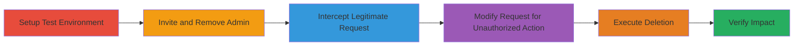

# Ex-Admin Retained Access to Delete Organization Members in Fabric.io

Multi-stage attack chain exploiting improper revocation of admin privileges in Fabric.io, allowing former organization admins to delete team members post-removal. This broken access control vulnerability disrupts team management and enables unauthorized account manipulation.

## Chain Metrics Dashboard

| Metric | Value |
|--------|-------|
| Chain Status | Unverified |
| Total Steps | 6 |
| Execution Time | ~15 minutes |
| Skill Level | Intermediate |
| Complexity | Medium |
| Impact Level | High |

## Attack Flow Visualization

## Prerequisites & Requirements

### Required Tools

- [[tools/Burp-Suite]]

### Target Environment

- Fabric.io web application
- Required services/ports: HTTPS (443)
- Network access requirements: Internet access to fabric.io

### Initial Access Requirements

- Valid Fabric.io account credentials for test setup
- Network position: Direct browser access
- Prior access needed: Ability to create organizations and invite users

## Detailed Attack Procedures

### Step 1: Setup Test Organization and Accounts

procedure: [[procedures/Setup-Test-Organization-and-Accounts]]

**Objective**: Create a victim organization with admin and member accounts to simulate the target environment.

**Instructions**: Register new accounts for Victimadmin and Victimmember, then create VictimOrg and add Victimmember as a team member.

**Expected Output**: VictimOrg created with ID (e.g., 54af7e07b8568e8c6a0001e) and Victimmember added with ID (e.g., 552787195127ae16b8000987).

**Success Indicators**:
- Organization dashboard shows both accounts
- Member list confirms Victimmember presence

### Step 2: Invite and Remove Admin from Organization

procedure: [[procedures/Invite-and-Remove-Admin-from-Organization]]

**Objective**: Invite a test admin (Hackeradmin), promote to admin role, obtain necessary IDs, and remove them to trigger improper access revocation.

**Instructions**: From Victimadmin, invite Hackeradmin, promote to admin, note Org ID and Member ID, then remove Hackeradmin.

**Expected Output**: Hackeradmin removed from VictimOrg team list.

**Success Indicators**:
- Hackeradmin can no longer access VictimOrg via UI
- IDs captured for later use

### Step 3: Intercept DELETE Request with Burp Proxy

procedure: [[procedures/Intercept-DELETE-Request-with-Burp-Proxy]]

**Objective**: Capture a legitimate DELETE request format while logged in as the ex-admin attempting to remove a member from their own organization.

**Instructions**: Configure Burp Proxy, log in as Hackeradmin, navigate to HackerOrg settings, and intercept the DELETE request triggered by removing Hackermember.

**Expected Output**: Intercepted request: `DELETE /api/v3/accounts/54c1e78b9ea696b3cb00026a/organizations/54aa36e3937ae35559011d17/leave HTTP/1.1 Host: fabric.io`.

**Success Indicators**:
- Request captured in Burp Repeater
- Original parameters match own org and member IDs

### Step 4: Modify and Send Unauthorized DELETE Request

procedure: [[procedures/Modify-and-Send-Unauthorized-DELETE-Request]]

**Objective**: Alter the intercepted request to target VictimOrg and Victimmember, exploiting retained admin permissions.

**Instructions**: In Burp, replace account_id with 552787195127ae16b8000987 and org_id with 54af7e07b8568e8c6a0001e, then forward the request.

**Expected Output**: Server responds with 200 OK, indicating successful deletion.

**Success Indicators**:
- No authorization error from server
- Request completes without rejection

### Step 5: Verify Member Deletion

procedure: [[procedures/Verify-Member-Deletion]]

**Objective**: Confirm the unauthorized removal by checking the victim organization's team members.

**Instructions**: Log in as Victimadmin and navigate to VictimOrg team settings.

**Expected Output**: Victimmember no longer listed in team members.

**Success Indicators**:
- Team list shows only Victimadmin
- No alerts or logs of the deletion action

## Attack Chain Summary

### Key Achievements

1. Demonstrated retained ex-admin privileges post-removal
2. Exploited via simple request modification without additional auth bypass
3. Achieved unauthorized account deletion, impacting organization control

## Technique & Tactic Coverage

### MITRE ATT&CK Techniques

- [[Valid Accounts]] Valid Accounts
- [[Exploit Public-Facing Application]] Exploit Public-Facing Application

### MITRE ATT&CK Tactics

- [[Persistence]] Persistence
- [[Initial Access]] Initial Access

---

*Last updated: 2023-10-01T00:00:00Z*
