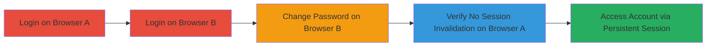

---
tags:
  - broken-auth
  - session-management
  - password-change
  - unauthorized-access
type: attack_chain
tools:
  - '[[tools/Mozilla-Firefox]]'
  - '[[tools/Google-Chrome]]'
tactics:
  - '[[Initial Access]]'
verified: false
platforms:
  - Web
submitted: true
complexity: low
created_at: '2023-10-01T12:00:00Z'
procedures:
  - '[[procedures/Login-to-Web-Application-on-Multiple-Browsers]]'
  - '[[procedures/Change-User-Password]]'
  - '[[procedures/Verify-Persistent-Session]]'
step_count: 5
techniques:
  - '[[Valid Accounts]]'
  - '[[Local Accounts]]'
updated_at: '2025-12-14T17:31:11.352Z'
description: >-
  Demonstrates how changing a password fails to invalidate active sessions on
  other browsers, allowing unauthorized access via lingering sessions.
skill_level: beginner
impact_level: high
id: 1159070f-6c43-44dd-9ec6-f769321c8b2d
validated: true
mitre_tactics:
  - '[[Initial Access]]'
mitre_techniques:
  - '[[Valid Accounts]]'
  - '[[Local Accounts]]'
---
# Exploit Broken Session Management for Persistent Access After Password Change

Multi-stage attack chain demonstrating a complete attack workflow for exploiting broken authentication and session management in a web application.

## Chain Metrics Dashboard

| Metric | Value |
|--------|-------|
| Chain Status | Unverified |
| Total Steps | 5 |
| Execution Time | ~5 minutes |
| Skill Level | Beginner |
| Complexity | Low |
| Impact Level | High |

## Attack Flow Visualization

## Prerequisites & Requirements

### Required Tools

- [[tools/Mozilla-Firefox]]
- [[tools/Google-Chrome]]

### Target Environment

- Web application platform
- Access to https://bridge.cspr.ng/
- Valid user credentials

### Initial Access Requirements

- Legitimate user account credentials
- Multiple browser instances or devices
- No special network privileges required; standard internet access

## Detailed Attack Procedures

### Step 1: Login on Primary Browser
procedure: [[procedures/Login-to-Web-Application-on-Multiple-Browsers]]

**Objective**: Establish an initial authenticated session on the first browser to simulate a legitimate or unattended login.

**Instructions**: Use [[tools/Mozilla-Firefox]] to access the login page and authenticate with valid credentials. This creates an active session that will later be tested for persistence.

**Expected Output**: Successful login, dashboard or account page loads without errors.

**Success Indicators**:
- User is redirected to the application dashboard
- Session cookie is set in browser developer tools

### Step 2: Login on Secondary Browser
procedure: [[procedures/Login-to-Web-Application-on-Multiple-Browsers]]

**Objective**: Create a second active session using the same credentials to enable password change without affecting the first session.

**Instructions**: Open [[tools/Google-Chrome]] and repeat the login process at https://bridge.cspr.ng/ with the same credentials.

**Expected Output**: Second session established, application accessible.

**Success Indicators**:
- Both browsers show authenticated access
- No session conflicts observed

### Step 3: Change Password on Secondary Browser
procedure: [[procedures/Change-User-Password]]

**Objective**: Update the account password, which should ideally invalidate all other sessions but does not in this vulnerable application.

**Instructions**: In [[tools/Google-Chrome]], navigate to the account settings and submit a new password.

**Expected Output**: Password change confirmation; session on this browser remains active.

**Success Indicators**:
- Password updated successfully
- No immediate logout on the changing browser

### Step 4: Check for Session Invalidation
procedure: [[procedures/Verify-Persistent-Session]]

**Objective**: Confirm that the password change did not log out the primary session, indicating broken session management.

**Instructions**: Switch back to [[tools/Mozilla-Firefox]] and attempt to interact with the application without re-authenticating.

**Expected Output**: No automatic logout or session expiration prompt.

**Success Indicators**:
- Application remains accessible
- No authentication challenge appears

### Step 5: Refresh and Validate Access
procedure: [[procedures/Verify-Persistent-Session]]

**Objective**: Perform actions to ensure the session is fully functional post-password change, demonstrating unauthorized access potential.

**Instructions**: Refresh the page or navigate to a protected resource in the primary browser.

**Expected Output**: Page reloads successfully with user data intact.

**Success Indicators**:
- Account details load correctly
- Attacker can perform actions as the user

## Attack Chain Summary

### Key Achievements

1. Established multiple concurrent sessions with the same credentials
2. Changed password without invalidating existing sessions
3. Demonstrated persistent unauthorized access on unattended devices

## Technique & Tactic Coverage

### MITRE ATT&CK Techniques

- [[Valid Accounts]] Valid Accounts
- [[Local Accounts]] Local Accounts

### MITRE ATT&CK Tactics

- [[Initial Access]] Initial Access

---

*Last updated: 2023-10-01T12:00:00Z*
