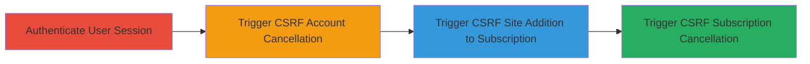

---
tags:
  - csrf
  - web-vulnerability
  - account-cancellation
  - subscription-manipulation
  - akismet
type: attack_chain
tools: []
tactics:
  - '[[Execution]]'
verified: false
platforms:
  - Web
submitted: true
complexity: low
created_at: '2023-10-01T00:00:00Z'
procedures:
  - '[[procedures/Authenticate-to-Akismet-Web-Application]]'
  - '[[procedures/Exploit-CSRF-to-Cancel-Akismet-Account]]'
  - '[[procedures/Exploit-CSRF-to-Add-Site-to-Subscription]]'
  - '[[procedures/Exploit-CSRF-to-Cancel-Subscription]]'
step_count: 4
techniques:
  - '[[Exploit Public-Facing Application]]'
updated_at: '2025-12-14T17:27:15.528Z'
description: >-
  This attack chain exploits multiple Cross-Site Request Forgery (CSRF)
  vulnerabilities in the Akismet service, allowing unauthorized actions such as
  account cancellation, subscription cancellation, and adding sites to
  subscriptions on behalf of authenticated users by forging requests without
  token validation.
skill_level: intermediate
impact_level: high
id: 6d3a8283-641f-4fbf-acf1-c0601c07775a
validated: true
mitre_tactics:
  - '[[Execution]]'
mitre_techniques:
  - '[[Exploit Public-Facing Application]]'
---
# Exploiting CSRF Vulnerabilities in Akismet for Unauthorized Account Cancellation and Subscription Manipulation

Multi-stage attack chain demonstrating CSRF exploitation in the Akismet service to perform unauthorized administrative actions on behalf of logged-in users.

## Chain Metrics Dashboard

| Metric | Value |
|--------|-------|
| Chain Status | Unverified |
| Total Steps | 4 |
| Execution Time | ~5 minutes |
| Skill Level | Intermediate |
| Complexity | Low |
| Impact Level | High |

## Attack Flow Visualization



## Prerequisites & Requirements

### Required Tools

- Browser for session authentication
- [[commands/curl-post-csrf-account-cancel]] or similar for testing

### Target Environment

- Web platform
- Akismet service (https://akismet.com)
- Authenticated user session required (victim must be logged in)

### Initial Access Requirements

- Victim must have an active Akismet account and subscription
- Attacker needs to host a malicious webpage or send a link/form to victim
- No direct credentials needed; exploits existing session

## Detailed Attack Procedures

### Step 1: Authenticate User Session
procedure: [[procedures/Authenticate-to-Akismet-Web-Application]]

**Objective**: Establish an authenticated session in the victim's browser to enable CSRF exploitation.

**Instructions**: The victim logs into their Akismet account via the web interface at https://akismet.com. This creates a session cookie that can be used for forged requests.

**Expected Output**: Successful login with session established; dashboard accessible.

**Success Indicators**:
- User sees account dashboard
- Session cookies present in browser dev tools

### Step 2: Trigger CSRF for Account Cancellation
procedure: [[procedures/Exploit-CSRF-to-Cancel-Akismet-Account]]

**Objective**: Forge a request to cancel the victim's account without CSRF token validation.

**Instructions**: Host a malicious HTML page with an auto-submitting form targeting https://akismet.com/api/account/1/cancel (userid ignored). Trick the victim into visiting the page while authenticated. For testing, use [[commands/curl-post-csrf-account-cancel]] with stolen cookies:

```bash
curl -X POST 'https://akismet.com/api/account/1/cancel' -H 'Cookie: session=abc123' -d ''
```

**Expected Output**: Account cancellation confirmation or error if session invalid.

**Success Indicators**:
- Account status changes to canceled
- Victim loses access to services

### Step 3: Trigger CSRF for Adding Site to Subscription
procedure: [[procedures/Exploit-CSRF-to-Add-Site-to-Subscription]]

**Objective**: Add an arbitrary site to the victim's subscription without authorization.

**Instructions**: Create a malicious form submitting to /api/activation/create with parameters subscriptionId=1&site_url=attacker-controlled-domain. Victim visits while logged in. Test with [[commands/curl-post-csrf-add-site]]:

```bash
curl -X POST 'https://akismet.com/api/activation/create' -H 'Cookie: session=abc123' -d 'subscriptionId=1&site_url=foo.bar'
```

**Expected Output**: Site added to subscription.

**Success Indicators**:
- New site appears in victim's subscription list
- Potential billing or service disruption

### Step 4: Trigger CSRF for Subscription Cancellation
procedure: [[procedures/Exploit-CSRF-to-Cancel-Subscription]]

**Objective**: Cancel a specific subscription belonging to the victim.

**Instructions**: Use a forged POST to /api/subscription/1/cancel. Embed in malicious page for victim click. Test via [[commands/curl-post-csrf-subscription-cancel]]:

```bash
curl -X POST 'https://akismet.com/api/subscription/1/cancel' -H 'Cookie: session=abc123' -d ''
```

**Expected Output**: Subscription canceled.

**Success Indicators**:
- Subscription status updated to canceled
- Victim notified of changes

## Attack Chain Summary

### Key Achievements

1. Unauthorized account cancellation disrupting user access
2. Manipulation of subscriptions by adding unauthorized sites
3. Targeted subscription cancellations affecting service continuity

## Technique & Tactic Coverage

### MITRE ATT&CK Techniques

- [[Exploit Public-Facing Application]]

### MITRE ATT&CK Tactics

- [[Execution]]

---
*Last updated: 2023-10-01T00:00:00Z*
