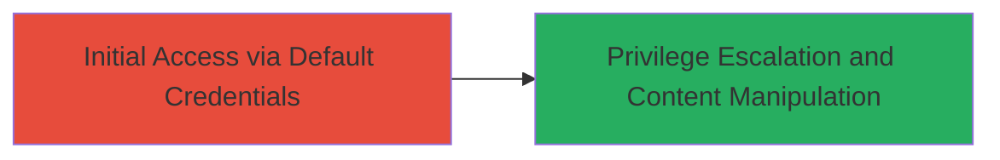

# Exploiting Default Administrator Credentials in DoD Geoportal for Unauthorized Content Manipulation

Multi-stage attack chain demonstrating a complete attack workflow.

## Chain Metrics Dashboard

| Metric | Value |
|--------|-------|
| Chain Status | Unverified |
| Total Steps | 1 |
| Execution Time | ~2 minutes |
| Skill Level | Beginner |
| Complexity | Low |
| Impact Level | High |

## Attack Flow Visualization

## Prerequisites & Requirements

### Required Tools

- Web browser (e.g., Chrome, Firefox)

### Target Environment

- Web platform
- Publicly accessible geoportal application
- No specific services/ports beyond standard HTTPS (443)

### Initial Access Requirements

- Internet access to the target URL
- No prior credentials or network position required
- Knowledge of common default username/password pairs

## Detailed Attack Procedures

### Step 1: Initial Access
procedure: [[procedures/Attempt-Default-Credentials-on-Geoportal-Login]]

**Objective**: Gain unauthorized administrator privileges by authenticating with unchanged default credentials on the geoportal login page.

**Instructions**: Open a web browser and navigate to the target geoportal login page at `https://███/geoportal/`. In the login form, attempt authentication using common default credentials. First, try username `admin` with password `admin`. If unsuccessful, try username `gptadmin` with password `gptadmin`. Upon successful login, verify admin privileges by accessing administrative functions such as post deletion or content editing.

**Expected Output**: Successful login redirects to the admin dashboard, displaying options to manage posts and edit site content.

**Success Indicators**:
- Login succeeds without errors
- Admin dashboard loads with elevated privileges
- Ability to delete a test post or edit content confirms access
