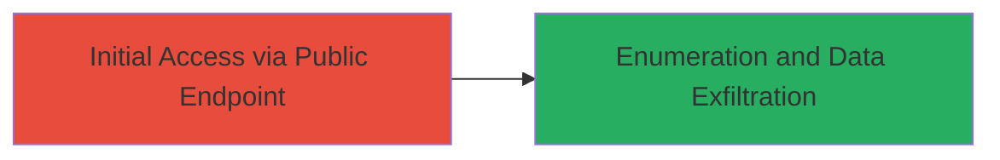

# Exploiting Misconfigured Public AWS S3 Bucket for Sensitive Data Exposure

Multi-stage attack chain demonstrating a complete attack workflow.

## Chain Metrics Dashboard

| Metric | Value |
|--------|-------|
| Chain Status | Unverified |
| Total Steps | 1 |
| Execution Time | ~1 minutes |
| Skill Level | Novice |
| Complexity | Low |
| Impact Level | High |

## Attack Flow Visualization



## Prerequisites & Requirements

### Required Tools

- None (uses standard HTTP client like curl or browser)

### Target Environment

- AWS Cloud platform
- S3 storage service
- Public internet access to the S3 bucket endpoint

### Initial Access Requirements

- No credentials required due to public misconfiguration
- Direct network access to the internet
- No prior access needed

## Detailed Attack Procedures

### Step 1: Access and Enumerate S3 Bucket
procedure: [[procedures/Access-and-Enumerate-Public-S3-Bucket-Contents]]

**Objective**: Gain unauthorized access to list and potentially download contents of a publicly exposed S3 bucket, revealing sensitive files like system diagnostics.

**Instructions**: Directly access the S3 bucket endpoint using a web browser or HTTP client to trigger the ListBucket operation. For example, navigate to the bucket URL or use [[commands/curl-list-s3-bucket]] to fetch the XML listing:

```bash
curl http://acronis.1.s3.amazonaws.com
```

If the bucket lists contents, identify sensitive files such as ZIP archives containing system information. Download them using standard HTTP GET requests, e.g., via browser or curl:

```bash
curl -O http://acronis.1.s3.amazonaws.com/sysinfo_AcronisAppliance_2018-08-01_15-16-21.zip
```

**Expected Output**: An XML response in ListBucketResult format detailing bucket objects, including file names, sizes, and last modified dates. Successful download yields the sensitive ZIP file.

**Success Indicators**:
- XML listing returned without authentication prompt
- Sensitive files like sysinfo ZIP visible and downloadable
- No access denied errors (e.g., 403 Forbidden)

## Attack Chain Summary

### Key Achievements

1. Unauthorized enumeration of S3 bucket contents via public endpoint
2. Identification of sensitive system information file
3. Potential exfiltration of confidential data leading to data leak

## Technique & Tactic Coverage

### MITRE ATT&CK Techniques

- [[Exploit Public-Facing Application]]
- [[Data from Cloud Storage]]

### MITRE ATT&CK Tactics

- [[Initial Access]]
- [[Discovery]]
- [[Collection]]

---
*Last updated: 2023-10-01T00:00:00Z*
