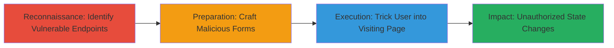

# Exploiting Multiple CSRF Vulnerabilities in Concrete CMS 5.7.3.1 for Unauthorized Admin Actions

Multi-stage attack chain demonstrating a complete attack workflow exploiting CSRF flaws in Concrete CMS 5.7.3.1 to perform unauthorized administrative actions on an authenticated user's behalf.

## Chain Metrics Dashboard

| Metric | Value |
|--------|-------|
| Chain Status | Unverified |
| Total Steps | 3 |
| Execution Time | ~5 minutes |
| Skill Level | Intermediate |
| Complexity | Medium |
| Impact Level | High |

## Attack Flow Visualization

## Prerequisites & Requirements

### Required Tools

- Web browser for testing
- Text editor for crafting HTML

### Target Environment

- Concrete CMS 5.7.3.1 running on PHP
- Administrative access required for victim (authenticated session)
- Web platform with accessible dashboard endpoints

### Initial Access Requirements

- Attacker must host malicious HTML pages (e.g., on a controlled web server)
- Victim must be an authenticated administrator in the same network/session context
- No direct credentials needed; relies on social engineering

## Detailed Attack Procedures

### Step 1: Reconnaissance and Identification
procedure: [[procedures/Identify-Missing-CSRF-Protections-in-Concrete5]]

**Objective**: Analyze the application to identify endpoints lacking CSRF token validation, focusing on state-changing POST requests in dashboard and block functionalities.

**Instructions**: Review the Concrete\Core\Validation\CSRF\Token class source code and test administrative functions like file management, registration settings, and user groups for missing token checks. Manually inspect network requests during legitimate actions to confirm absence of CSRF tokens in vulnerable forms.

**Expected Output**: List of vulnerable endpoints, such as /index.php/tools/required/files/delete and /index.php/dashboard/system/registration/open/update_registration_type.

**Success Indicators**:
- Confirmed inconsistent Synchronizer Token Pattern implementation
- Identified multiple POST endpoints without token validation

### Step 2: Preparation of Exploit Payloads
procedure: [[procedures/Craft-CSRF-Proof-of-Concept-HTML-Pages]]

**Objective**: Create malicious HTML pages with auto-submitting forms targeting the identified vulnerable endpoints to simulate unauthorized actions.

**Instructions**: Use a text editor to build HTML forms with hidden fields mimicking legitimate POST data. Include JavaScript to auto-submit the form upon page load. Target specific endpoints like file deletion or registration updates, ensuring forms match the expected parameters from reconnaissance.

**Expected Output**: Functional HTML files (e.g., delete-file.html) that, when loaded, submit requests to vulnerable URLs.

**Success Indicators**:
- Forms validate against legitimate endpoint parameters
- Auto-submit script triggers without user interaction

### Step 3: Execution and Impact
procedure: [[procedures/Execute-CSRF-Attack-via-Social-Engineering]]

**Objective**: Deliver the malicious pages to authenticated victims, forcing unauthorized actions like deleting files or altering settings.

**Instructions**: Host the HTML pages on an attacker-controlled server and use social engineering (e.g., phishing email with a link) to lure the admin to visit. Monitor for successful submissions via network logs or application changes.

**Expected Output**: Confirmation of actions performed, such as files deleted from the File Manager or public registration enabled.

**Success Indicators**:
- Victim's session performs unintended POST requests
- Application state changes without direct consent (e.g., user groups modified)

## Attack Chain Summary

### Key Achievements

1. Identified 8+ vulnerable CSRF endpoints in Concrete CMS 5.7.3.1
2. Crafted reusable PoC forms for actions like file deletion and authentication changes
3. Demonstrated high-impact unauthorized modifications via drive-by exploitation

## Technique & Tactic Coverage

### MITRE ATT&CK Techniques

- [[Drive-by Compromise]] Drive-by Compromise
- [[Active Scanning]] Active Scanning

### MITRE ATT&CK Tactics

- [[Initial Access]] Initial Access
- [[Reconnaissance]] Reconnaissance

---
*Last updated: 2023-10-01T00:00:00Z*
