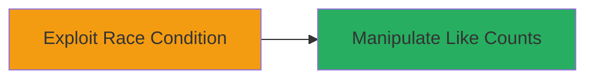

# Exploiting Race Condition in Figma Community File Unlike Function to Manipulate Like Counts

Multi-stage attack chain demonstrating a complete attack workflow.

## Chain Metrics Dashboard

| Metric | Value |
|--------|-------|
| Chain Status | Unverified |
| Total Steps | 1 |
| Execution Time | ~1 minute |
| Skill Level | Intermediate |
| Complexity | Low |
| Impact Level | Low |

## Attack Flow Visualization



## Prerequisites & Requirements

### Required Tools

- None (uses standard HTTP client like curl)

### Target Environment

- Web platform
- Access to Figma community files endpoint
- Authenticated user session with like/unlike permissions

### Initial Access Requirements

- Valid Figma user account
- Network access to Figma's API
- Prior like on a community file

## Detailed Attack Procedures

### Step 1: Exploit Race Condition
procedure: [[procedures/Exploiting-Race-Condition-for-Multiple-Unlikes-in-Figma]]

**Objective**: Bypass the single-unlike limit per user by sending concurrent unlike requests, reducing the like count more than intended.

**Instructions**: Authenticate to Figma and identify a community file with likes. Use concurrent HTTP requests to the unlike endpoint to trigger the race condition. For example, prepare a script or use parallel curl invocations to send multiple unlike requests simultaneously.

First, obtain the file ID and reaction ID from the community file (via browser dev tools or API exploration). Then execute concurrent requests using a bash loop or tool like Apache Benchmark (ab):

```bash
# Example using parallel curl (install parallel if needed: apt install parallel)
seq 10 | parallel -j10 curl -X POST 'https://www.figma.com/api/community/files/{file_id}/reactions/{reaction_id}/unlike' -H 'Authorization: Bearer {your_token}' -H 'Content-Type: application/json'
```

Replace {file_id}, {reaction_id}, and {your_token} with actual values. This sends 10 concurrent unlike requests.

**Expected Output**: Server responses indicating successful unlikes (e.g., 200 OK for each), and the like count on the file decreases by more than 1.

**Success Indicators**:
- Multiple unlike confirmations received
- Like count reduced beyond single-user limit
- No rate-limiting errors during concurrent sends

## Attack Chain Summary

### Key Achievements

1. Bypassed logical restriction on unlikes per user
2. Demonstrated potential for artificial like count manipulation
3. Highlighted server-side synchronization flaw

## Technique & Tactic Coverage

### MITRE ATT&CK Techniques

- [[Exploit Public-Facing Application]]

### MITRE ATT&CK Tactics

- [[Execution]]

---
*Last updated: 2023-10-01T00:00:00Z*
