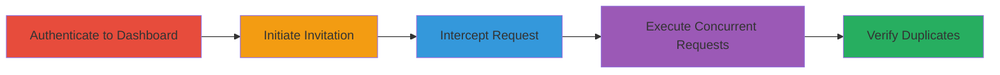

# Exploiting Race Condition in Omise Team Invitations for Duplicate Entries

Multi-stage attack chain demonstrating exploitation of a race condition in the Omise dashboard to bypass duplicate prevention checks during team member invitations, resulting in multiple invitations to the same email and persistent duplicates even after acceptance.

## Chain Metrics Dashboard

| Metric | Value |
|--------|-------|
| Chain Status | Unverified |
| Total Steps | 5 |
| Execution Time | ~5 minutes |
| Skill Level | Intermediate |
| Complexity | Medium |
| Impact Level | Medium |

## Attack Flow Visualization



## Prerequisites & Requirements

### Required Tools

- [[tools/Burp-Suite]]
- [[tools/Turbo-Intruder]]

### Target Environment

- Web platform: Omise dashboard at dashboard.omise.co
- Required services/ports: HTTPS on port 443
- Network access requirements: Direct internet access to omise.co

### Initial Access Requirements

- Valid Omise account credentials (admin or team manager role)
- Network position: External attacker with authenticated access
- Prior access needed: None, but authentication required

## Detailed Attack Procedures

### Step 1: Authenticate to Dashboard
procedure: [[procedures/Authenticate-to-Omise-Dashboard]]

**Objective**: Gain authenticated access to the Omise dashboard to reach the team management features.

**Instructions**: Navigate to dashboard.omise.co and log in using valid credentials. Ensure the account has permissions to invite team members.

**Expected Output**: Successful login redirect to the dashboard homepage.

**Success Indicators**:
- Dashboard loads with user profile visible
- Access to team settings available

### Step 2: Initiate Team Member Invitation
procedure: [[procedures/Initiate-Team-Member-Invitation]]

**Objective**: Trigger the invitation process to capture the relevant POST request for interception.

**Instructions**: From the dashboard, navigate to the team section and start an invitation to a test email address.

**Expected Output**: Form submission ready for interception.

**Success Indicators**:
- Invitation form populated
- No errors on initial setup

### Step 3: Intercept Invitation Request with Burp Suite
procedure: [[procedures/Intercept-Invitation-Request-with-Burp-Suite]]

**Objective**: Capture and modify the POST request to /team/memberships for race condition exploitation.

**Instructions**: Configure Burp Suite proxy, submit the invitation form, intercept the request, modify to HTTP/1.1, add 'x-request: %s' header, and forward to Turbo Intruder. Include parameters: authenticity_token, email, membership[admin], membership[technical], commit=Send invitation.

**Expected Output**: Intercepted request visible in Burp with modifications applied.

**Success Indicators**:
- Request headers updated
- Parameters intact for replay

### Step 4: Exploit Race Condition with Turbo Intruder
procedure: [[procedures/Exploit-Race-Condition-with-Turbo-Intruder]]

**Objective**: Send 30 concurrent requests to bypass duplicate checks and create multiple invitations.

**Instructions**: In Turbo Intruder, load the intercepted request and execute the race script using [[commands/turbo-intruder-race-script]] to queue 30 requests with gate='race1'.

```python
def queueRequests(target, wordlists):
    engine = RequestEngine(endpoint=target.endpoint,
                           concurrentConnections=30,
                           requestsPerConnection=100,
                           pipeline=False
                          )

    for i in range(30):
        engine.queue(target.req, target.baseInput, gate='race1')

    engine.openGate('race1')

    engine.complete(timeout=60)

def handleResponse(req, interesting):
    table.add(req)
```

**Expected Output**: Multiple 200 OK responses in the Turbo Intruder table.

**Success Indicators**:
- 30+ successful responses
- No rate limiting observed

### Step 5: Verify Duplicate Invitations and Impacts
procedure: [[procedures/Verify-Duplicate-Invitations-and-Impacts]]

**Objective**: Confirm the exploitation by checking for duplicates and observing side effects like multiple emails.

**Instructions**: Refresh the team members list and monitor the test email for invitations. Attempt further invites to verify persistence.

**Expected Output**: Same email listed multiple times in team members; multiple invitation emails received.

**Success Indicators**:
- Duplicates visible in UI
- Error messages bypassed for already invited users

## Attack Chain Summary

### Key Achievements

1. Bypassed duplicate invitation prevention via race condition
2. Created persistent duplicate team entries
3. Triggered multiple notification emails to the invitee
4. Demonstrated similar vulnerability in /test/links endpoint

## Technique & Tactic Coverage

### MITRE ATT&CK Techniques

- [[Exploit Public-Facing Application]]

### MITRE ATT&CK Tactics

- [[Initial Access]]

---
*Last updated: 2023-10-01T00:00:00Z*
