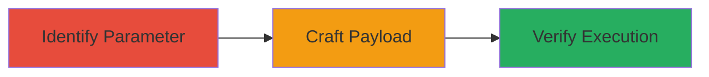

---
tags:
  - xss
  - reflected-xss
  - web-vulnerability
  - pangle
type: attack_chain
tools:
  - '[[tools/Browser-Developer-Tools]]'
tactics:
  - '[[Initial Access]]'
  - '[[Execution]]'
commands:
  - '[[commands/test-xss-payload]]'
platforms:
  - Web
complexity: low
procedures:
  - '[[procedures/Identify-Vulnerable-Parameter]]'
  - '[[procedures/Craft-XSS-Payload]]'
  - '[[procedures/Verify-Payload-Execution]]'
step_count: 3
techniques:
  - '[[Exploit Public-Facing Application]]'
  - '[[JavaScript]]'
description: >-
  Multi-stage attack chain demonstrating the discovery and exploitation of a
  reflected XSS vulnerability in a Pangle endpoint through the redirect
  parameter, leading to arbitrary JavaScript execution in the user's browser.
skill_level: beginner
impact_level: medium
id: 18aa12f6-7753-4223-95e8-c5d9fac4564d
created_at: '2025-12-13T22:26:40.900Z'
updated_at: '2025-12-13T22:26:40.900Z'
verified: false
validated: true
submitted: true
mitre_tactics:
  - '[[Initial Access]]'
  - '[[Execution]]'
mitre_techniques:
  - '[[Exploit Public-Facing Application]]'
  - '[[JavaScript]]'
---
# Exploiting Reflected XSS in Pangle Endpoint via Redirect Parameter

## Overview

This attack chain outlines the process of identifying and exploiting a reflected cross-site scripting (XSS) vulnerability in a Pangle endpoint. The vulnerability occurs due to improper handling of user-supplied data in the 'redirect' parameter, which is reflected back without HTML escaping or encoding. This allows an attacker to inject malicious JavaScript payloads that execute in the victim's browser, potentially leading to session hijacking, data theft, or further attacks. The chain is based on a reported vulnerability with no prior exploitation evidence, remediated after discovery.

## Attack Flow Visualization



## Prerequisites & Requirements

### Required Tools
- [[tools/Browser-Developer-Tools]]

### Target Environment
- Web platform
- Access to Pangle endpoint
- No specific ports required

### Initial Access Requirements
- Ability to access the target URL via a web browser
- No credentials needed for basic testing

## Detailed Attack Procedures

### Step 1: Identify Vulnerable Parameter
procedure: [[procedures/Identify-Vulnerable-Parameter]]

**Objective**: Locate the 'redirect' parameter in the Pangle endpoint and test for reflection of user input without proper sanitization.

**Instructions**: Access the Pangle endpoint URL and append a test string to the 'redirect' parameter, such as '?redirect=test'. Observe the response in the browser or using developer tools to check if the input is reflected verbatim.

Use [[commands/test-xss-payload]] to send a basic test:

```bash
curl "https://example.pangle-endpoint.com?redirect=test"
```

**Expected Output**: The response body contains the reflected 'test' string without encoding.

**Success Indicators**:
- User input is reflected in the HTML output
- No HTML escaping is applied

### Step 2: Craft XSS Payload
procedure: [[procedures/Craft-XSS-Payload]]

**Objective**: Create a malicious JavaScript payload to inject into the 'redirect' parameter.

**Instructions**: Construct a payload like '<script>alert("XSS")</script>' and append it to the URL: '?redirect=<script>alert("XSS")</script>'. Use [[commands/test-xss-payload]] to verify the injection:

```bash
curl "https://example.pangle-endpoint.com?redirect=<script>alert(\"XSS\")</script>"
```

**Expected Output**: The response includes the injected script tag.

**Success Indicators**:
- Payload is reflected without sanitization
- Script tag remains intact in the response

### Step 3: Verify Payload Execution
procedure: [[procedures/Verify-Payload-Execution]]

**Objective**: Confirm that the injected payload executes in the browser context.

**Instructions**: Open the crafted URL in a web browser and observe if the JavaScript executes, such as displaying an alert box. Use browser developer tools to inspect the DOM for the injected code.

**Expected Output**: An alert box pops up with 'XSS', indicating successful execution.

**Success Indicators**:
- JavaScript payload executes
- No errors in console related to sanitization

## Attack Chain Summary

### Key Achievements
1. Identification of unsanitized parameter reflection
2. Successful injection of JavaScript payload
3. Verified execution in browser context

## Technique & Tactic Coverage

### MITRE ATT&CK Techniques
- [[Exploit Public-Facing Application]]
- [[JavaScript]]

### MITRE ATT&CK Tactics
- [[Initial Access]]
- [[Execution]]
