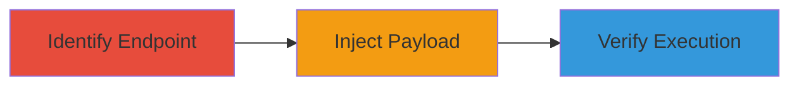

---
tags:
  - xss
  - reflected-xss
  - web-vulnerability
  - javascript-execution
type: attack_chain
tools:
  - '[[tools/Web-Browser]]'
tactics:
  - '[[Initial Access]]'
  - '[[Execution]]'
commands:
  - '[[commands/inject-xss-payload-url]]'
  - '[[commands/view-page-source]]'
platforms:
  - Web
complexity: low
procedures:
  - '[[procedures/Identify-Vulnerable-Endpoint]]'
  - '[[procedures/Craft-and-Inject-XSS-Payload]]'
  - '[[procedures/Verify-XSS-Exploitation]]'
step_count: 3
techniques:
  - '[[Drive-by Compromise]]'
  - '[[JavaScript]]'
description: >-
  Multi-stage attack chain exploiting a reflected XSS vulnerability in the
  lang_id parameter to execute arbitrary JavaScript
skill_level: beginner
impact_level: medium
id: 2d4bdadf-2703-47c1-81d3-7c44c5d2aaa6
created_at: '2025-12-14T00:11:16.383Z'
updated_at: '2025-12-14T00:11:16.383Z'
verified: false
validated: true
submitted: true
mitre_tactics:
  - '[[Initial Access]]'
  - '[[Execution]]'
mitre_techniques:
  - '[[Drive-by Compromise]]'
  - '[[JavaScript]]'
---
# Exploiting Reflected XSS in Uber's Icecream Endpoint via Lang_ID Parameter

## Overview

This attack chain demonstrates the exploitation of a reflected Cross-Site Scripting (XSS) vulnerability in the 'lang_id' parameter of the /icecream/ endpoint on pages.et.uber.com. The vulnerability allows unsanitized user input to be reflected in the page's HTML, enabling arbitrary JavaScript execution via mouseover events. This could lead to theft of cookies, domain information, or other client-side data. The chain covers identification, payload injection, and verification steps.

## Attack Flow Visualization



## Prerequisites & Requirements

### Required Tools

- [[tools/Web-Browser]]

### Target Environment

- Web platform
- Target URL: https://pages.et.uber.com/icecream/
- No specific ports or services required beyond HTTP access

### Initial Access Requirements

- Public access to the target endpoint
- No credentials needed
- Browser for URL manipulation

## Detailed Attack Procedures

### Step 1: Identify Vulnerable Endpoint
procedure: [[procedures/Identify-Vulnerable-Endpoint]]

**Objective**: Access and analyze the target page to identify the potentially vulnerable lang_id parameter.

**Instructions**: Navigate to the target URL using [[tools/Web-Browser]] and note the lang_id parameter in the query string. For example, access https://pages.et.uber.com/icecream/?lang_id=5 to observe how the parameter is handled.

**Expected Output**: Confirmation that the lang_id parameter is reflected in the page without sanitization.

**Success Indicators**:
- Parameter value appears in the HTML source
- No evidence of encoding or filtering on the parameter

### Step 2: Craft and Inject XSS Payload
procedure: [[procedures/Craft-and-Inject-XSS-Payload]]

**Objective**: Modify the URL to include a malicious XSS payload that triggers JavaScript execution on mouseover.

**Instructions**: Append a crafted payload to the lang_id parameter using [[commands/inject-xss-payload-url]]. For example:

```bash
# URL example (modify in browser): https://pages.et.uber.com/icecream/?lang_id=%22%20onmouseover%3dprompt(document.domain)%20bad%3d%22
```

Test additional payloads like %22%20onmouseover%3dprompt(document.cookie)%20bad%3d%22 or %22%20onmouseover%3dprompt(9020)%20bad%3d%22.

**Expected Output**: The payload is reflected in the page, and JavaScript executes on mouseover, displaying alerts with domain, cookies, or test values.

**Success Indicators**:
- Alert pops up on mouseover
- Payload visible in page source without sanitization

### Step 3: Verify XSS Exploitation
procedure: [[procedures/Verify-XSS-Exploitation]]

**Objective**: Confirm the vulnerability by inspecting the source and capturing evidence of execution.

**Instructions**: Use [[commands/view-page-source]] to examine the HTML:

```bash
# In browser developer tools, inspect the element or view source
```

Capture screenshots showing the alert execution and reflected payload.

**Expected Output**: Visual confirmation of JavaScript execution via alerts.

**Success Indicators**:
- Screenshots show successful prompt execution
- Source code reveals unsanitized input

## Attack Chain Summary

### Key Achievements

1. Identification of injectable parameter
2. Successful injection and execution of JavaScript payloads
3. Verification of potential impacts like data theft

## Technique & Tactic Coverage

### MITRE ATT&CK Techniques

- [[JavaScript]]
- [[Drive-by Compromise]]

### MITRE ATT&CK Tactics

- [[Initial Access]]
- [[Execution]]

*Last updated: 2023-10-01*
