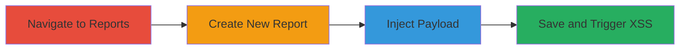

---
tags:
  - xss
  - stored-xss
  - web-vulnerability
  - data-theft
type: attack_chain
tools:
  - '[[tools/Firefox]]'
  - '[[tools/Chrome]]'
tactics:
  - '[[Execution]]'
  - '[[Collection]]'
commands: []
platforms:
  - Web
complexity: low
procedures:
  - '[[procedures/Navigate-to-MoPub-Custom-Reports-Page]]'
  - '[[procedures/Initiate-New-Network-Report-Creation]]'
  - '[[procedures/Inject-XSS-Payload-into-Report-Name]]'
  - '[[procedures/Save-and-Run-Report-to-Trigger-XSS]]'
step_count: 4
techniques:
  - '[[JavaScript]]'
description: >-
  Multi-stage attack chain exploiting a stored XSS vulnerability in MoPub to
  inject and execute malicious scripts for data theft
skill_level: beginner
impact_level: high
id: e5c22275-7641-4fc6-8a04-5d523252729a
created_at: '2025-12-13T23:56:20.444Z'
updated_at: '2025-12-13T23:56:20.444Z'
verified: false
validated: true
submitted: true
mitre_tactics:
  - '[[Execution]]'
  - '[[Collection]]'
mitre_techniques:
  - '[[JavaScript]]'
---
# Exploiting Stored XSS in MoPub Report Names to Steal User Data

Multi-stage attack chain demonstrating a complete workflow to exploit a stored XSS vulnerability in the MoPub web application. This allows injection of malicious scripts into report names, which persist and execute when viewed, potentially stealing sensitive data like session cookies from users.

## Chain Metrics Dashboard

| Metric | Value |
|--------|-------|
| Chain Status | Unverified |
| Total Steps | 4 |
| Execution Time | ~2 minutes |
| Skill Level | Beginner |
| Complexity | Low |
| Impact Level | High |

## Attack Flow Visualization

## Prerequisites & Requirements

### Required Tools

- [[tools/Firefox]]
- [[tools/Chrome]]

### Target Environment

- Web platform
- MoPub service
- Access to https://app.mopub.com

### Initial Access Requirements

- Valid MoPub account credentials
- Browser access to the MoPub dashboard
- No prior elevated access needed

## Detailed Attack Procedures

### Step 1: Navigate to Custom Reports Page
procedure: [[procedures/Navigate-to-MoPub-Custom-Reports-Page]]

**Objective**: Access the custom reports section of the MoPub application to begin the report creation process.

**Instructions**: Open a web browser such as [[tools/Firefox]] or [[tools/Chrome]] and navigate to the URL https://app.mopub.com/reports/custom/.

**Expected Output**: The custom reports page loads successfully.

**Success Indicators**:
- Page loads without errors
- Access to report creation options

### Step 2: Initiate New Network Report Creation
procedure: [[procedures/Initiate-New-Network-Report-Creation]]

**Objective**: Start the process of creating a new network report to expose the vulnerable input field.

**Instructions**: On the custom reports page, click the 'New network report' button to open the report creation form.

**Expected Output**: The new report creation form appears with input fields.

**Success Indicators**:
- Form loads correctly
- Name input field is accessible

### Step 3: Inject XSS Payload into Report Name
procedure: [[procedures/Inject-XSS-Payload-into-Report-Name]]

**Objective**: Insert a malicious XSS payload into the report name field to exploit the lack of input sanitization.

**Instructions**: In the name input field of the report creation form, enter the payload ">.

**Expected Output**: The payload is accepted into the form without immediate errors.

**Success Indicators**:
- Payload is entered successfully
- No client-side validation blocks the input

### Step 4: Save and Run Report to Trigger XSS
procedure: [[procedures/Save-and-Run-Report-to-Trigger-XSS]]

**Objective**: Persist the injected payload and execute the malicious script by saving and viewing the report.

**Instructions**: Click the 'Run and save' button to save the report and trigger the XSS execution upon viewing.

**Expected Output**: The report saves, and when viewed, the script executes, displaying an alert with the document domain.

**Success Indicators**:
- Report saves successfully
- Script executes on view, confirming XSS
- Potential for data theft if viewed by victims

## Attack Chain Summary

### Key Achievements

1. Successful navigation and access to vulnerable endpoint
2. Injection of persistent XSS payload
3. Triggering of malicious script execution

## Technique & Tactic Coverage

### MITRE ATT&CK Techniques

- [[JavaScript]]

### MITRE ATT&CK Tactics

- [[Execution]]
- [[Collection]]

*Last updated: 2023-10-01*
