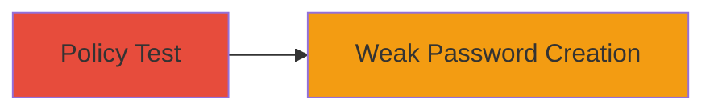

---
tags:
  - weak-password
  - password-policy
  - brute-force
type: attack_chain
tools: []
tactics:
  - '[[Credential Access]]'
commands: []
platforms:
  - Web
complexity: low
procedures:
  - '[[procedures/Test-Password-Policy-Enforcement]]'
step_count: 1
techniques:
  - '[[Brute Force]]'
description: >-
  Demonstrates testing and exploitation of unenforced password policy
  requirements on Khan Academy, allowing creation of weak alphabetic-only
  passwords that increase brute force susceptibility.
skill_level: beginner
impact_level: medium
id: e4b9f9c8-d802-4902-91d9-28871e65f8a2
created_at: '2025-12-14T17:28:20.222Z'
updated_at: '2025-12-14T17:28:20.222Z'
verified: false
validated: true
submitted: true
mitre_tactics:
  - '[[Credential Access]]'
mitre_techniques:
  - '[[Brute Force]]'
---
# Exploiting Weak Password Policy Enforcement on Khan Academy

## Overview

This attack chain outlines a simple test to identify and exploit a discrepancy in Khan Academy's password policy. The platform's documentation requires passwords to include a mixture of numbers and symbols, but backend validation does not enforce this, permitting purely alphabetic passwords. This misconfiguration allows the creation of weaker credentials, potentially exposing accounts to brute force attacks. Although Khan Academy classifies this as an informative recommendation rather than a strict rule, it represents a security weakness in policy enforcement. The chain involves a single manual testing step via the website's registration or password reset functionality.

## Chain Metrics Dashboard

| Metric | Value |
|--------|-------|
| Chain Status | Unverified |
| Total Steps | 1 |
| Execution Time | ~2 minutes |
| Skill Level | Beginner |
| Complexity | Low |
| Impact Level | Medium |

## Attack Flow Visualization

## Prerequisites & Requirements

### Required Tools

- Web browser (e.g., Chrome, Firefox)

### Target Environment

- Khan Academy website (https://www.khanacademy.org)
- Access to registration or password reset forms

### Initial Access Requirements

- No prior credentials needed
- Public internet access to the site

## Detailed Attack Procedures

### Step 1: Test Password Policy Enforcement
procedure: [[procedures/Test-Password-Policy-Enforcement]]

**Objective**: Verify if the system's password validation enforces the documented requirement for numbers and symbols, allowing creation of alphabetic-only passwords.

**Instructions**: Navigate to the Khan Academy registration or password change page. Enter a username and a password consisting solely of alphabetic characters (e.g., "password123" but modified to "passwordonlyletters"). Submit the form and observe if it accepts the input without validation errors.

**Expected Output**: The account is created or password is updated successfully, despite violating the stated policy.

**Success Indicators**:
- No error message about missing numbers or symbols
- Account registration completes or password change is confirmed

## Attack Chain Summary

### Key Achievements

1. Identified unenforced password policy allowing weak credentials
2. Demonstrated potential for brute force exploitation due to reduced password entropy
3. Highlighted discrepancy between documentation and implementation

## Technique & Tactic Coverage

### MITRE ATT&CK Techniques

- [[Brute Force]]

### MITRE ATT&CK Tactics

- [[Credential Access]]

---
*Last updated: 2023-10-01*
