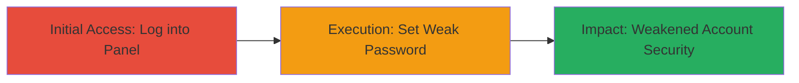

---
tags:
  - weak-password
  - directadmin
  - brute-force
  - password-policy
type: attack_chain
tools: []
tactics:
  - '[[Initial Access]]'
  - '[[Credential Access]]'
verified: false
platforms:
  - Web
submitted: true
complexity: low
created_at: '2023-10-01T00:00:00Z'
procedures:
  - '[[procedures/Access-DirectAdmin-Control-Panel]]'
  - '[[procedures/Set-Weak-Password-in-DirectAdmin]]'
step_count: 2
techniques:
  - '[[Valid Accounts]]'
  - '[[Brute Force]]'
updated_at: '2025-12-14T17:28:28.484Z'
description: >-
  Demonstrates the exploitation of a weak password policy in DirectAdmin by
  setting extremely weak passwords, which reduces account security and increases
  susceptibility to brute-force attacks.
skill_level: beginner
impact_level: medium
id: dda3f497-a9ea-4014-b3fc-66324b4d8d8e
validated: true
mitre_tactics:
  - '[[Initial Access]]'
  - '[[Credential Access]]'
mitre_techniques:
  - '[[Valid Accounts]]'
  - '[[Brute Force]]'
---
# Exploiting Weak Password Policy in DirectAdmin

Multi-stage attack chain demonstrating how authenticated users can exploit the lack of password complexity enforcement in DirectAdmin to set weak passwords, thereby weakening account security and enabling easier brute-force compromises.

## Chain Metrics Dashboard

| Metric | Value |
|--------|-------|
| Chain Status | Unverified |
| Total Steps | 2 |
| Execution Time | ~2 minutes |
| Skill Level | Beginner |
| Complexity | Low |
| Impact Level | Medium |

## Attack Flow Visualization

## Prerequisites & Requirements

### Required Tools

- Web browser (e.g., Chrome or Firefox)

### Target Environment

- DirectAdmin web panel running on port 2222
- Valid user credentials for the target account

### Initial Access Requirements

- Network access to the DirectAdmin login endpoint (e.g., https://target:2222)
- Existing valid credentials (username and password)

## Detailed Attack Procedures

### Step 1: Access DirectAdmin Control Panel
procedure: [[procedures/Access-DirectAdmin-Control-Panel]]

**Objective**: Authenticate into the DirectAdmin panel to gain access to administrative functions, including password management.

**Instructions**: Open a web browser and navigate to the DirectAdmin login page. Enter valid credentials to log in. No special tools are required; this is a standard web login process.

**Expected Output**: Successful login redirects to the DirectAdmin dashboard, confirming access to user controls.

**Success Indicators**:
- Dashboard loads without errors
- User menu options, including password change, are visible

### Step 2: Set Weak Password in DirectAdmin
procedure: [[procedures/Set-Weak-Password-in-DirectAdmin]]

**Objective**: Exploit the absence of password policy enforcement to change the account password to a weak value, demonstrating the vulnerability and its impact on account security.

**Instructions**: From the dashboard, navigate to the password change endpoint. Enter the current password for verification, then input a weak new password (e.g., '1234' or '0000') in the new password fields. Submit the form. The system accepts the change without any validation checks for length, complexity, or common weak patterns.

**Expected Output**: Password change confirmation message appears, and the new weak password is set successfully.

**Success Indicators**:
- No error messages about password strength
- Ability to log out and log back in with the weak password
- Account now uses the weak password, verifiable by attempting a brute-force simulation if desired

## Attack Chain Summary

### Key Achievements

1. Gained authenticated access to the DirectAdmin panel
2. Successfully set a weak password without policy enforcement
3. Demonstrated reduced security posture, making the account vulnerable to brute-force guessing

## Technique & Tactic Coverage

### MITRE ATT&CK Techniques

- [[Valid Accounts]] Valid Accounts
- [[Brute Force]] Brute Force

### MITRE ATT&CK Tactics

- [[Initial Access]] Initial Access
- [[Credential Access]] Credential Access

---
*Last updated: 2023-10-01T00:00:00Z*
