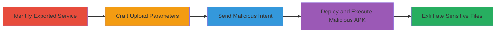

# Exported UploadService Exploitation for Arbitrary File Theft in Quora Android App

Multi-stage attack chain demonstrating exploitation of an exported Android service in the Quora app's third-party upload library to enable arbitrary file uploads from the app's private data directory, resulting in theft of sensitive information such as cookies, Google auth tokens, and shared preferences, potentially leading to account takeover.

## Chain Metrics Dashboard

| Metric | Value |
|--------|-------|
| Chain Status | Unverified |
| Total Steps | 4 |
| Execution Time | ~5 minutes |
| Skill Level | Intermediate |
| Complexity | Medium |
| Impact Level | High |

## Attack Flow Visualization

## Prerequisites & Requirements

### Required Tools

- [[tools/android-upload-service]] (vulnerable library analysis)
- Android development tools (e.g., Android Studio for APK building)
- ADB (Android Debug Bridge) for device interaction

### Target Environment

- Android OS (tested on versions supporting Instant Apps)
- Quora Android app installed (com.quora.android package)
- Attacker-controlled server for receiving uploads (e.g., HTTP endpoint)

### Initial Access Requirements

- Physical or ADB access to the target Android device
- No prior credentials needed; exploits side-channel via intents
- Quora app must be installed and running

## Detailed Attack Procedures

### Step 1: Identify Exported Service
procedure: [[procedures/Identify-Exported-UploadService-in-Android-App]]

**Objective**: Locate the vulnerable exported UploadService in the Quora app's manifest to confirm exploitability.

**Instructions**: Decompile the Quora APK using tools like APKTool and examine the AndroidManifest.xml for the service declaration.

**Expected Output**: Confirmation of `<service android:enabled="true" android:exported="true" android:name="net.gotev.uploadservice.UploadService"/>`.

**Success Indicators**:
- Service found with exported=true
- No intent filters or permissions restricting access

### Step 2: Craft Upload Parameters
procedure: [[procedures/Craft-UploadTaskParameters-for-Arbitrary-File]]

**Objective**: Prepare parameters to specify the target sensitive file (e.g., cookies) and attacker server URL for upload.

**Instructions**: In your malicious app code, instantiate UploadTaskParameters and configure the file path from Quora's private directory and the remote URL.

**Expected Output**: Configured params object ready for intent bundling.

**Success Indicators**:
- Parameters include valid file path like `/data/data/com.quora.android/app_webview/Cookies`
- Server URL points to attacker-controlled endpoint

### Step 3: Send Malicious Intent
procedure: [[procedures/Send-Intent-to-Trigger-UploadService]]

**Objective**: Construct and dispatch an Intent to the UploadService to initiate the unauthorized upload.

**Instructions**: Build the Intent with action, class name, and extras including the params, then call startService.

**Expected Output**: Service starts and begins uploading the file.

**Success Indicators**:
- Intent delivered without errors
- Network traffic observed to attacker server

### Step 4: Deploy Malicious APK
procedure: [[procedures/Deploy-Malicious-APK-to-Automate-Exploitation]]

**Objective**: Install and trigger a PoC APK that automates the intent sending upon launch.

**Instructions**: Build, sign, and install the APK via ADB, then launch it to execute the exploit.

**Expected Output**: Sensitive file received on attacker server.

**Success Indicators**:
- APK installs successfully
- File upload completes, confirming data exfiltration

## Attack Chain Summary

### Key Achievements

1. Confirmed exported service vulnerability in Quora app
2. Crafted parameters for stealing private files like cookies and auth tokens
3. Triggered upload via cross-app intent without permissions
4. Demonstrated full exfiltration leading to potential account takeover

## Technique & Tactic Coverage

### MITRE ATT&CK Techniques

- [[T1417]] - Hijack Execution Flow (Android Intent Hijacking)
- [[T1409]] - Access Stored Application Data

### MITRE ATT&CK Tactics

- [[Execution]] - Execution
- [[Collection]] - Collection

---
*Last updated: 2023-10-01T00:00:00Z*
