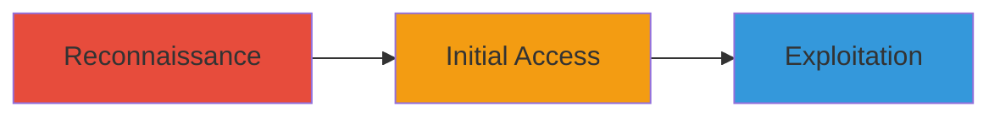

---
tags:
  - grafana
  - information-disclosure
  - sqli
  - fuzzing
type: attack_chain
tools: []
tactics:
  - '[[Initial Access]]'
  - '[[Execution]]'
  - '[[Collection]]'
commands: []
platforms:
  - Web
complexity: medium
procedures:
  - '[[procedures/Discover-Exposed-Grafana-via-Fuzzing]]'
  - '[[procedures/Access-Grafana-as-Guest-User]]'
  - '[[procedures/Exploit-SQL-Injection-in-Grafana-Module]]'
step_count: 3
techniques:
  - '[[Active Scanning]]'
  - '[[Exploit Public-Facing Application]]'
description: >-
  Multi-stage attack exploiting an exposed Grafana instance for unauthorized
  dashboard access and SQL injection in a custom module
skill_level: intermediate
impact_level: high
id: 0d81d5b5-0039-4502-9779-6907911a086a
created_at: '2025-12-11T03:47:39.557Z'
updated_at: '2025-12-11T03:47:39.557Z'
verified: false
validated: true
submitted: true
mitre_tactics:
  - '[[TA0001]]'
  - '[[TA0002]]'
  - '[[TA0009]]'
mitre_techniques:
  - '[[T1595]]'
  - '[[T1190]]'
---
# Exposed Grafana Instance Access Leading to Information Disclosure and SQL Injection

Multi-stage attack chain demonstrating unauthorized access to a production Grafana instance via fuzzing, guest user navigation, and exploitation of SQL injection in a custom module, leading to sensitive data exposure.

## Chain Metrics Dashboard

| Metric | Value |
|--------|-------|
| Chain Status | Unverified |
| Total Steps | 3 |
| Execution Time | ~15 minutes |
| Skill Level | Intermediate |
| Complexity | Medium |
| Impact Level | High |

## Attack Flow Visualization



## Prerequisites & Requirements

### Required Tools

- #ffuf
- #curl
- #sqlmap

### Target Environment

- Web-based platform
- Grafana service exposed
- No specific ports required beyond HTTP/HTTPS

### Initial Access Requirements

- Public internet access
- No credentials needed for initial steps
- Knowledge of target domain (e.g., snapchat.com)

## Detailed Attack Procedures

## Step 1: Fuzzing to Discover Grafana Instance - [[procedures/Discover-Exposed-Grafana-via-Fuzzing]]

**Objective**: Identify accessible Grafana endpoints through pattern fuzzing related to Snapchat projects.

**Instructions**:

Use [[commands/ffuf-fuzz-subdomains]] to fuzz for subdomains or paths:

```bash
ffuf -u https://snapchat.com/FUZZ -w wordlist.txt -fc 404
```

Review results for Grafana-related endpoints, such as those matching 'grafana' or project-specific patterns.

**Expected Output**: List of discovered URLs, including the exposed Grafana instance.

**Success Indicators**:
- At least one valid Grafana URL is found
- No authentication errors during initial probe

## Step 2: Access Grafana as Guest User - [[procedures/Access-Grafana-as-Guest-User]]

**Objective**: Navigate to the discovered Grafana instance and access dashboards without authentication.

**Instructions**:

Use [[commands/curl-access-grafana]] to test access:

```bash
curl -v https://discovered-grafana.snapchat.com
```

If guest access is allowed, browse to dashboards via the web interface to view confidential metrics.

**Expected Output**: Successful response with dashboard data visible.

**Success Indicators**:
- Access to production dashboards granted
- Confidential company metrics displayed

## Step 3: Identify and Exploit SQL Injection - [[procedures/Exploit-SQL-Injection-in-Grafana-Module]]

**Objective**: Test and exploit SQL injection in a custom Grafana module for further data exposure.

**Instructions**:

Use [[commands/sqlmap-exploit-sqli]] to automate SQL injection testing:

```bash
sqlmap -u "https://grafana.snapchat.com/custom-module?param=vulnerable" --batch --dump
```

Inject payloads to confirm vulnerability and extract data.

**Expected Output**: Dumped database contents or confirmation of arbitrary SQL execution.

**Success Indicators**:
- Successful injection and data retrieval
- No input validation errors blocking exploits

## Attack Chain Summary

### Key Achievements

1. Discovery of exposed Grafana instance
2. Unauthorized access to sensitive dashboards
3. Exploitation of SQL injection for deeper access

## Technique & Tactic Coverage

### MITRE ATT&CK Techniques

- [[Active Scanning]]
- [[Exploit Public-Facing Application]]

### MITRE ATT&CK Tactics

- [[Initial Access]]
- [[Execution]]

*Last updated: 2023-10-01*
