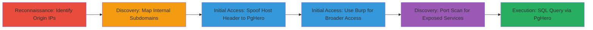

---
tags:
  - host-header-injection
  - misconfiguration
  - sql-injection
  - reconnaissance
  - port-scan
  - access-control-bypass
type: attack_chain
tools:
  - '[[tools/Censys]]'
  - '[[tools/Burp-Suite]]'
tactics:
  - '[[Reconnaissance]]'
  - '[[Initial Access]]'
  - '[[Discovery]]'
  - '[[Execution]]'
  - '[[Collection]]'
commands:
  - '[[commands/curl-host-header-spoof-to-pghero]]'
  - '[[commands/nmap-port-scan-on-ip]]'
platforms:
  - Web
  - Cloud
complexity: medium
procedures:
  - '[[procedures/Reconnaissance-of-Origin-IPs-with-Censys]]'
  - '[[procedures/Identify-Internal-Subdomains-and-Instances]]'
  - '[[procedures/Access-PgHero-with-Curl-Host-Header-Spoofing]]'
  - '[[procedures/Access-Services-with-Burp-Suite-Host-Replacement]]'
  - '[[procedures/Port-Scan-Exposed-Origin-IPs]]'
step_count: 5
techniques:
  - '[[Gather Victim Host Information]]'
  - '[[Exploit Public-Facing Application]]'
  - '[[Network Service Scanning]]'
  - '[[Unix Shell]]'
description: >-
  Attack chain exploiting misconfigured origin IP exposure on go.exchange to
  access internal development instances like PgHero and Grafana via Host header
  spoofing, leading to SQL query execution and potential data compromise.
skill_level: intermediate
impact_level: high
id: 70187071-ed88-4c70-be53-25b3c8bd0ede
created_at: '2025-12-14T03:15:05.048Z'
updated_at: '2025-12-14T03:15:05.048Z'
verified: false
validated: true
submitted: true
mitre_tactics:
  - '[[Reconnaissance]]'
  - '[[Initial Access]]'
  - '[[Discovery]]'
  - '[[Execution]]'
  - '[[Collection]]'
mitre_techniques:
  - '[[Gather Victim Host Information]]'
  - '[[Exploit Public-Facing Application]]'
  - '[[Network Service Scanning]]'
  - '[[Unix Shell]]'
---
# Exposed Origin IPs Enabling Host Header Manipulation to Internal Services

Multi-stage attack chain demonstrating reconnaissance, access bypass, and discovery on misconfigured cloud infrastructure for Omise's go.exchange domain.

## Chain Metrics Dashboard

| Metric | Value |
|--------|-------|
| Chain Status | Unverified |
| Total Steps | 5 |
| Execution Time | ~15 minutes |
| Skill Level | Intermediate |
| Complexity | Medium |
| Impact Level | High |

## Attack Flow Visualization



## Prerequisites & Requirements

### Required Tools

- [[tools/Censys]]
- [[commands/curl-host-header-spoof-to-pghero]]
- [[tools/Burp-Suite]]
- [[commands/nmap-port-scan-on-ip]]

### Target Environment

- Cloud platform (Google Cloud Platform, based on IP ranges like 35.x.x.x)
- Web services on ports 80/tcp, 443/tcp
- Exposed internal services: PostgreSQL (5432/tcp), Grafana, PgHero

### Initial Access Requirements

- Public internet access to query search engines like Censys
- No credentials needed initially; relies on misconfiguration
- Tools like curl or Burp Suite for HTTP manipulation

## Detailed Attack Procedures

### Step 1: Reconnaissance of Origin IPs
procedure: [[procedures/Reconnaissance-of-Origin-IPs-with-Censys]]

**Objective**: Discover origin IP addresses behind the go.exchange domain to identify potential entry points for internal services.

**Instructions**: Query Censys for IPv4 addresses associated with the target domain to reveal backend infrastructure.

**Expected Output**: List of IPs such as 35.244.200.254, 34.96.94.220, 35.241.6.32 linked to go.exchange.

**Success Indicators**:
- IPs retrieved from Censys query
- Confirmation of cloud provider (e.g., Google Cloud)

### Step 2: Identify Internal Subdomains and Instances
dprocedure: [[procedures/Identify-Internal-Subdomains-and-Instances]]

**Objective**: Map exposed internal subdomains like pghero.dev-go.exchange to specific IPs for targeted access.

**Instructions**: Analyze Censys results to associate subdomains with IPs, such as pghero.dev-go.exchange on 35.244.200.254.

**Expected Output**: Mapping of IPs to services (e.g., PgHero, Grafana, TokenModel).

**Success Indicators**:
- Subdomains identified (e.g., grafana.dev-go.exchange)
- Potential services noted for exploitation

### Step 3: Access PgHero with Host Header Spoofing
procedure: [[procedures/Access-PgHero-with-Curl-Host-Header-Spoofing]]

**Objective**: Bypass external restrictions to access the internal PgHero instance for PostgreSQL query execution.

**Instructions**: Use [[commands/curl-host-header-spoof-to-pghero]] to send a request to the origin IP with spoofed Host header:

```bash
curl -i -s -k -X GET -H 'Host: pghero.dev-go.exchange' -H 'Connection: close' -H 'Upgrade-Insecure-Requests: 1' -H 'User-Agent: Mozilla/5.0 (Windows NT 10.0; Win64; x64) AppleWebKit/537.36 (KHTML, like Gecko) Chrome/76.0.3809.132 Safari/537.36' -H 'Sec-Fetch-Mode: navigate' -H 'Sec-Fetch-User: ?1' -H 'Accept: text/html,application/xhtml+xml,application/xml;q=0.9,image/webp,image/apng,*/*;q=0.8,application/signed-exchange;v=b3' -H 'Sec-Fetch-Site: same-origin' -H 'Referer: https://35.244.200.254/explain' -H 'Accept-Encoding: gzip, deflate' -H 'Accept-Language: fr-FR,fr;q=0.9,en-US;q=0.8,en;q=0.' https://35.244.200.254/
```

**Expected Output**: HTML response from PgHero interface, allowing login or direct query access.

**Success Indicators**:
- HTTP 200 response with PgHero UI
- Ability to execute PostgreSQL queries

### Step 4: Access Services with Burp Suite Host Replacement
procedure: [[procedures/Access-Services-with-Burp-Suite-Host-Replacement]]

**Objective**: Scale access to multiple internal instances by automating Host header replacement.

**Instructions**: Configure Burp Suite to replace Host headers for requests to origin IPs, targeting subdomains like grafana.dev-go.exchange.

**Expected Output**: Successful proxying and access to services requiring credentials or exposing data.

**Success Indicators**:
- Requests routed to internal subdomains
- Access to Grafana dashboard or similar

### Step 5: Port Scan Exposed Origin IPs
procedure: [[procedures/Port-Scan-Exposed-Origin-IPs]]

**Objective**: Discover additional exposed services on origin IPs for further exploitation.

**Instructions**: Perform a port scan on an IP like 35.241.6.32 using [[commands/nmap-port-scan-on-ip]]:

```bash
nmap -p- -sV 35.241.6.32
```

**Expected Output**: List of open ports including 80/tcp, 443/tcp, 5432/tcp (PostgreSQL), 3389/tcp (RDP).

**Success Indicators**:
- Multiple open ports identified
- Services like PostgreSQL directly accessible

## Attack Chain Summary

### Key Achievements

1. Exposed origin IPs via public reconnaissance
2. Bypassed access controls with Host header manipulation
3. Accessed sensitive internal tools like PgHero for SQL execution
4. Discovered open ports leading to potential lateral movement

## Technique & Tactic Coverage

### MITRE ATT&CK Techniques

- [[Gather Victim Host Information]] Gather Victim Host Information
- [[Exploit Public-Facing Application]] Exploit Public-Facing Application
- [[Network Service Scanning]] Network Service Scanning
- [[Unix Shell]] SQL

### MITRE ATT&CK Tactics

- [[Reconnaissance]] Reconnaissance
- [[Initial Access]] Initial Access
- [[Discovery]] Discovery
- [[Execution]] Execution
- [[Collection]] Collection

---
*Last updated: 2023-10-01*
