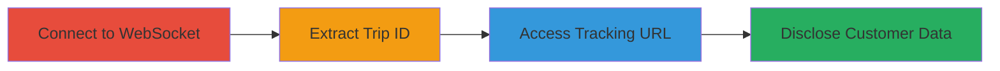

# Exposed Trip ID in WebSocket Leading to Unauthorized Customer Data Disclosure

Multi-stage attack chain demonstrating improper access control in Bykea's WebSocket system, where trip identifiers are leaked to drivers before bid acceptance, enabling unauthorized access to customer tracking URLs and excessive disclosure of customer information.

## Chain Metrics Dashboard

| Metric | Value |
|--------|-------|
| Chain Status | Unverified |
| Total Steps | 3 |
| Execution Time | ~5 minutes |
| Skill Level | Intermediate |
| Complexity | Medium |
| Impact Level | High |

## Attack Flow Visualization

## Prerequisites & Requirements

### Required Tools

- Browser Developer Tools or WebSocket client (e.g., wscat)

### Target Environment

- Web platform with Bykea driver WebSocket endpoint
- Access to driver account credentials

### Initial Access Requirements

- Valid driver login to Bykea app/web
- Network access to WebSocket server (typically wss://api.bykea.com/ws or similar)

## Detailed Attack Procedures

### Step 1: Connect and Monitor Driver WebSocket
procedure: [[procedures/Connect-and-Monitor-Driver-WebSocket]]

**Objective**: Establish connection as a driver and observe WebSocket messages for leaked data.

**Instructions**: Log in as a driver using the Bykea web or app interface, then open browser developer tools (Network tab, filter for WS) to monitor WebSocket connections. Alternatively, use a WebSocket client to connect to the driver endpoint and subscribe to trip-related channels.

**Expected Output**: Incoming WebSocket messages containing trip details sent to the driver before any bid acceptance.

**Success Indicators**:
- WebSocket connection established
- Messages received with trip_no visible in payload

### Step 2: Extract Trip ID from WebSocket Response
procedure: [[procedures/Extract-Trip-ID-from-WebSocket-Response]]

**Objective**: Identify and capture the exposed trip_no identifier from unauthorized WebSocket payloads.

**Instructions**: Inspect the JSON payload in the WebSocket response using developer tools or log the messages in your client. Look for fields like "trip_no" in the message body sent prior to bid acceptance.

**Expected Output**: A specific trip_no value, e.g., "TRIP123456".

**Success Indicators**:
- trip_no identifier successfully parsed from message
- Confirmation that the message was sent without bid acceptance

### Step 3: Access Customer Tracking URL with Exposed ID
procedure: [[procedures/Access-Customer-Tracking-URL-with-Exposed-ID]]

**Objective**: Construct and visit the tracking URL using the leaked trip_no to view unauthorized customer details.

**Instructions**: Build the tracking URL in the format https://bykea.com/track?trip_no=TRIP123456 (replace with actual leaked ID). Open the URL in a browser while authenticated as the unauthorized driver.

**Expected Output**: Page loads displaying customer location, contact info, and trip details without requiring bid acceptance.

**Success Indicators**:
- Access granted to tracking page
- Customer data (e.g., name, phone, route) visible

## Attack Chain Summary

### Key Achievements

1. Monitored WebSocket for pre-bid leaks
2. Extracted sensitive trip_no identifier
3. Accessed and disclosed customer information via constructed URL

## Technique & Tactic Coverage

### MITRE ATT&CK Techniques

- [[Exploit Public-Facing Application]]
- [[Data from Information Repositories]]

### MITRE ATT&CK Tactics

- [[Initial Access]]
- [[Collection]]

---
*Last updated: 2023-10-01T12:00:00Z*
