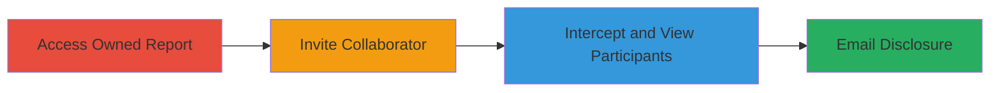

# Exposing Collaborator Emails via Improper Access Control on HackerOne

Multi-stage attack chain demonstrating a complete attack workflow on the HackerOne bug bounty platform, exploiting improper access control to disclose private email addresses of report collaborators, including non-registered users.

## Chain Metrics Dashboard

| Metric | Value |
|--------|-------|
| Chain Status | Unverified |
| Total Steps | 3 |
| Execution Time | ~5 minutes |
| Skill Level | Intermediate |
| Complexity | Low |
| Impact Level | Low |

## Attack Flow Visualization

## Prerequisites & Requirements

### Required Tools

- [[tools/Burp-Suite]]

### Target Environment

- HackerOne web platform
- Valid user account with report ownership
- Network access to HackerOne (https://hackerone.com)

### Initial Access Requirements

- Authenticated HackerOne account with at least one owned report
- No elevated privileges required
- Browser with proxy support for interception

## Detailed Attack Procedures

### Step 1: Access Owned Report
procedure: [[procedures/Access-Owned-Report-on-HackerOne]]

**Objective**: Select and navigate to a report owned by the authenticated user to prepare for collaborator invitation.

**Instructions**: Log in to the HackerOne platform and navigate to the user's dashboard. Locate and open one of the reports owned by the user via the reports list or direct URL (e.g., https://hackerone.com/reports/<id>).

**Expected Output**: The report details page loads, displaying options to manage participants and collaborators.

**Success Indicators**:
- Report page accessible without errors
- Collaborator invitation UI visible

### Step 2: Invite Non-Registered Collaborator
procedure: [[procedures/Invite-Non-Registered-Collaborator-to-Report]]

**Objective**: Add a collaborator using an email address of a non-registered user, triggering the backend invitation process that populates participant data.

**Instructions**: On the report page, locate the 'Invite Collaborator' or 'Add Participant' option. Enter an email address belonging to a user without a HackerOne account (e.g., a personal email like example@gmail.com). Complete the invitation by submitting the form, which sends an invitation email but also updates the internal participant list.

**Expected Output**: Invitation sent confirmation message; the email is now associated with the report internally.

**Success Indicators**:
- Invitation form submits successfully
- No errors on non-registered email

### Step 3: Intercept Participants Endpoint
procedure: [[procedures/Intercept-Participants-Endpoint-to-View-Emails]]

**Objective**: Capture the GET request to the /reports/<id>/participants endpoint after invitation to extract the collaborator's email from the JSON response.

**Instructions**: With Burp Suite configured as a proxy, refresh the report page or trigger a participants list load to intercept the GET request to /reports/<REPORT ID>/participants. Observe the JSON response, which includes the invited email address in plain text without requiring additional authentication.

**Expected Output**: JSON response containing participant details, e.g., {"participants": [{"email": "example@gmail.com", ...}]}.

**Success Indicators**:
- Email address visible in response
- No authorization denial (200 OK status)

## Attack Chain Summary

### Key Achievements

1. Successfully accessed an owned report and invited a non-registered collaborator.
2. Intercepted API traffic to reveal private email addresses.
3. Demonstrated low-severity information disclosure due to missing access controls.

## Technique & Tactic Coverage

### MITRE ATT&CK Techniques

- [[Account Discovery]]

### MITRE ATT&CK Tactics

- [[Discovery]]

---
*Last updated: 2023-10-01T12:00:00Z*
