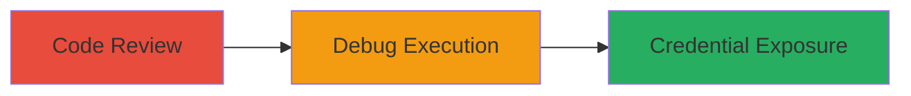

---
tags:
  - api-key-leak
  - cleartext-logging
  - python-library
  - omise
  - credential-exposure
type: attack_chain
tools: []
tactics:
  - '[[Execution]]'
  - '[[Persistence]]'
verified: false
platforms:
  - Python
submitted: true
complexity: low
created_at: '2023-10-01T00:00:00Z'
procedures:
  - '[[procedures/Review-Omise-Python-Library-Source-Code-for-Secret-Logging]]'
  - >-
    [[procedures/Execute-Omise-Python-Script-with-Debug-Logging-to-Expose-API-Key]]
step_count: 2
techniques:
  - '[[Compromise Software Dependencies and Development Tools]]'
  - '[[Python]]'
  - '[[Unsecured Credentials]]'
updated_at: '2025-12-14T17:32:20.776Z'
description: >-
  Demonstrates the vulnerability in the omise-python library where API secret
  keys are logged in cleartext during debug mode, potentially leading to
  unauthorized access.
skill_level: intermediate
impact_level: high
id: 6c5ff32d-26a4-4ae0-ba6d-46d884bdd638
validated: true
mitre_tactics:
  - '[[Execution]]'
  - '[[Persistence]]'
mitre_techniques:
  - '[[Compromise Software Dependencies and Development Tools]]'
  - '[[Python]]'
  - '[[Unsecured Credentials]]'
---
# Exposure of Omise API Secret Key via Cleartext Debug Logging

Multi-stage attack chain demonstrating the discovery and exploitation of a vulnerability in the omise-python library, where secret API keys are logged in cleartext during debug mode. This can lead to inadvertent exposure of credentials in logs, demos, or shared files, enabling unauthorized access to the Omise API for actions like creating customers or processing payments.

## Chain Metrics Dashboard

| Metric | Value |
|--------|-------|
| Chain Status | Unverified |
| Total Steps | 2 |
| Execution Time | ~5 minutes |
| Skill Level | Intermediate |
| Complexity | Low |
| Impact Level | High |

## Attack Flow Visualization

## Prerequisites & Requirements

### Required Tools

- Python environment with omise library installed
- Access to GitHub repository

### Target Environment

- Python 2.7+ or 3.x
- omise-python library (version affected, e.g., pre-fix)
- No specific services/ports required beyond local execution

### Initial Access Requirements

- Public access to https://github.com/omise/omise-python/
- Local Python setup for testing
- Test API key from Omise dashboard

## Detailed Attack Procedures

### Step 1: Code Review
procedure: [[procedures/Review-Omise-Python-Library-Source-Code-for-Secret-Logging]]

**Objective**: Identify locations in the library source code where sensitive API keys are logged without redaction.

**Instructions**: Clone the repository and examine the request.py file for debug logging statements that include the API key.

**Expected Output**: Identification of logger.debug calls at lines 88 and 111 that output 'Authorization: %s' with the full api_key.

**Success Indicators**:
- Debug statements found logging full API key
- Confirmation of cleartext exposure risk

### Step 2: Demonstrate Exposure
procedure: [[procedures/Execute-Omise-Python-Script-with-Debug-Logging-to-Expose-API-Key]]

**Objective**: Reproduce the vulnerability by enabling debug logging and executing a script that uses the API, capturing the leaked key in console output.

**Instructions**: Install the library, set logging to DEBUG, and run a sample script to create a customer, observing the console for the leaked key.

**Expected Output**: Console logs showing 'DEBUG:omise.request:Authorization: skey_test_5sqdfyjv0rtqzs9f2x2'.

**Success Indicators**:
- API key appears in cleartext in logs
- Successful customer creation confirms API functionality while exposing the key

## Attack Chain Summary

### Key Achievements

1. Discovered insecure debug logging in omise-python library via code review.
2. Reproduced credential exposure using a simple Python script.
3. Highlighted risk of unauthorized API access from leaked logs.

## Technique & Tactic Coverage

### MITRE ATT&CK Techniques

- [[Compromise Software Dependencies and Development Tools]] Compromise Software Dependencies and Development Tools
- [[Python]] Python
- [[Unsecured Credentials]] Unsecured Credentials

### MITRE ATT&CK Tactics

- [[Execution]] Execution
- [[Persistence]] Persistence

---
*Last updated: 2023-10-01T00:00:00Z*
