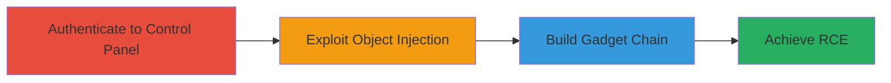

# ExpressionEngine PHP Object Injection to RCE via Custom Gadget Chain

Multi-stage attack chain demonstrating a complete attack workflow exploiting PHP Object Injection in the ExpressionEngine control panel to achieve remote code execution.

## Chain Metrics Dashboard

| Metric | Value |
|--------|-------|
| Chain Status | Unverified |
| Total Steps | 3 |
| Execution Time | ~10 minutes |
| Skill Level | Advanced |
| Complexity | Medium |
| Impact Level | High |

## Attack Flow Visualization

## Prerequisites & Requirements

### Required Tools

- None (manual exploitation via browser and PHP knowledge)

### Target Environment

- Web platform running ExpressionEngine CMS
- PHP backend
- Control panel accessible

### Initial Access Requirements

- Valid credentials for an authenticated user with permissions to build custom gadgets in the control panel
- Network access to the ExpressionEngine instance
- No prior access beyond authentication needed

## Detailed Attack Procedures

### Step 1: Authenticate to Control Panel
procedure: [[procedures/Authenticate-to-ExpressionEngine-Control-Panel]]

**Objective**: Gain authenticated access to the ExpressionEngine control panel with necessary permissions.

**Instructions**: Log in using valid credentials via the control panel login page. Ensure the account has permissions to access and build custom gadgets.

**Expected Output**: Successful login redirect to the control panel dashboard.

**Success Indicators**:
- Access to control panel features
- Permissions to build gadgets confirmed

### Step 2: Exploit PHP Object Injection
procedure: [[procedures/Exploit-PHP-Object-Injection-with-Custom-Gadget-Chain]]

**Objective**: Leverage PHP Object Injection to construct a malicious gadget chain.

**Instructions**: In the control panel, identify the deserialization point (e.g., via gadget building interface). Craft a serialized PHP object payload that exploits unsafe deserialization to build a custom gadget chain targeting RCE.

**Expected Output**: Successful injection and chain construction without errors.

**Success Indicators**:
- No deserialization errors
- Gadget chain processed by the application

### Step 3: Achieve Remote Code Execution
procedure: [[procedures/Achieve-Remote-Code-Execution-via-Gadget-Chain]]

**Objective**: Trigger the gadget chain to execute arbitrary commands on the server.

**Instructions**: Submit the built gadget chain through the control panel interface, configuring it to invoke system commands (e.g., via PHP functions like exec or system in the chain).

**Expected Output**: Command execution output visible in the response or logs.

**Success Indicators**:
- Arbitrary command runs successfully
- Server-side effects observed (e.g., file creation or network activity)

## Attack Chain Summary

### Key Achievements

1. Authenticated access to vulnerable control panel
2. Custom gadget chain built via PHP Object Injection
3. Remote code execution enabling arbitrary server commands

## Technique & Tactic Coverage

### MITRE ATT&CK Techniques

- [[Exploit Public-Facing Application]]
- [[Command-Line Interface]]

### MITRE ATT&CK Tactics

- [[Execution]]

---
*Last updated: 2023-10-01T12:00:00Z*
