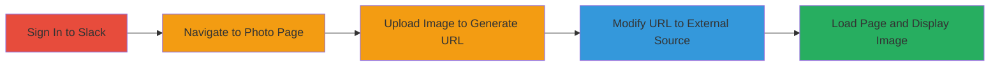

# External Image Loading via URL Parameter Manipulation in Slack Avatar Upload

Multi-stage attack chain demonstrating manipulation of Slack's avatar upload feature to load external images, reported as potential RFI but classified as intended file-sharing behavior by Slack.

## Chain Metrics Dashboard

| Metric | Value |
|--------|-------|
| Chain Status | Unverified |
| Total Steps | 5 |
| Execution Time | ~2 minutes |
| Skill Level | Beginner |
| Complexity | Low |
| Impact Level | Low |

## Attack Flow Visualization

## Prerequisites & Requirements

### Required Tools

- Web browser (e.g., Chrome, Firefox)

### Target Environment

- Slack web application
- Access to a Slack workspace
- AWS S3 integration (implicit in Slack's backend)

### Initial Access Requirements

- Valid Slack account credentials
- Network access to Slack's web interface (e.g., https://[workspace].slack.com)
- No prior elevated access needed

## Detailed Attack Procedures

### Step 1: Sign In to Slack Account
procedure: [[procedures/Access-Slack-Account-and-Photo-Page]]

**Objective**: Authenticate to a Slack workspace to gain access to account settings.

**Instructions**: Open a web browser and navigate to the Slack login page for your workspace. Enter your credentials to sign in.

**Expected Output**: Successful login, redirecting to the Slack dashboard.

**Success Indicators**:
- Dashboard loads without errors
- User profile accessible

### Step 2: Navigate to Change Photo Page
procedure: [[procedures/Access-Slack-Account-and-Photo-Page]]

**Objective**: Reach the avatar upload interface to prepare for URL generation.

**Instructions**: From the Slack dashboard, click on your profile picture, select 'View profile', then 'Edit profile', and navigate to the photo change section, or directly access https://[workspace].slack.com/account/photo.

**Expected Output**: Photo upload page loads, prompting for image selection.

**Success Indicators**:
- URL matches /account/photo endpoint
- Upload interface visible

### Step 3: Select and Upload a File
procedure: [[procedures/Generate-and-Manipulate-Avatar-Upload-URL]]

**Objective**: Upload a local image to generate a temporary S3 URL with the 'url' parameter.

**Instructions**: Choose a local image file (e.g., JPG) and click upload. The page will redirect to a crop interface with a URL like https://[workspace].slack.com/account/photo?url=https%3A%2F%2Fs3-us-west-2.amazonaws.com%2Fslack-files2%2Favatar-temp%2F[date]%2F[file].jpg.

**Expected Output**: Temporary S3 URL generated and image preview shown.

**Success Indicators**:
- URL contains 'url' parameter pointing to S3
- Image loads in crop tool

### Step 4: Modify the 'url' Parameter to an External Source
procedure: [[procedures/Generate-and-Manipulate-Avatar-Upload-URL]]

**Objective**: Tamper with the URL to point to an external image resource.

**Instructions**: In the browser's address bar, edit the 'url' parameter to replace the S3 path with an external URL, e.g., change to https://[workspace].slack.com/account/photo?url=https://www.google.co.in/images/srpr/logo11w.png. Press Enter to apply.

**Expected Output**: Modified URL accepted without error.

**Success Indicators**:
- No 404 or validation error
- Page reloads with new parameter

### Step 5: Load the Page to Display the External Image
procedure: [[procedures/Load-External-Image-as-Avatar]]

**Objective**: Trigger the server to fetch, display, and potentially store the external image as the avatar.

**Instructions**: Access the modified URL. The external image (e.g., Google logo) should load in the crop interface and may be saved to S3 as avatar files.

**Expected Output**: External image displays as avatar preview; two files potentially uploaded to S3.

**Success Indicators**:
- External image visible in Slack avatar
- No server-side errors; image persists

## Attack Chain Summary

### Key Achievements

1. Successful authentication and navigation to vulnerable endpoint
2. Generation of manipulable URL parameter
3. Loading and storage of arbitrary external image without validation

## Technique & Tactic Coverage

### MITRE ATT&CK Techniques

- [[Exploit Public-Facing Application]]

### MITRE ATT&CK Tactics

- [[Initial Access]]

---
*Last updated: 2023-10-01T00:00:00Z*
