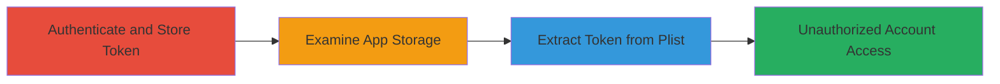

# Extract IRCCloud Session Token from Unsecured Plist File on Locked iOS Device

Multi-stage attack chain demonstrating how a physical attacker can steal an IRCCloud session token from a locked iOS device to achieve unauthorized account access.

## Chain Metrics Dashboard

| Metric | Value |
|--------|-------|
| Chain Status | Unverified |
| Total Steps | 3 |
| Execution Time | ~5 minutes |
| Skill Level | Intermediate |
| Complexity | Medium |
| Impact Level | High |

## Attack Flow Visualization

## Prerequisites & Requirements

### Required Tools

- [[tools/iOS-Data-Protection-Tool]]
- [[tools/iExplorer]]

### Target Environment

- iOS device (non-jailbroken)
- IRCCloud iOS app installed
- Device locked with passcode
- Physical access to the device

### Initial Access Requirements

- Physical possession of the locked iOS device
- No network access or credentials needed beyond physical access
- App must have been previously authenticated by the victim

## Detailed Attack Procedures

### Step 1: Authenticate to IRCCloud iOS App
procedure: [[procedures/Authenticate-to-IRCCloud-iOS-App]]

**Objective**: Trigger the app to store the session identifier in the unsecured plist file.

**Instructions**: Open the IRCCloud app on the target iOS device and log in with valid credentials if not already authenticated. This causes the session token to be written to the plist file without protection.

**Expected Output**: Successful login, with session token now present in the app's storage.

**Success Indicators**:
- App displays connected status
- No errors during authentication

### Step 2: Examine IRCCloud App Storage
procedure: [[procedures/Examine-IRCCloud-App-Storage]]

**Objective**: Verify the plist file's accessibility while the device is locked.

**Instructions**: Connect the locked device to a computer and use [[tools/iOS-Data-Protection-Tool]] to check data protection status, then navigate to the app's Preferences folder using [[tools/iExplorer]] to locate com.irccloud.IRCCloud.plist.

**Expected Output**: File is readable, confirming lack of protection like NSFileProtectionComplete.

**Success Indicators**:
- Tool reports file as accessible when locked
- Plist file visible in app sandbox

### Step 3: Extract Session Token from Plist
procedure: [[procedures/Extract-Session-Token-from-Plist]]

**Objective**: Dump the plist contents to obtain the session identifier for reuse.

**Instructions**: Use [[tools/iExplorer]] to export the plist file and parse it to retrieve the session token value.

**Expected Output**: Raw plist contents showing the session identifier key-value pair.

**Success Indicators**:
- Token extracted successfully
- Token can be used to access the IRCCloud account via web or API

## Attack Chain Summary

### Key Achievements

1. Bypassed iOS lock screen to access app data
2. Exploited insecure storage to steal session token
3. Enabled unauthorized IRCCloud account access without jailbreak

## Technique & Tactic Coverage

### MITRE ATT&CK Techniques

- [[Credentials In Files]] Credentials In Files
- [[Steal Web Session Cookie]] Steal Web Session Cookie

### MITRE ATT&CK Tactics

- [[Credential Access]] Credential Access

---

*Last updated: 2023-10-01T00:00:00Z*
